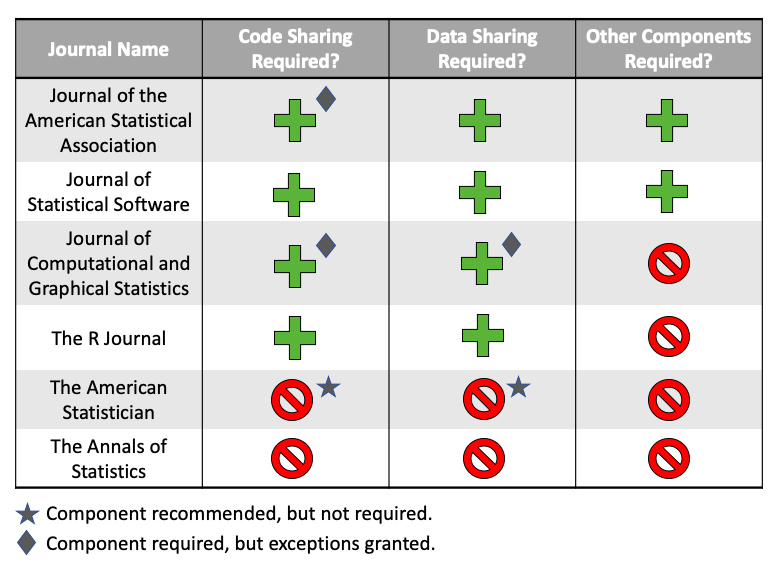

<!--
This is for including Chapter 1.  Notice that it's also good practice to name your chunk.  This will help you debug potential issues as you knit.  The chunk above is called intro and the one below is called chapter1.  Feel free to change the name of the Rmd file as you wish, but don't forget to change it here from chap1.Rmd.
-->

<!--
The {#rmd-basics} text after the chapter declaration will allow us to link throughout the document back to the beginning of Chapter 1.  These labels will automatically be generated (if not specified) by changing the spaces to hyphens and capital letters to lowercase.  Look for the reference to this label at the beginning of Chapter 2.
-->

# An Introduction to Reproducibility {#reproducibility}

## What is reproducibility?

In the field of data science, research is considered fully *reproducible* when the requisite code and data files produce identical results when run by another analyst, or more generally, when a researcher can "duplicate the results of a prior study using the same materials as were used by the original investigator" (@arlington).


This term was first coined in 1992 by computer scientist Jon Claerbout, who associated it with a "software platform and set of procedures that permit the reader of a paper to see the entire processing trail from the raw data and code to figures and tables" (@claerbout).

Since its inception, the concept of reproducibility has been applied across many different data-intensive fields, including epidemiology, computational biology, economics, clinical trials, and, now, the more general domain of statistical and data sciences (@Goodman341ps12).

Reproducible research has a wide variety of benefits in the scientific community. When researchers provide the code and data used for their work in a well-organized and reproducible format, readers are more easily able to determine the veracity of any findings by following the steps from raw data to conclusions. The creators of reproducible research can also more easily receive more specific feedback (including bug fixes) on their work. Moreover, others interested in the research topic can use the code to apply the methods and ideas used in one project to their own work with minimal effort. 

Although often confused, the concept of *reproducibility* is distinct from the similar idea of *replicability*: the ability of a researcher to duplicate the results of a study when following the original procedure but collecting new data. Replicability has larger-scale implications than reproducibilty; the findings of research studies can not be accepted unless a variety of other researchers come to the same conclusions through independent work.

```{r out.width = '100%', echo = FALSE}
knitr::include_graphics("figure/versus.png")
```

Reproducibility and replicability are both necessary to the advancement of scientific research, but they vary significantly in terms of their difficulty to achieve. Reproducibility, in theory, is somewhat simple to attain in data analyses--because code is inherently non-random (excepting applications involving random number generation) and data remain consistent, variability is highly restricted. The achievement of replicability, on the other hand, is a much more complex challenge, involving significantly more variablility and requiring high quality data, effective study design, and incredibly robust hypotheses.


## The Reproducibility Crisis

Despite the relative simplicity of achieving reproducibility, a significant proportion of the work produced in the scientific community fails to meet reproducibility standards. 52% of respondents in a 2016 Nature survey believed that science was going through a "crisis" of reproducibility. Additionally, the vast majority of researchers across all fields studied reported having been unable to reproduce another researcher's results, while approximately half reported having been unable to reproduce their own (@nature-crisis). Other studies paint an even bleaker picture: a 2015 study found that over 50% of studies psychology failed reproducibility tests and research from 2012 found that figure closer to 90% in the field of cancer biology (@nature-psych, @begley2012raise).

In the past several years, this "crisis" of reproducibility has risen toward the forefront of scientific discussion. Without reproducibility, the scientific community cannot properly verify study results.This makes it difficult to identify which information should be believed and which should not and increases the likelihood that studies sharing misleading information will be dispersed. The rise of data-driven technologies, alongside our newly founded ability to instantly share knowledge worldwide, has made reproducibility increasingly critical to the advancement of scientific understanding, necessitating the development of solutions for addressing the issue. 

Academics have recognized this, and publications on the topic appear to have increased siginficantly in the last several years (@eisner-reproducibility; @sep-scientific-reproducibility; @bioessays-gosselin; @engineering-reproducibility; @plos-biology).

## The Components of Reproducible Research

In order to address the lack of reproducibility in scientific research, it is important to first consider the question: Which components are necessary to declare research reproducibile?

Publications attempting to answer this can be found in all areas of scientific research. However, as @Goodman341ps12 argue, the language and conceptual framework used to describe research reproducibility varies significantly across the sciences, and there are no clear standards on reproducibility agreed upon by the scientific community as a whole. 

At a minimum, according to @Goodman341ps12, documenting reproducibility requires the sharing of data (raw or processed), relevant metadata, code, and related software. However, according to other authors, the full achievement of reproducibility may require additional components.

@kitzes2017practice present a collection of case studies on reproducibility practices from across the data-intensive sciences, illustrating a variety of recommendations and techniques for achieving reproducibility. Although their work does not come to a consensus on the exact standards of reproducibility that should be followed, several common trends and principles emerge from their case studies that extend beyond the minimum recommendations of @Goodman341ps12: 

1) use clear separation, labeling, and documentation in provided code,
2) automate processes when possible, and
3) design the data analysis workflow as a sequence of small steps glued together, with outputs from one step serving as inputs into the next. This is a common suggestion within the computing community, originating as part of the Unix philosophy (@unix).

@cooper2017guide focus on data analysis completed in `R` and identify a similar list of important reproducibility components, reinforcing the need for clearly labeled, well-documented, and well-separated files. In addition, they recommend publishing a list of software dependencies and using version control to track project changes over time.

@broman reiterates the need for clear naming and file separation while sharing several additional suggestions: keep the project contained in one directory, use relative paths when accessing the file system, and include a `README` file describing the project.

The reproducibility recommendations from R OpenSci, a non-profit initiative founded in 2011 to make scientific data retrieval reproducible, share similar principles to those discussed previously. They focus on a need for a well-developed file system, with no extraneous files and clear labeling. They also reiterate the need to note dependencies and use automation when possible, while making clear a suggestion not present in the previously-discussed literature: the need to use seeds, which allow for the saving and restoring of the random number generator state, when running code involving randomness (@r-opensci).

Although these recommendations differ from one another, when considered in combination they provide a well-rounded picture of the components important to research reproducibility across the scientific community:

1. The basic project components are made accessible:

  - Data (raw and/or processed)
  - Metadata
  - Code
  - Related Software

2. The file structure of project is well-organized:

  - Separate folders for different file types.
  - No extraneous files.
  - Minimal clutter.

3. The project is documented well:

  - Files are clearly named, preferably in a way where the order in which they should be run is clear.
  - A README is present.
  - Software dependencies are noted.

4. File paths used in code are not system- or user-dependent:

  - No absolute paths.
  - No paths leading to locations outside of a project's directory.
  - Only relative paths, pointing to locations within a project's directory, are permitted.

5. Randomness is accounted for:

  - If randomness is used in code, a seed must also be set.

6. Readable, styled code:

  - Though not mentioned in the sources described previously, it is also important that code be written in a coherent style. This is because code that conforms to a style guide or is written in a consistent dialect is easier to read, simplifying the process of following a researcher's work from beginning to end (@hermans2017programming). 

## Current Attempts to Address Reproducibility in Scientific Publishing

** NEED SOME STUFF HERE SUMMARIZING THIS WHOLE IDEA*

### Case Studies in Journal Reproducibility Policy Across The Sciences

In an attempt to increase reproducibility in the sciences, leaders from academic journals around the world have taken steps to create new standards and requirements for submitted articles. However, these standards are highly inconsistent, varying significantly both across and within disciplines.

The journal whose requirements appear to align most closely with those components defined previously in Section 3 is the *American Journal of Political Science* (AJPS). In 2012, the AJPS became the first political science journal to require authors to make their data openly accessible online, and the publication has instituted stricter requirements since. AJPS now requires that authors submit the following alongside their papers (@ajps-guidelines).

* The dataset analyzed in the paper and information about its source. If the dataset has been processed, instructions for manipulating the raw data to achieve the final data must also be shared.
* Detailed, clear code necessary for reproducing all of the tables and figures in the paper.
* Documentation, including a README and codebook.
* Information about the software used to conduct the analysis, including the specific versions and packages used.

These standards are quite thorough and contain mandates for the inclusion of the vast majority of components necessary for complete reproducibility. Most journals, however, do not come close to meeting such high standards in their reproducibility statements. We will consider examples from several fields:

In the biomedical sciences, a group of editors reproesenting over 30 major journals met in 2014 to address reproducibility in their field, coming to a consensus on a set of principles they wanted to uphold (@bio-principles). Listed below are those relating specifically to the use of data and statistical methods:

1) Journals in the biomedical sciences should have a mechanism to check the statistical accuracy of submissions.

2) Journals should have no (or generous) limit on methods section length.

3) Journals should use a checklist to ensure the reporting of key information, including: 

  - The article meets nomenclature/reporting standards of the biomedical field.
  - Investigators report how often each experiment was performed and whether results were substantiated by repetition under a range of conditions.
  - Statistics must be fully reported in the paper (including test used, value of N, definition of center, dispersion and precision measures).
  - Authors must state whether samples were randomized and how.
  - Authors must state whether the experiment was blinded.
  - Authors must clearly state the criteria used for exclusion of any data or subjects and must include all results, even those that do not support the main findings.
  
4) All datasets used in analysis must be made available on request and should be hosted on public repositories when possible. If not possible, data values should be presented in the paper or supplementary information.

5) Software sharing should be encouraged. At the minimum, authors should provide a statement describing if software is available and how to obtain it.

Even though these principles seem well-developed on the surface, they fail to meet even the basic requirements defined by @Goodman341ps12 previously. Several of the principles are purely recommendations; there is no requirement that code be shared, nor metadata. Additionally, software requirements are quite loose, requiring no information about dependencies or software version.

We see a similar issue even in journals designed specifically for the purpose of improving scientific reproducibility. *Experimental Results*, a publication created by Cambridge University Press to address some of the reproducibility and open access issues in academia, also falls short of meeting high standards. The journal, which showcases articles from a variety of scientific decisions disciplines, states in their transparency and openness policy: 

> Whenever possible authors should make evidence and resources that underpin published findings, such as data, code, and other materials, available to readers without undue barriers to access. 

The inclusion of code and data are only recommended and no definition of what "other materials" may mean is provided. No components of reproducibility extending beyond those required at a minimum are even considered (@exp-results).

The *American Economic Review*, the first of the top economics journals to require the inclusion of data alongside publications, has stronger guidelines than several of those mentioned previously, though not as strong as the *American Journal of Political Science*. Their Data and Code Availability Policy states the following (@aee-policy):

> It is the policy of the American Economic Association to publish papers only if the data and code used in the analysis are clearly and precisely documented, and access to the data and code is clearly and precisely documented and is non-exclusive to the authors.

These requirements are quite strict, prohibiting exceptions for papers using data or code not available to the public in the way that many other journals claiming to promote reproducibility do.

### Case Studies In The Statistical And Data Sciences

In the field of statistical and data sciences, the majority of highly ranked journals contain statements on reproducibility. Some of these are quite robust, surpassing the requirements of many of the other journals discussed previously, while others are lacking.

The *Journal of the American Statistical Association* stands out as having relatively robust requirements. The publication's guideliens require that data be made publicly available at the time of publication except for reasons of security or confidentiality. It is strongly recommended that code be deposited in open repositories. If data is used in a process form, the provided code should include the necessary cleaning/preparation steps. Data must be in an easily understood form and a data dictionary should be included. Code should also be in a form that can be used and understood by others, including consistent and readable syntax and comments. Workflows involving more than one script should also contain a master script, Makefile, or other mechanism that makes it clear what each component does, in what order to run them, and what the inputs and outputs to each area (@asa-guide).

The *Journal of Statistical Software* also has strong guidelines, though less thorough. Authors must provide *commented* source code for their software; all figures, tables, and output must be exactly reproducible on at least one platform, and random number generation must be controlled; and replication materials (typically in the form of a script) must be provided (@jss-guide).

The expectations of the *Journal of Computational and Graphical Statistics* are notably weaker, requiring only that authors "submit code and datasets as online supplements to the manuscript," with exceptions for security or confidentiality, but providing no further detail (@jcgs-guide). The *R Journal* has the same requirements, but with no exceptions on the data provision policy, stating that authors should "not use such datasets as examples" (@r-journal).

Perhaps the weakest reproducibility policies come from *The American Statistician* and the *Annals of Statistics*. The former appears to have no requirements, stating only that it "strongly encourages authors to submit datasets, code, other programs, and/or appendices that are directly relevant to their submitted articles," while the latter appears to have no statement on reproducibility at all (@ams-guide)  https://imstat.org/journals-and-publications/annals-of-statistics/annals-of-statistics-manuscript-submission/.

```{r out.width = '100%'}

```


### The Big Picture: Reproducibility Across Academia

While previously we have focused on several case studies, it is important to also consider the wider view of the state of reproducibility policy across scientific journals. Are the examples considered previously relatively standard, or are their policies either stronger or weaker than the average policy in academia?

Academics at the Center for Open Science (COS) attempted to create a metric, called the TOP Factor, to help answer this. The TOP Factor reports the steps that a journal is taking to implement open science practices. Publications receive a score from 0 to 3 based on how well they achieve different aspects of open science: 

* Data citation
* Data transparency
* Analytical code transparency
* Materials transparency
* Reporting guidelines
* Study preregistration
* Replication
* Publication Bias 

A journal's final score is the sum of the individual scores in each of the categories. The full rubric for how the scores are calculated can be found at the following site: https://osf.io/t2yu5/.

When looking at the overall distribution of TOP Factor scores, we see a relatively grim picture: Around 50% of journals score as low as 0-5 overall, while only just over 5% score more than 15, just half of the maximum possible score. Over 40 journals failed to score a single point. **Source**: https://www.natureindex.com/news-blog/top-factor-rates-journals-on-transparency-openness

Although it is clear that some journals have relatively strong reproducibility and openness policies, that is clearly not the norm. And many that do appear to have policies lacking in robustness, including exceptions for data privacy and security concerns or phrasing guidelines as recommendations rather than reqquirements. The field of data science stands out among the rest, with the majority of top journals having relatively robust policies.

### Assessing the Success of Academic Reproducibility Policies

We have seen that, although not necessarily the standard, many journals across the sciences have enacted reproducibility policies. The simple implementation of a policy, however, does not ensure that its goals will be achieved. Reproducibility can only be addressed when both authors *and* journal reviewers actively implement publishing standards in practice. Without participation and dedication from all involved, reproducibility guidelines serve more as a theoretical goal than a practical achievement.

It is important to ask, then, whether academic reproducibility standards *actually* result in a greater number of reproducible publications.

Let us consider the case of the journal *Science*. *Science* instituted a reproducibility policy in 2011 and has maintained it ever since. In its original form, their policy stated the following:

> All data necessary to understand, assess, and extend the conclusions of the manuscript must be available to any reader of Science. All computer codes involved in the creation or analysis of data must also be available to any reader of Science. After publication, all reasonable requests for data and materials must be fulfilled. Any restrictions on the availability of data, codes, or materials...must be disclosed to the editors upon submission...

This policy is similar to many of the others considered previously, requiring the publishing of code and data with exceptions permitted when necessary.

Researchers Victoria Stodden, Jennifer Seiler, and Zhaokun Ma (https://www.pnas.org/content/115/11/2584) tested the efficacy of this policy in practice, emailing corresponding authors of 204 articles published in the year after *Science* first implmented its policy to request the data and code associated with their articles. The researchers only received (at least some of) the requested material from 36% of authors. This low rates were due to several factors:

* 26% of authors did not respond to email contact.
* 11% of authors were unwilling to provide the data or code without further information regarding the researchers' intentions.
* 11% asked the researchers to contact someone else and that person did not respond.
* 7% refused to share data and/or code.
* 3% directed the researchers back to their paper's supplmental information section.
* 3% of authors made a promise to follow up and then did not follow through.
* 3% of emails bounced.
* 2% gave reasons why they could not share for ethical reasons, size limitations, or some other reason.

Of the 56 papers they deemed likely reproducible, the authors randomly selected 22 and were able to replicate the results for all but 1, which failed due to its reliance on software that was no longer available.

A similar study was done on the journal *Cognition*, where researchers compared the reproducibility of published work both before and after the journal instituted an open data policy, which required that authors make relevant research data publicly available prior to publication of an article.

The researchers found a considerable increase in the proportion of data available statements (in constrast to 'data not available' statements, which could be present due to privacy or security concerns) since the implementation of the policy. Pre-open data policy, only 25% of articles had data available, while that number was a much higher 78% after the policy was put in place. 

While the institution of an open data policy appears to have been associated with a significant increase in the percentage of studies with data available, further research indicates that the policy was perhaps not as effective as intended. Many of the datasets were usable in theory, but not in practice. Only 62% of the articles with data available statements had truly reusable datasets--in this case, meaning that the data were accessible, complete, and understandable. Though this is an increase from the pre-policy period, which saw 49% of articles with data availability statements as reusable in practice, it is still far from ideal. 

Combining these two data points indicates that *less than half* of articles published after the open data policy was instituted actually contained truly usable data.

**Source** https://royalsocietypublishing.org/doi/full/10.1098/rsos.180448

In this small sample of cases, we see that purely having a reproducibility statement does not necessarily mean that all, or even a majority, of published work will truly be reproducible.

## Limitations on Achieving Reproducibility

There are several reasons for this apparent divide between journal reproducibility standards and the true proportion of submitted articles that are truly reproducible. Some of these are challenges faced by the article authors, while others are faced by the journal editors.

### Challenges for Authors

A *Springer Nature* survey asked over 7,700 researchers about one of the key characteristics of reproducibility -- open data -- and gathered information about the reasons why authors found difficulties in making their data available to the public.

The main challenges listed by respondents were as follows:

* 46% identified "Organizing data in a presentable and useful way" to be difficult.
* 37% had been "Unsure about copyright and licensing."
* 33% had problems with "Not knowing which repository to use."
* 26% cited a "Lack of time to deposit data."
* 19% found the "Costs of sharing data" to be high.

The relative frequency of these issues varied across several characteristics, including author seniority, subject area, and geographical location, though authors in all categories faced some issues.

**STUDY LINK** https://figshare.com/articles/Whitepaper_Practical_challenges_for_researchers_in_data_sharing/5975011

Given the relatively high frequency of concern over achieving reproducibility, it follows that researchers will not make the necessary effort to do so if journal guidelines provide a way out. Policies that *recommend* the inclusion of data or that allow exceptions to open data for certain reasons are likely to be associated with a lower proportion of reproducible articles than those that make open data mandatory.

### Challenges for Journals

In addition to the challenges faced on the part of the authors, journal reviewers face their own difficulties in ensuring reproducibility.

In order to make sure that all submitted articles comply with reproducibility guidelines, reviewers must go through them one by one and reproduce all of the results by hand using the provided materials.

This is an incredibly intensive process, as we will see in the example of the *American Journal for Political Science* (AJPS), whose reproducibility policy was discussed prevously in Chapter 1.4.1.

Acceptance of an article for publication in the AJPS is contingent on successful reproducibility of any empirical analyses reported in the article. 

After an article is submitted, staff from a third party vendor hired by AJPS go through the provided materials to ensure that they can be preserved, understood, and used by others. They then run all of the analyses in the article using the code, instructions, and data provided by the authors and compare their results to the submitted articles. Authors are then given an opportunity to resolve any issues that come up. This process is repeated until reproducibility is ensured.

Although providing a significant benefit to the scientific community, this thorough process is associated with high costs. 

The verification process slows down the journal review process significantly, adding a median 53 days to the publication workflow, as many submitted articles require one or more rounds of resubmission (the average number of resubmissions is 1.7). It is also quite labor intensive, taking an average of 8 person-hours per manuscript to reproduce the analyses and prepare the materials for public release and adding significant monetary cost to AJPS.

https://www.insidehighered.com/blogs/rethinking-research/should-journals-be-responsible-reproducibility

Journals are often reluctant to take on such an intensive task due to the drastically increased burden it places on reviewers and on the publication's financial resources. This is particularly true given that the number of submitted articles per year has been increasing over time. ( https://www.ncbi.nlm.nih.gov/pmc/articles/PMC4317455/ ) Every additional submission increases the burden of achieving reproducibility, and with a large enough volume, the challenge can quickly become seemingly impossible to manage reasonably. 

As a result, journals often encourage reviewers to consider authors' compliance with data sharing policies, but do not formally require that they ensure it as a criterion for acceptance. https://link.springer.com/chapter/10.1007/164_2019_290


http://emiguel.econ.berkeley.edu/assets/miguel_research/78/jel.20171350.pdf


## Reproducibility Education


