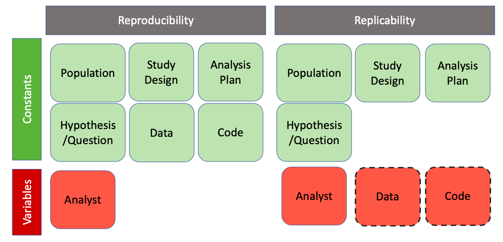

<!--
This is for including Chapter 1.  Notice that it's also good practice to name your chunk.  This will help you debug potential issues as you knit.  The chunk above is called intro and the one below is called chapter1.  Feel free to change the name of the Rmd file as you wish, but don't forget to change it here from chap1.Rmd.
-->

<!--
The {#rmd-basics} text after the chapter declaration will allow us to link throughout the document back to the beginning of Chapter 1.  These labels will automatically be generated (if not specified) by changing the spaces to hyphens and capital letters to lowercase.  Look for the reference to this label at the beginning of Chapter 2.
-->

# An Introduction to Reproducibility {#reproducibility}

## What Is Reproducibility?

In the field of data science, research is considered fully *reproducible* when the requisite code and data files produce identical results when run by another analyst, or more generally, when a researcher can "duplicate the results of a prior study using the same materials as were used by the original investigator" (@arlington).

This term was first coined in 1992 by computer scientist Jon Claerbout, who associated it with a "software platform and set of procedures that permit the reader of a paper to see the entire processing trail from the raw data and code to figures and tables" (@claerbout).

Since its inception, the concept of reproducibility has been applied across many different data-intensive fields, including epidemiology, computational biology, economics, clinical trials, and, now, the more general domain of statistical and data sciences (@Goodman341ps12).

Reproducible research has a wide variety of benefits in the scientific community. When researchers provide the code and data used for their work in a well-organized and reproducible format, readers are more easily able to determine the veracity of any findings by following the steps from raw data to conclusions. The creators of reproducible research can also more easily receive more specific feedback (including bug fixes) on their work. Moreover, others interested in the research topic can use the code to apply the methods and ideas used in one project to their own work with minimal effort. 

Although often confused, the concept of *reproducibility* is distinct from the similar idea of *replicability*: the ability of a researcher to duplicate the results of a study when following the original procedure but collecting new data. Replicability has larger-scale implications than reproducibilty; the findings of research studies can not be accepted unless a variety of other researchers come to the same conclusions through independent work.

```{r out.width = '100%', echo = FALSE, fig.align = 'center', fig.cap = "Reproducibility vs. Replicability"}

```

Reproducibility and replicability are both necessary to the advancement of scientific research, but they vary significantly in terms of their difficulty to achieve. Reproducibility, in theory, is somewhat simple to attain in data analyses--because code is inherently non-random (excepting applications involving random number generation) and data remain consistent, variability is highly restricted. The achievement of replicability, on the other hand, is a much more complex challenge, involving significantly more variablility and requiring high quality data, effective study design, and incredibly robust hypotheses.


## The Reproducibility Crisis

Despite the relative simplicity of achieving reproducibility, a significant proportion of the work produced in the scientific community fails to meet reproducibility standards. 52% of respondents in a 2016 Nature survey believed that science was going through a "crisis" of reproducibility. Additionally, the vast majority of researchers across all fields studied reported having been unable to reproduce another researcher's results, while approximately half reported having been unable to reproduce their own (@nature-crisis). Other studies paint an even bleaker picture: a 2015 study found that over 50% of studies psychology failed reproducibility tests and research from 2012 found that figure closer to 90% in the field of cancer biology (@nature-psych, @begley2012raise).

In the past several years, this "crisis" of reproducibility has risen toward the forefront of scientific discussion. Without reproducibility, the scientific community cannot properly verify study results.This makes it difficult to identify which information should be believed and which should not and increases the likelihood that studies sharing misleading information will be dispersed. The rise of data-driven technologies, alongside our newly founded ability to instantly share knowledge worldwide, has made reproducibility increasingly critical to the advancement of scientific understanding, necessitating the development of solutions for addressing the issue. 

Academics have recognized this, and publications on the topic appear to have increased siginficantly in the last several years (@eisner-reproducibility; @sep-scientific-reproducibility; @bioessays-gosselin; @engineering-reproducibility; @plos-biology).

## The Components of Reproducible Research

In order to see why there is an issue with reproducibility and gain a sense of how to solve it, it is important to first understand the components of reproducibility. Essentially, to answer, "What parts does researcher need to include, or what steps do they need to take, to be able to declare their work reproducible?"

Publications attempting to answer this can be found in all areas of scientific research. However, as @Goodman341ps12 argue, the language and conceptual framework used to describe research reproducibility varies significantly across the sciences, and there are no clear standards on reproducibility agreed upon by the scientific community as a whole.

At a minimum, according to @Goodman341ps12, achieving reproducibility requires the sharing of data (raw or processed), relevant metadata, code, and related software. However, according to other authors, the full achievement of reproducibility may require additional components.

@kitzes2017practice present a collection of case studies on reproducibility practices from across the data-intensive sciences, illustrating a variety of recommendations and techniques for achieving reproducibility. Although their work does not come to a consensus on the exact standards of reproducibility that should be followed, several common trends and principles emerge from their case studies that extend beyond the minimum recommendations of @Goodman341ps12: 

1) use clear separation, labeling, and documentation in provided code,
2) automate processes when possible, and
3) design the data analysis workflow as a sequence of small steps glued together, with outputs from one step serving as inputs into the next. This is a common suggestion within the computing community, originating as part of the Unix philosophy (@unix).

@cooper2017guide focus on data analysis completed in `R` and identify a similar list of important reproducibility components, reinforcing the need for clearly labeled, well-documented, and well-separated files. In addition, they recommend publishing a list of software dependencies and using version control to track project changes over time.

@broman reiterates the need for clear naming and file separation while sharing several additional suggestions: keep the project contained in one directory, use relative paths when accessing the file system, and include a `README` file describing the project.

@wilson2017good argue that to follow good practice, an analysis must be located in a well-organized directory, be supplemented by a file containing information about the project (i.e., a README), and a provide an explicit list of dependencies. 

@wilson2014best emphasize communication, recommending that code be human-readable and consistently styled for ease of understanding once shared.

The reproducibility recommendations from R OpenSci, a non-profit initiative founded in 2011 to make scientific data retrieval reproducible, share similar principles to those discussed previously. They focus on a need for a well-developed file system, with no extraneous files and clear labeling. They also reiterate the need to note dependencies and use automation when possible, while making clear a suggestion not present in the previously-discussed literature: the need to use seeds, which allow for the saving and restoring of the random number generator state, when running code involving randomness (@r-opensci).

Although these recommendations differ from one another, when considered in combination they provide a well-rounded picture of the components important to research reproducibility across the scientific community:

1. The basic project components are made accessible to the public:

  - Data (raw and/or processed)
  - Metadata
  - Code
  - Related Software

2. The file structure of project is well-organized:

  - Separate folders for different file types.
  - No extraneous files.
  - Minimal clutter.

3. The project is documented well:

  - Files are clearly named, preferably in a way where the order in which they should be run is clear.
  - A README is present.
  - Code contains comments.
  - Software dependencies are noted.
  

4. File paths used in code are not system- or user-dependent:

  - No absolute paths.
  - No paths leading to locations outside of a project's directory.
  - Only relative paths, pointing to locations within a project's directory, are permitted.

5. Randomness is accounted for:

  - If randomness is used in code, a seed must also be set.

6. Code is readable and consistently styled:

  - Though not mentioned in the sources described previously, it is also important that code be written in a coherent style. This is because code that conforms to a style guide or is written in a consistent dialect is easier to read, simplifying the process of following a researcher's work from beginning to end (@hermans2017programming). 

## Current Attempts to Address Reproducibility in Scientific Publishing

In an attempt to increase reproducibility, leaders from academic journals around the world have taken steps to create new standards and requirements for submitted articles. These standards attempt to address the components of reproducibility listed previously, requesting that authors provide certain materials necessary for reproducibing their work when they submit an article. However, these standards are highly inconsistent, varying significantly both across and within disciplines, and many only cover one or two of the six primary components, if any at all.

To illustrate this point, we will consider several case studies from journals publishing research on a variety of scientific fields.


### Case Studies Across The Sciences

The journal whose requirements appear to align most closely with those components defined previously in Section 3 is the *American Journal of Political Science* (AJPS). In 2012, the AJPS became the first political science journal to require authors to make their data openly accessible online, and the publication has instituted stricter requirements since. AJPS now requires that authors submit the following alongside their papers (@ajps-guidelines).

* The dataset analyzed in the paper and information about its source. If the dataset has been processed, instructions for manipulating the raw data to achieve the final data must also be shared.
* Detailed, clear code necessary for reproducing all of the tables and figures in the paper.
* Documentation, including a README and codebook.
* Information about the software used to conduct the analysis, including the specific versions and packages used.

These standards are quite thorough and contain mandates for the inclusion of the vast majority of components necessary for complete reproducibility. Most journals, however, do not come close to meeting such high standards in their reproducibility statements. 

For example, in the biomedical sciences, a group of editors reproesenting over 30 major journals met in 2014 to address reproducibility in their field, coming to a consensus on a set of principles they wanted to uphold (@bio-principles). Listed below are those relating specifically to the use of data and statistical methods:

1) Journals in the biomedical sciences should have a mechanism to check the statistical accuracy of submissions.

2) Journals should have no (or generous) limit on methods section length.

3) Journals should use a checklist to ensure the reporting of key information, including: 

  - The article meets nomenclature/reporting standards of the biomedical field.
  - Investigators report how often each experiment was performed and whether results were substantiated by repetition under a range of conditions.
  - Statistics must be fully reported in the paper (including test used, value of N, definition of center, dispersion and precision measures).
  - Authors must state whether samples were randomized and how.
  - Authors must state whether the experiment was blinded.
  - Authors must clearly state the criteria used for exclusion of any data or subjects and must include all results, even those that do not support the main findings.
  
4) All datasets used in analysis must be made available on request and should be hosted on public repositories when possible. If not possible, data values should be presented in the paper or supplementary information.

5) Software sharing should be encouraged. At the minimum, authors should provide a statement describing if software is available and how to obtain it.

Even though these principles seem well-developed on the surface, they fail to meet even the basic requirements defined by @Goodman341ps12 previously. Several of the principles are purely recommendations; there is no requirement that code be shared, nor metadata. Additionally, software requirements are quite loose, requiring no information about dependencies or software version.

We see a similar issue even in journals designed specifically for the purpose of improving scientific reproducibility. *Experimental Results*, a publication created by Cambridge University Press to address some of the reproducibility and open access issues in academia, also falls short of meeting high standards. The journal, which showcases articles from a variety of scientific decisions disciplines, states in their transparency and openness policy: 

> Whenever possible authors should make evidence and resources that underpin published findings, such as data, code, and other materials, available to readers without undue barriers to access. 

The inclusion of code and data are only recommended and no definition of what "other materials" may mean is provided. No components of reproducibility extending beyond those required at a minimum are even considered (@exp-results).

The *American Economic Review*, the first of the top economics journals to require the inclusion of data alongside publications, has stronger guidelines than several of those mentioned previously, though not as strong as the *American Journal of Political Science*. Their Data and Code Availability Policy states the following (@aee-policy):

> It is the policy of the American Economic Association to publish papers only if the data and code used in the analysis are clearly and precisely documented, and access to the data and code is clearly and precisely documented and is non-exclusive to the authors.

These requirements are quite strict, prohibiting exceptions for papers using data or code not available to the public in the way that many other journals claiming to promote reproducibility do.

### Case Studies In The Statistical And Data Sciences

When considering reproducibility policy, the field of Statistical and Data Sciences performs relatively well. The majority of highly ranked journals in the field contain statements on reproducibility. Some of these are quite robust, surpassing the requirements of many of the other journals discussed previously, while others are lacking.

The *Journal of the American Statistical Association* stands out as having relatively robust requirements. The publication's guideliens require that data be made publicly available at the time of publication except for reasons of security or confidentiality. It is strongly recommended that code be deposited in open repositories. If data is used in a process form, the provided code should include the necessary cleaning/preparation steps. Data must be in an easily understood form and a data dictionary should be included. Code should also be in a form that can be used and understood by others, including consistent and readable syntax and comments. Workflows involving more than one script should also contain a master script, Makefile, or other mechanism that makes it clear what each component does, in what order to run them, and what the inputs and outputs to each area (@asa-guide).

The *Journal of Statistical Software* also has strong guidelines, though less thorough. Authors must provide *commented* source code for their software; all figures, tables, and output must be exactly reproducible on at least one platform, and random number generation must be controlled; and replication materials (typically in the form of a script) must be provided (@jss-guide).

The expectations of the *Journal of Computational and Graphical Statistics* are notably weaker, requiring only that authors "submit code and datasets as online supplements to the manuscript," with exceptions for security or confidentiality, but providing no further detail (@jcgs-guide). The *R Journal* has the same requirements, but with no exceptions on the data provision policy, stating that authors should "not use such datasets as examples" (@r-journal).

Perhaps the weakest reproducibility policies come from *The American Statistician* and the *Annals of Statistics*. The former appears to have no requirements, stating only that it "strongly encourages authors to submit datasets, code, other programs, and/or appendices that are directly relevant to their submitted articles," while the latter appears to have no statement on reproducibility at all (@ams-guide).

```{r out.width = '100%', echo = FALSE, fig.align = 'center', fig.cap = "Reprodubility Policies of Top Statistical and Data Sciences Journals"}
knitr::include_graphics("figure/stats-journals.png")
```

### The Bigger Picture

The journals mentioned here are just some of the many academic publishers with reproducibility policies. While they provide a sense of the specific wording and requirements of some policies, they do not necessarily serve as a representative sample of all academic publishing. It is important to also consider the bigger picture, exploring the state of reproducibility policy in academic publishing as a whole.

Given the scale of the academic publishing network and the sheer number of journals around the world, this is not necessarily an easy task. 

In order to simplify this process, academics at the Center for Open Science (COS) attempted to create a metric, called the TOP Factor. The TOP Factor reports the steps that a journal is taking to implement open science practices. It has been calculated for a wide variety of journals, though the COS is still far from scoring all of the publications that are currently available. 

The TOP Factor is calculated as follows. Publications are scored on a variety of categories associated with open science and reproducibility. For each category, they receive a score between 0 (poor) and 3 (excellent) based on the degree to which they emphasize each category in their submission/publication policies.  A journal's final score, which can range from 0 to 30, is the sum of the individual scores in each of the categories. 

```{r top-factor, echo = FALSE, out.width = '100%', fig.align = 'center'}


```

```{r top-factor2, echo = FALSE, out.width = '100%', fig.align = 'center', fig.cap="The TOP Factor Rubric"}

```


When looking at the overall distribution of TOP Factor scores, we see a relatively grim picture: Around 50% of journals score as low as 0-5 overall, while only just over 5% score more than 15, just half of the maximum possible score. Over 40 journals failed to score a single point (@top-guidelines).

Although it is clear that some journals have relatively strong reproducibility and openness policies, that is clearly not the norm. And many that do appear to have policies lacking in robustness, including exceptions for data privacy and security concerns or phrasing guidelines as recommendations rather than reqquirements. The field of data science stands out among the rest, with the majority of top journals having relatively robust policies.

### Assessing the Success of Academic Reproducibility Policies

We have seen that, although not necessarily the standard, some journals across the sciences have enacted reproducibility policies. The simple implementation of a policy, however, does not ensure that its goals will be achieved. Reproducibility can only be addressed when both authors *and* journal reviewers actively implement publishing standards in practice. Without participation and dedication from all involved, reproducibility guidelines serve more as a theoretical goal than a practical achievement.

It is important to ask, then, whether academic reproducibility standards *actually* result in a greater number of reproducible publications.

Let us consider the case of the journal *Science*. *Science* instituted a reproducibility policy in 2011 and has maintained it ever since. In its original form, their policy stated the following:

> All data necessary to understand, assess, and extend the conclusions of the manuscript must be available to any reader of Science. All computer codes involved in the creation or analysis of data must also be available to any reader of Science. After publication, all reasonable requests for data and materials must be fulfilled. Any restrictions on the availability of data, codes, or materials...must be disclosed to the editors upon submission...

This policy is similar to many of the others considered previously, requiring the publishing of code and data with exceptions permitted when necessary.

@policy-effectiveness tested the efficacy of this policy in practice, emailing corresponding authors of 204 articles published in the year after *Science* first implmented its policy to request the data and code associated with their articles. The researchers only received (at least some of) the requested material from 36% of authors. This low rates were due to several factors:

* 26% of authors did not respond to email contact.
* 11% of authors were unwilling to provide the data or code without further information regarding the researchers' intentions.
* 11% asked the researchers to contact someone else and that person did not respond.
* 7% refused to share data and/or code.
* 3% directed the researchers back to their paper's supplmental information section.
* 3% of authors made a promise to follow up and then did not follow through.
* 3% of emails bounced.
* 2% gave reasons why they could not share for ethical reasons, size limitations, or some other reason.

Of the 56 papers they deemed likely reproducible, the authors randomly selected 22 and were able to replicate the results for all but 1, which failed due to its reliance on software that was no longer available.

@hardwicke2018data conducted a study on the journal *Cognition*, where researchers compared the reproducibility of published work both before and after the journal instituted an open data policy, which required that authors make relevant research data publicly available prior to publication of an article.

The researchers found a considerable increase in the proportion of data available statements (in constrast to 'data not available' statements, which could be present due to privacy or security concerns) since the implementation of the policy. Pre-open data policy, only 25% of articles had data available, while that number was a much higher 78% after the policy was put in place. 

While the institution of an open data policy appears to have been associated with a significant increase in the percentage of studies with data available, further research indicates that the policy was perhaps not as effective as intended. Many of the datasets were usable in theory, but not in practice. Only 62% of the articles with data available statements had truly reusable datasets--in this case, meaning that the data were accessible, complete, and understandable. Though this is an increase from the pre-policy period, which saw 49% of articles with data availability statements as reusable in practice, it is still far from ideal. 

Combining these two data points indicates that *less than half* of articles published after the open data policy was instituted actually contained truly usable data.

In this small sample of cases, we see that purely having a reproducibility statement does not necessarily mean that all, or even a majority, of published work will truly be reproducible.

## Limitations on Achieving Reproducibility in Scientific Publishing

There are several reasons for this apparent divide between journal reproducibility standards and the true proportion of submitted articles that are truly reproducible. Some of these are challenges faced by the article authors, while others are faced by the journal editors.

### Challenges for Authors

@Stodden2584 conducted a survey asking over 7,700 researchers about one of the key characteristics of reproducibility -- open data -- and gathered information about the reasons why authors found difficulties in making their data available to the public 

The main challenges listed by respondents were as follows:

* 46% identified "Organizing data in a presentable and useful way" to be difficult.
* 37% had been "Unsure about copyright and licensing."
* 33% had problems with "Not knowing which repository to use."
* 26% cited a "Lack of time to deposit data."
* 19% found the "Costs of sharing data" to be high.

The relative frequency of these issues varied across several characteristics, including author seniority, subject area, and geographical location, though authors in all categories faced some issues.

Beyond technical challenges, other reasons may lead authors to not place their focus on reproducibility. For example, some researchers might fear damage to their reputation if a reproduction attempt fails after they have provided the necessary materials (@lupia2014openness).

Given the relatively high frequency of concern over achieving reproducibility, it follows that researchers will not make the necessary effort to do so if journal guidelines provide a way out. Policies that *recommend* the inclusion of data or that allow exceptions to open data for certain reasons are likely to be associated with a lower proportion of reproducible articles than those that make open data mandatory.

### Challenges for Journals

In addition to the challenges faced on the part of the authors, journal reviewers face their own difficulties in ensuring reproducibility.

In order to make sure that all submitted articles comply with reproducibility guidelines, reviewers must go through them one by one and reproduce all of the results by hand using the provided materials.

This is an incredibly intensive process, as we will see in the example of the *American Journal for Political Science* (AJPS), whose reproducibility policy was discussed prevously in Chapter 1.4.1.

@higher-ed describe the AJPS process in detail:

Acceptance of an article for publication in the AJPS is contingent on successful reproducibility of any empirical analyses reported in the article. 

After an article is submitted, staff from a third party vendor hired by AJPS go through the provided materials to ensure that they can be preserved, understood, and used by others. They then run all of the analyses in the article using the code, instructions, and data provided by the authors and compare their results to the submitted articles. Authors are then given an opportunity to resolve any issues that come up. This process is repeated until reproducibility is ensured.

Although providing a significant benefit to the scientific community, this thorough process is associated with high costs. 

The verification process slows down the journal review process significantly, adding a median 53 days to the publication workflow, as many submitted articles require one or more rounds of resubmission (the average number of resubmissions is 1.7). It is also quite labor intensive, taking an average of 8 person-hours per manuscript to reproduce the analyses and prepare the materials for public release and adding significant monetary cost to AJPS.

Journals are often reluctant to take on such an intensive task due to the drastically increased burden it places on reviewers and on the publication's financial resources. This is particularly true given that the number of submitted articles per year has been increasing over time (@leopold2015increased). Every additional submission increases the burden of achieving reproducibility, and with a large enough volume, the challenge can quickly become seemingly impossible to manage reasonably. 

As a result, journals often encourage reviewers to consider authors' compliance with data sharing policies, but do not formally require that they ensure it as a criterion for acceptance (@hrynaszkiewicz2020publishers).

## Attempts to Address These Limitations

The previous discussion makes clear that, although reproducibility is critically important to scientific progress and academic journals are taking steps to encourage it, the scientific community is far from achieving the desired level of widespread reproducibility. In large part, this appears due to the challenge and complexity of actually achieving reproducibility. Those attempting to improve the reproducibility of work can face issues with concerns over legality of sharing data, large commitments of time or money, challenges finding a good repository, and organizing all of the many components of their work in an understandable way, among other things. 

Additionally, science faces the additional challenge that many publishers do not emphasize reproducibility at all, providing many opportunities for all authors except those personally dedicated to producing reproducible work to leave reproducibility by the wayside. Many journals have no reproducibility requirements, and those that do often do not take the necessary steps to ensure that they are actually met.

These issues, however, are not impossible to overcome. Proponents of reproducibility have taken action to help address them, both through education on reproducibility and through software that helps simplify the process of achieving it. 

### Through Education

One way to address the reproducibility crisis is to educate data analysts on the topic so that they are aware of both the concept of reproducibility and how to achieve it in their own work. A natural place to focus this education is early on in the data science training pipeline as part of introductory or early-intermediate courses in undergraduate and graduate data science porgrams (@horton2014teaching). This sort of educational integration has a variety of benefits:

* Bringing reproducibility into the discussion early on gives students the tools to add knowledge to their field in the best way possible before they actually conduct any substantive analysis on their own (@janz2016bringing). This produces many long run benefits, helping lessen the burden on promoting reproducibility placed on journals and increasing the number (and percentage) of researchers doing and promoting reproducible work. 

* If covered in detail as part of the data science curriculum, reproducibility will eventually come easily to students. If learned independently, without effective tools, reproducibility can challenging and even disheartening to try to understand and succeed at. Practicing in the classroom gives students the ability to fail without damaging their reputation, giving a great opportunity to truly learn and understand the concepts so that they feel capable of handling them when they begin their own research. 

* The application of grading to the topic provides an incentive for students to pay attention, learn, and absorb the information. This same incentive does not exist when researchers attempt to learn about reproducibility independently. In that situation, internal motivation, which may be weak in some individuals, is the only factor present to help promote success.

Several educators, primarily at the graduate level, have realized the opportunity and taken steps to introduce reproducibility into their courses. 
According to @janz2016bringing, the primary way of achieving this integration is through the assignment of "replication studies" in standard methods choices. In these assignments, students are given a published study and its supporting materials and asked to reproduce the results. The most famous course of this kind is Government 2001, taught by Gary King at Harvard University.  In King's course, students team up in small groups to reproduce a previous study. To help ensure that their workflow is reproducible, students are required to hand over their data and code to another student team who then tries to reproduce their work once again.

In Thomas M. Carsey's intermediate statistics course at the University of North Carolina at Chapel Hill, students must reproduce the findings of a study by re-collecting the data from the original sources, then must extend the study by building on the analysis.

Christopher Fariss of Penn State University asks his students to replicate a research paper published in the last five years, noting that students must describe the article and the ease in which the results replicate.

The University of California at Berkeley has a similar course to Gary King's Harvard course, where students each take a different piece of an existing study to work on reproducing and have to ensure that their piece fits with the piece of the next student (@berkeley_teaching).

At the undergraduate level, rather than assign replication studies the way many graduate schools tend to do, Smith College and Duke University have both integrated reproducibility into their introductory courses through the requirement that assignments be completed in the `RMarkdown` code + narration format (@baumer2014r). 

Another way to provide education on reproducibility is through the creation of workshops that focus solely on the topic, rather than through integration as just one part of a class (@@janz2016bringing).

For example, the University of Cambridge conducts a Replication Workshop, where graduate students are asked replicate a paper in their field over eight weekly sessions. When students encounter challenges, such as authors not responding to queries for data or steps of the analysis being poorly defined and explained, they gain a first hand understanding of the consequences of poor transparency. 

Workshops such as these are typically optional and not included as part of the primary curriculum, however, so while they may cover the topic of reproducibility in more detail than traditional courses, they often reach fewer students.

In spite of all of the advantages that these educational tools provide, "reproducibility training and assessment in data science education is largely neglected, especially among undergraduates and Master’s students in professional schools..., probably because the students are usually considered to be non-research oriented" (@yu2019toward). While some examples of reproducibility education exist, they are certainly not commonplace. However, given the increased discussion and emphasis on reproducibility in academia over the past several years, it is likely that this will change, particularly if methods are provided to educators to make the integration of reproducibility into their courses simple and relatively unburdensome.

### Through Software

Several researchers and members of the Statistical and Data Sciences community have taken action to develop software focused on reproducibility which removes some of the load on data analysts by automating reproducibility processes and checking whether certain components are achieved. 

Much of this software has been written for users of the coding and data analysis language `R`. `R` is very popular in the data science community due to its open-source nature, accessibility, extensive developer and user base, and statsitical analysis-specific features.

Some of the existing software solutions are listed below:

 `rrtools` (@R-rrtools) addresses many of the issues discussed in @marwick2018packaging by creating a basic reproducible structure based on the `R` package format for a data analysis project. In addition, it allows for isolation of the computer environment using `Docker`, provides a method to capture information about the versions of packages used in a project, contains tools for generating a README file, and provides an option for users to write tests to check that their functions operate as intended.
 
 The `orderly` (@R-orderly) package also focuses on file structure, requiring the user to declare a desired project structure (typically a step-by-step structure, where outputs from one step are inputs into the next) at the beginning and then creating the files necessary to achieve that structure. Its principal aim is to automate many of the basic steps involved in writing analyses, making it simple to: 
 
1) Track all inputs into an analysis.
2) Store multiple versions of an analysis where it is repeated.
3) Track outputs of an analysis.
4) Create analyses that depend on the outputs of previous analyses.

When projects have a variety of components, `orderly` makes it easy to see inputs and outputs change with each re-run. 
 
 `workflowr`'s (@R-workflowr) functionality is based around version control and making code easily available online. It works to generate a website containing time-stamped, versioned, and documented results. In addition, it manages the session and package information of each analysis and controls random number generation. 
 
 `checkers` (@R-checkers) allows you to create custom checks that examine different aspects of reproducibility. It also contains some pre-built checks, such as seeing if users reference packages that are less preferred to other similar ones and ensuring that the project is under version control. 
 `renv` (@R-renv) (formerly `packrat`) helps to make projects more isolated, portable, and reproducible. It gives every project its own private package library, makes it easy to install the packages the project depends on if it is moved to another computer.
 
 `drake` (@R-drake) analyzes workflows, skips steps where results are up to date, utilizes optimized computing to complete the rest of the steps, and provides evidence that results match the underlying code and data. 
 
 Lastly, the `reproducible` (@R-reproducible) package focuses on the concept of caching: saving information so that projects can be run faster each time they are re-completed from the start.

```{r, echo = FALSE, out.width = '50%', fig.align = 'center', fig.cap='Popular Reproducibility Packages in R'}

```

There have also been several `Continuous integration` tools developed outside of R which can be used by those coding in almost any language. These provide more general approaches to automated checking, which can enhance reproducibility with minimal code. 

For example, `wercker`---a command line tool that leverages Docker---enables users to test whether their projects will successfully compile when run on a variety of operating systems without access to the user's local hard drive (@wercker). 

`GitHub Actions` is integrated into GitHub and can be configured to do similar checks on projects hosted in repositories. 

`Travis CI` and `Circle CI` are popular continuous integration tools that can also be used to check `R` code. 

```{r, echo = FALSE, out.width = '80%', fig.align = 'center', fig.cap="Popular Continuous Integration Tools"}
knitr::include_graphics("figure/ci-tools.png")
```


## Understanding The Gaps In Existing Reproducibility Solutions

Although the current state of reproducibility in academia is quite poor, it is not an impossible challenge to overcome. The relative simplicity of addressing reproducibility, particularly when compared with replicability, makes it an ideal candidate for solution-building. Although significant progress on addressing reproducibility on a widespread scale is a long-term challenge, impactful forward progress--if on a smaller scale--can be achieved in the short-term. 

As we have seen, software developers, data scientists, and educators around the world have realized this potential, taking steps to help address the current crisis of reproducibility. Journals have put in place guidelines for authors, statisticians have developed `R` packages that help structure projects in a reproducible format, and educators have begun integrate reproducibility exercises into their courses.

We have already explored the issues with journal policies, both for authors and reviewers, in-depth. Educational and software-based strategies attempt to address these policy issues by spreading ideas of reproducibility to more people and simplifying the process of achieving it, therefore resulting (in theory) in an improvement in the reproducibility of published scientific articles.

However, the reality is not quite so rosy. Many current educational and software-based solutions face their own challenges that limit them from achieving the desired outcome. In this section, we will consider these issues.

### In Education

The two primary concerns about the integration of reproducibility in data science curricula revolve around time and difficulty.

As noted previously, the primary mode of teaching reproducibility is through the assignment of replication studies where students must take an existing study and go through the process of reproducing it themselves, including contacting the author for all necessary materials, rerunning code and analysis, and problem-solving when issues almost certainly come up. 

In addition to the time required for the professor to collect all of the studies that students will be working on, the inclusion of such an assignment places a significant burden on educators by taking up time where they could be teaching other important material. Replication studies, if done correctly, can take weeks for students to successfully complete. The choice to give such assignments is therefore associated with a significant opportunity cost which many professors are unwilling to take.

Additionally, both replication studies assigned in class and replication workshops outside of normal coursework require a working knowledge of how to successfully complete and understand research. This makes them inaccessible to individuals who are still in their undergraduate career and may not yet have had an opportunity to conduct research or those who are studying in non-research-focused technical programs.

In order to reach the widest variety of students possible, it is necessary to develop a new method of teaching reproducibility that is neither time consuming nor dependent on a prior understanding of the research process.

### In Software

Previously, we considered several different types of software solutions: packages designed for users of `R` and continuous integration programs that can be used alongside a variety of coding languages. Although these solutions have their advantages, they also have significant drawbacks in terms of their ability to address reproducibility on a widespread scale.

Many of the packages designed for `R` are incredibly narrow in scope, with each effectively addressing a small component of reproducibility: file structure, modularization of code, version control, etc. They often succeed in their area of focus, but at the cost of accessibility to a wider audience. Their functions are often quite complex to use, and many steps must be completed to achieve the required reproducibility goal. This cumbersome nature means that most reproducibility packages currently available are not easily accessible to users with minimal `R` experience, nor particularly useful to those looking for quick and easy reproducibility checks. The significant learning curve associated with them can also detract potential users who may be interested in reproducibility but not willing to dedicate an extensive amount of time to understanding the intricacies of software operation.

Due to their generalized design, Continuous Integration tools do not face the same issues with narrowness or complexity that `R` packages struggle with. However, this generalizability provides its own additional challenge. Since Continuous Integration tools are designed to be accessible to a wide variety of users with different coding preferences, they are not particularly customizable and lack the ability to address features specific to certain programming languages. 

Neither of these different software solutions appear to adequately address the challenge of reproducibility. 


### What We Need Moving Forward

While a variety of attempts to address reproducibility have been made, they all face their own set of challenges. Most focus on only one area of reproducibility, are too time consuming and burdensome to attempt, or require an extensive amount of background knowledge.

In order to truly improve scientific reproducibility, a better solution is needed. The optimal solution should combine the positive aspects of the previously discussed educational and software methods, while remaining simple and easy to use. It should also have a variety of potential applications---journal reviewers should benefit from it, as should authors, as should educators and students and even those outside of academia.

The full list of necessary features for an effective reproducibility tool are provided below:

1) Be simple, with a small library of functions/tools that are straightforward to use.
2) Be accessible to a variety of users, with a relatively small learning curve.
3) Be able to address a wide variety of aspects of reproducibility, rather than just one or two key issues.
4) Have features specific to a particular coding language that can address that language's unique challenges.
5) Be customizable, allowing users to choose for themselves which aspects of reproducibility they want to focus on.
6) Be educational, teaching those that use it about why their projects are not reproducible and how to correct that in the future.
7) Be applicable to a wide variety of domains.

While this seems like a lot to ask, such a task is not impossible. In the next chapter, we will consider one potential solution: `fertile`, an R package focused on reproducibility that I have worked to develop.
