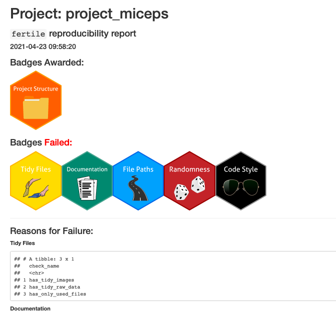
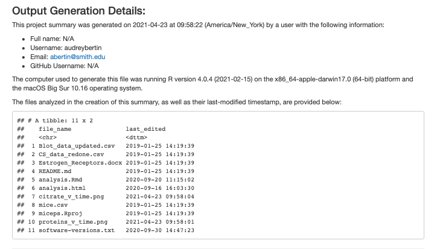

# `fertile`: My Contribution To Addressing Reproducibility {#my-solution}

##  `fertile`, An R Package Creating Optimal Conditions For Reproducibility

`fertile` is an `R` package that attempts to combine the 7 key features of an effective reproducibility tool, discussed at the end of Chapter 1, into a singular piece of software that can be easily downloaded, installed, and operated by `R` users. 

```{r, echo = FALSE, out.width = "30%", fig.align = 'center', fig.cap = "fertile's Package Logo"}
knitr::include_graphics("figure/fertile-hex.png")
```


`fertile` attempts to address the gaps in existing reproducibility solutions by combining software and education in one product. The package provides a set of simple, easy-to-learn tools that, rather than focus intensely on a specific area like other software programs, provide some information about all six major components of reproducibility. It is also designed to be flexible, offering benefits to users at any stage in the data analysis workflow and providing users with the option to select which aspects of reproducibility they want to focus on. 

`fertile` also contains several `R`-specific features, which address certain aspects of reproducibility that can be missed by external project development tools. It is designed primarily to be used on data analyses organized as `R` Projects (i.e. directories containing an `.Rproj` file) and contains several associated features to ensure that the project structure meets the standards discussed in the `R` community.

In addition, `fertile` is designed to be educational, teaching its users about the components of reproducibility and how to achieve them in their work. The package provides users with detailed reports on the aspects of reproducibility where their projects fell short, identifying the root causes and, in many cases, providing a recommended solution.

`fertile` is structured in such a way as to be understandable and operable to individuals of any skill level, from students in their first undergraduate data science course to experienced PhD statisticians. The majority of its tools can be accessed in only a handful of functions with minimal required arguments. This simplicity makes the process of achieving and learning about reproducibility accessible to a wide audience in a way that complex software programs or graduate courses requiring an advanced knowledge of research methods do not.

Reproducibility is significantly easier to achieve when all of the tools necessary to do so are located in one place. `fertile` provides this optimal all-inclusive structure, addressing all 6 major components of reproducibility. We will consider `fertile`'s treatment of each of these components in turn, exploring its behavior using the sample R project shown below, titled `project_miceps`:

```{r, echo = FALSE, out.width="100%", fig.cap="A Sample R Project"}
knitr::include_graphics("figure/sample-project.png")
```

`project_miceps` contains data and analysis from a study concerning the differences in bicep muscle growth between male and female mice. The results from this study, conducted in part by Smith College professor Stylianos Scordilis, were published in *Cellular and Molecular biology letters* in 2010 (@metskas2010gender).

The folder contains a variety of different file types:
- 1 `.Rmd` file containing the analysis code. This involves data manipulation, visualization, and random number generation
- 1 `.html` containing the knitted output of the analysis code
- 3 `.csv` files containing the experimental data
- 2 `.png` image files containing plot outputs from the analysis
- 1 `README` file containing information about the project
- A `.docx` file containing text about estrogen receptors in mice
- `.Rproj` and `.Rhistory` files, containing data used by `R` to track work and maintain the project structure


In the following sections, we will consider the functionality of `fertile` as demonstrated primarily through the results of a reproducibility analysis conducted on `project_miceps`. All of the code for `fertile` that will be discussed in this chapter can be found at https://github.com/baumer-lab/fertile, while the local branch tracking my changes can be found at https://github.com/ambertin/fertile.


### Component 1: Accessible Project Files

The inclusion of key files---such as analysis scripts, data, and documentation information---helps ensure reproducibility by providing the audience with access to everything relevant and necessary to the process of re-running a project.

```{r, message = FALSE}
library(fertile)
```

`fertile` takes several steps to help users ensure that all of files necessary to run an analysis are provided in the project folder. 

#### File Overview

One way to gain an overview of the existing files (including data, code, and metadata) is with the `proj_analyze_files()` function. It lists all of the files in the project, along with their size, type, and relative path within the directory. This can help users quickly produce an overview of how many code, data, and auxiliary (image or text) files they have. 

When this is run on `project_miceps`, we see the same files as described before--their names, file sizes, extensions, and a "mime", which summarizes the file type in a more general way than the extension.

```{r, eval = FALSE}
proj_analyze_files("project_miceps")
```

\footnotesize 

```{r, echo = FALSE}
proj_analyze_files("project_miceps")
```

\normalsize

Users can also check for the existence of a README description file with `has_readme()`. Since, as we know, `project_miceps` contains a `README` file, this function returns a positive confirmation.

```{r}
has_readme("project_miceps")
```


#### Testing For Self-Containment

In order to truly check that a project is self contained---not dependent on any way in its location in a user's file system---it is important to test whether the project still executes properly if it is moved to another directory than its primary location in the user's computer.


The `sandbox()` function is designed to help facilitate this. `sandbox()` allows the user to make a copy of their project in a temporary directory that is isolated from the file system. This function works on both compressed (`.zip`) and non-compressed directories.

 
```{r, echo=FALSE, message=FALSE}
library(tidyverse)
library(fertile)
```

Before the files are sandboxed, we see them in their original directory.

```{r sandbox-1, eval = FALSE}
fs::dir_ls('project_miceps') %>%
  head(3)
```

```{r, sandbox-better-output-1, echo = FALSE}
output <- as.character(fs::dir_ls('project_miceps') %>% head(3))

cat(output[1], "\n")
cat(output[2], "\n")
cat(output[3])
```

After they are sandboxed, we see that the directories for the files have changed, now beginning with a sequence starting with `/var/folders...`---the path used in temporary directories---indicating that the files have now been copied to a new location.


```{r, sandbox-2, eval = FALSE}
temp_dir <- sandbox('project_miceps')
fs::dir_ls(temp_dir) %>% 
  head(3)
```

```{r, sandbox-better-output-2, echo = FALSE}
temp_dir <- sandbox('project_miceps')
output <- as.character(fs::dir_ls(temp_dir) %>% head(3))

cat(stringr::str_wrap(output[1], width = 80, indent = 0, exdent = 0), "\n")
cat(stringr::str_wrap(output[2], width = 80, indent = 0, exdent = 0), "\n")
cat(stringr::str_wrap(output[3], width = 80, indent = 0, exdent = 0))


```
 

Once a directory is sandboxed, users can run the `proj_render()` function, which checks all `.R` and `.Rmd` code files in the directory to ensure that they can compile properly, to ensure that their project is self-contained.

Below, `proj_render()` executes without error, indicating that the project compiles successfully when removed from its original environment---a positive sign of reproducibility.

```{r}
proj_render(temp_dir)
```

Users can confirm the last time the project was known to have successfully rendered by checking the time of the last successful render, captured in the `render_log_report()` function. If the recorded time of last render was *before* the time at which `proj_render()` was run, this would indicate that the project did not compile successfully. 
 
```{r, message = FALSE}
# Get last row of render log report (last rendered time)

render_log_report(temp_dir) %>%
  tail(1)
```


### Component 2: Organized Project Structure

`fertile` provides a wide variety of features for managing the file system of a project. Nine of the package's fifteen primary reproducibility checks relate to file structure.

#### Clear Project Root

Two of these are focused on the `R project` aspect of the file system. `has_proj_root()` ensures that there is a single `.Rproj` file indicating a clear root directory for the project, while `has_no_nested_proj_root()` ensures that there are no sub-projects within. Sub-projects can cause challenges with version control, confusing software that is trying to track changes by making it unclear where to focus, and should be avoided. The recognition of a clear root directory is necessary to allow for file structure analysis and project restructuring as it provides a baseline directory to define relative file paths from.


#### No File Clutter

Six of the major checks, whose names begin with `has_tidy_` focus on file clutter, addressing one of the components of a clean file structure. They check to make sure that no audio/video, image, source, raw data, .rda, or .R files are found in the root directory of the project.

The last check that focuses on the file system is `has_only_used_files()`. One of the more complicated checks in `fertile`, this function checks to make sure that there are no extraneous files serving no purpose (that are not "used") included alongside the analysis. For this function to work properly, a clear definition of which files are considered as "used" is needed. In `fertile`, that definition includes the following:

* `.R`,`.Rmd`, and `.Rproj` files
* README files
* Data/text/image files whose file paths are referenced, either as an input or output, in any of the `.R` or `.Rmd` files
* Outputs created by knitting any `.Rmd` files (`.html`, `.pdf`, or `.docx` files with the same name as the `.Rmd`)
* Files created by `fertile`. In an effort to capture information about dependencies, `fertile` creates a text file capturing the session information when a project is run and provides an option to generate an `.R` script that can install all of the packages referenced in a project's code. 

When `has_only_used_files()` is run on `project_miceps`, two files are returned: the `.docx` file and one of the data files, `mice.csv`. This indicates that neither of those files were referenced in the code, nor were they created by it. Since no other files were returned, this indicates that all of the other files were either inputs or outputs to the data analysis.
 
```{r}
# List the files in the directory
fs::dir_ls("project_miceps")

# Check to see which are "used"
has_only_used_files("project_miceps")

```
 

#### Reorganizing File Structure

There are also several functions that help with reshaping the entire project structure to a more reproducible format. For example, `proj_suggest_moves()` provides suggestions for how to reorganize the files into folders, with recommendations based on an R package structure.

When run on `project_miceps`, the results indicate that the `.csv` files should be moved to a `data-raw` file, the `.Rmd` should be moved to vignettes, and the `.docx`, `.html` and `.png` files should be moved to an `inst` folder, with further deliniation by file type.

```{r, eval = FALSE}
files <- proj_analyze_files("project_miceps")

proj_suggest_moves(files)
```

\footnotesize 

```{r, echo = FALSE}
files <- proj_analyze_files("project_miceps")

proj_suggest_moves(files)
```

\normalsize 

These suggestions are based on achieving the optimal file structure design for reproducibility, argued by @marwick2018packaging, and believed by me, to be that of an `R` package (@coreteam-extensions, @hadley-packages), with an `R` folder, as well as `data`, `data-raw`, `inst`, and `vignettes`. Such a structure keeps all of the files separated and in clearly labeled directories where they are easy to find. Additionally, the extension of the `R` package structure to data analysis projects promotes standardization of file structure within the R community. It also provides the advantage of making it easy to convert the project into a package, if necessary.

Users can execute these suggestions individually, using the code snippets provided next to each file name when running `proj_suggest_moves()`, but they can also run them all together. `proj_move_files()` executes all of the suggestions from `proj_suggest_moves()` at once, building an `R` package style structure and sorting files into the correct folders by type.

Combined together, all of these functions make it simple to ensure that projects fall under a standard, simple, and reproducible structure with minimal clutter.

### Component 3: Documentation

  
High quality documentation, including the presence of a README file, comments explaining the code, a list of software packages an analysis is dependent on, and a method in which to understand which order to run code files in, is essential to reproducibility. Without written guidance, individuals looking to reproduce results may not understand how to take all of the project components and combine them in the right way to produce the desired outcome. Additionally, code used without the proper dependencies and software versions, even if it is perfectly functional and correctly written, will often result in errors when compiled. 

`fertile` contains a variety of functions to ensure that projects are well documented.

#### README

One important component of documentation is the inclusion of a README file. A README is a text file that introduces and explains a project. Commonly, a project README contains background information necessary to understand a project. According to @prana2019categorizing, alongside a variety of best-practices posts from `R` coders, some of the components that might be contained within are:

1. Background on the purpose of the project and the questions of interest.
2. Background on where the data used in the project came from and what they contain.
3. Information about installing and setting up the software necessary to run it.
4. A list of included files.
5. A description of how to run the project---for example, a summary of the order in which the included files should be run.
6. Contact information for the author of the project.

`fertile` ensures that a `README` is included alongside the user's project with the `has_readme()` function. As discussed in the previous section on Component 1, this returns a positive result since `project_miceps` contains a `README` file.

 

```{r}
has_readme("project_miceps")
```

 

#### Clear File Order

Another important component of documentation is that it must be clear in which order provided files should be run. While this information can be included as part of the README, it is sometimes provided via other methods---for example, through a `makefile`/`drakefile` (make-style file generated by the `drake` package in `R`) or through a standardized naming or numbering convention of files. 

`has_clear_build_chain()` checks for these non-README methods of ensuring that file ordering is clear. `project_miceps`, since it only contains one code file, passes this check easily and no error messages result:


```{r}
has_clear_build_chain("project_miceps")
```

Compare this with the following example: `project_transportation`. This project contains three code files---`cars.Rmd`, `planes.Rmd`, and `trucks.Rmd`---with no clear order. None of the files have a number attached to them, nor is there a makefile in the directory.

```{r}
proj_analyze_files("project_transportation")
```

When `has_clear_build_chain()` is run on `project_transportation`, it fails, returning a note stating that "it is not obvious in what order to run [the] R scripts."

```{r}
has_clear_build_chain("project_transportation")
```


#### Software Dependencies

There are also several features focused on software dependencies. Every time the code contained within a project is rendered by `fertile`, the package generates a file capturing the `sessionInfo()` just after the code was run. This file contains information about the R version in which the code was run, the list of packages that were loaded, and their specific versions. 

The dependency information from `project_miceps` looks as follows. As we see, the project loaded the `stargazer`, `skimr`, `purrr`, `ggplot2`, `tidyr`, `readr` and `dplyr` packages, indicating that they are potential dependencies. We can also see the R version and operating system version that the project was run on, as well as the fact that the rendering was completed on a Mac.


```{r echo = FALSE, eval = FALSE}
proj_render("project_miceps")
session_info <- "project_miceps/.software-versions.txt"
cat(readChar(session_info, 1e5))
```

\small
```{r, echo = FALSE}
proj_render("project_miceps")
session_info <- "project_miceps/.software-versions.txt"
output <- readChar(session_info, 1e5)

string_intro <- "The R project located at '/Users/audreybertin/Documents/thesis/index/\nproject_miceps' was last run in the following software environment:"

cat(string_intro)
cat(substr(output, 138, 742))
```
\normalsize


Interactively, users can access this dependency summary using the function `proj_dependency_report()`. The `proj_pkg_script()` function builds off of this behavior, providing a method to simplify the process of installing the packages seen in the dependency report.  

When run on an `R` project directory, the function creates a `.R` script file that contains the code needed to install all of the packages referenced in the project, differentiating between packages located on CRAN and those located on GitHub.

When run on `project_miceps`, we find that `broom`, `dplyr`, `ggplot2`, `readr`, and other packages are all referenced in the code. As indicated by the installation script, these packages are hosted on CRAN and can be installed using `install.packages()`. We also see that there are no GitHub packages used in this project.

```{r}
install_script <- proj_pkg_script("project_miceps")
```

```{r, echo = FALSE, linewidth = 60}
cat(readChar(install_script, 1e5))
```

 

As good practice, users interested in ensuring that their project is reproducible should include both of the following files alongside it.

1. The text-based summary of dependencies produced by `proj_dependency_report()`.
2. The `.R` dependency installation script.

Then, anyone wanting to re-create the results would have the documentation necessary to do so alongside a quick and easy method to set up the required software. 

#### Code Commenting

In addition to README and dependency documentation, `fertile` also analyzes the quality of documentation provided directly alongside code. 

Code commenting---the process of placing human-readable descriptions next to code to explain what the code is doing---is important for ensuring that a project can be understood by someone other than its author. To ensure that their code is understandable, data analysts must regularly include comments throughout their project code files.

`has_well_commented_code()` is designed to check for this. The function reads through all `.R` and `.Rmd` files in a project directory and, for each, calculates the fraction of lines in the file that are comments. Files for which comments make up less than 10% of the written lines are flagged as poorly commented, warning users to make corrections and increase the number of comments in their code. This 10% recommendation is designed to be a low-bar recommendation, setting its minimum on the lower end of comment production, but within a reasonable distance from the mean. It is based on data from @arafat2009commenting, who found the mean percentage of comments in open source code was around 18%, with a standard deviation of approximately 10%. This places a 10% comment minimum within 1 standard deviation below the mean.

The primary code file in `project_miceps`, "analysis.Rmd", is a great example of a poorly commented file. It only contains 6 lines of comments, while including over 100 lines of code. As such, it is flagged by `has_well_commented_code()`, indicating that the creator of that file should add more comments to clarify what is happening in the code. In addition, it recommends a link to a site containing tips for adding comments to code:

```{r, eval = FALSE}
has_well_commented_code("project_miceps")
```

```{r, echo = FALSE}
comments_tbl <- has_well_commented_code("project_miceps")

cat("*", comments_tbl$name, "\n")
cat("Problem:", comments_tbl$problem, "\n")
cat("Solution:", stringr::str_wrap(comments_tbl$solution, width = 60), "\n")
cat("See for help:", stringr::str_wrap(comments_tbl$help, width = 60))

errors <- comments_tbl$error

errors[[1]]
```


### Component 4: File Paths

`fertile` contains a variety of features designed to address issues with file paths. Several of these features happen proactively, warning users that they are entering a non-reproducible file path as it happens, while others can be accessed after a project has already been written.

#### Proactive Warnings When Coding

Proactively, `fertile` catches when an absolute path, or one leading outside of the project directory, is referenced in an input or output function and throws an error. 

This interactive behavior is one of the educational features of the package, as it immediately provides an informative message explaining to the user that such a path is not reproducible, giving the programmer an opportunity to learn and course-correct from there.

One of the important components of R package development, however, is that a package should not interfere too much with user behavior. Users who are trying to code in their console, for example, might still want to open a file if they know the path is not reproducible if they are just trying to take a quick look at some data.  

`fertile` accounts for this. Even though the package throws an error when non-reproducible paths are used, it also provides a solution for users to override this behavior and execute the command anyway. This is done through the error messaging system. The message provided when an error is thrown is custom created, responding to the command and path which triggered the error in the first place. For example, in the code below, `read.csv("~/Desktop/my_data.csv")`, gives a different message than `read_csv("../../../Desktop/my_data.csv")`, even though both paths point to the same location in the computer.

```{r write_csv, include=FALSE}
readr::write_csv(mtcars, "~/Desktop/my_data.csv")
```

```{r, message = FALSE}
library(fertile)
```

```{r file-testing}
file.exists("~/Desktop/my_data.csv")
```

When we try to access the `my_data.csv` file via an absolute path to the computer desktop, where the file is located, `fertile` recognizes that an absolute path has been provided and returns an error stating this. It also gives the option for the user to run `utils::read.csv('~/Desktop/my_data.csv')`, which will not throw an error, but will return the same result.

```{r, eval = FALSE}
read.csv("~/Desktop/my_data.csv")
```

```{r, echo = FALSE}
error_msg <- "Error: Detected absolute paths. Absolute paths are not reproducible and will likely only work on your computer. If you would like to continue anyway, please execute the following command: utils::read.csv('~/Desktop/my_data.csv')"

cat(stringr::str_wrap(error_msg, width = 70))
```

The error message is different when referring to a relative path that is outside of the directory. In the example below, we reference the same `my_data.csv` file, but instead using relative paths indicating to go back three directories to find the `/Desktop` folder. This time, the `fertile` warning message mentions path that "lead outside the project directory". The suggested override command also changes to reflect the path that was provided.

```{r, eval = FALSE}
read_csv("../../../Desktop/my_data.csv")
```

```{r, echo = FALSE}
error_msg <- "Error: Detected paths that lead outside the project directory. Such paths are not reproducible and will likely only work on your computer. If you would like to continue anyway, please execute the following command: readr::read_csv('../../../Desktop/my_data.csv')"

cat(stringr::str_wrap(error_msg, width = 80))
```

 
In addition to catching non-reproducible file paths, `fertile` also stops the user when they try to change the working directory. Unlike with input and output functions like `read_csv()`, which can take a variety of different file paths---some which may be reproducible and some not, `setwd()` is essentially guaranteed to break reproducibility, no matter what directory it is set to. As a result, `fertile` is particularly strict with it. When a call to `setwd()` is caught, `fertile` throws an error and does not provide an option to override. Rather, the user is given an alternative function (`here::here()`) to use that achieves the same behavior in a more reproducible way.

```{r setwd, error = TRUE}
getwd()
setwd("project_miceps")

here::here("project_miceps")
```

For more information about the interactive warning system and some of its customization features, see Section 2.2.1.

#### Project Path Summaries

`fertile` also contains functionality that analyzes code for path information after it is written. For example, `proj_analyze_paths` goes through all of the paths used in a project's `.R` and `.Rmd` files and produces a report detailing which ones failed to meet reproducibility standards, explaining the problem, and providing a solution.

When this function is run on `project_miceps`, we see no paths at fault, indicating that all paths in the project are reproducible.

```{r, eval = FALSE}
proj_analyze_paths('project_miceps')
```

\footnotesize
```{r, echo = FALSE}
proj_analyze_paths('project_miceps')
```
\normalsize
 

Paths can also be checked individually, or in groups, using `check_path()`.

For example, since the current working directory (`getwd()`) is always returned as an absolute path, running `check_path()` on it throws an error warning about this fact.

```{r path checks-1, eval = FALSE}
# Absolute path (current working directory)
check_path(getwd())
```

```{r, echo = FALSE}
error_msg <- "Error: Detected absolute paths. Absolute paths are not reproducible and will likely only work on your computer."

cat(stringr::str_wrap(error_msg, width = 70))
```

If providing a path leading outside the project directory, up a level in the file framework, an error mentioning paths outside the project directory is returned.

```{r path checks-2, eval = FALSE}
# Path outside the directory
check_path("../README.md")
```
```{r, echo = FALSE}
error_msg <- "Error: Detected paths that lead outside the project directory. Such paths are not reproducible and will likely only work on your computer."

cat(stringr::str_wrap(error_msg, width = 70))
```
 
These functions, together, cover all of the reproducibility sub-components involving file paths. Users are warned not to use absolute paths or paths pointing outside of the directory, both while they are coding and after the fact, and provided with a recommended solution to the problem if they do so. Additionally, users are prevented from using functions that will certainly break reproducibility and provided with safer alternatives. 

### Component 5: Randomness

The component of randomness is addressed by `fertile` in a reproducibility check function titled `has_no_randomness()`, which does the following: First, it checks code files to determine whether they have employed random number generation. This is confirmed by recording the random number generation seed prior to running the files, rendering the files, and then checking to see whether the seed has changed. If the seed has changed, that indicates that one or more functions using random number generation were called. Finally, in order to select an appropriate response, `fertile` determines the type of randomness that has occurred. 

Here, I make a distinction between two primary types of randomness in `R`: *controlled* (or semi-random) and *uncontrolled*. All randomness in `R` is pseudo-random and not truly random---the number generation system uses algorithms to generate sequences of random numbers which approximate a truly random outcome but are not in fact themselves completely random---but not all randomness is controlled. The distinction between controlled and uncontrolled randomness emerges from the use of `set.seed()`. When `set.seed()` is used alongside pseudo-random number generation, the number generator returns the same "random" sequence of numbers each time. In a sense this is "random", because it is still a pseudo-randomly generated sequence, but it is also non-random in that it is predictable and repeatable---and therefore, controlled. Every time the code is run, it will generate the same sequence of numbers. This is in contrast to the behavior when `set.seed()` is excluded from the code, what I term *uncontrolled* randomness. In this situation, functions employing random number generation will *not* return the same pseudo-random sequence each time they are run. This will therefore affect the outcome of results and the reproducibility of the work. Two people running the same code when randomness is *uncontrolled* will not receive identical outputs, while they would if the randomness were *controlled*. For this reason, `fertile` flags *uncontrolled* randomness as dangerous, but has no problem with *controlled* randomness.

Let us consider an example of how `has_no_randomness()` performs on `project_miceps`. The primary code file, `analysis.Rmd` contains the following code. In this code, we see that a data set is read in via `read_csv` and reformatted. Then, the `sample_frac()` function takes a random sample of 50% of the rows of the data.

 
```{r, message=FALSE, eval = FALSE}

mice <- read_csv("Blot_data_updated.csv") %>%
  transmute(
    time = `Time point`,
    sex = Sex,
    id = `Mouse #`,
    erb = `ERB Normalized Final`,
    era = `ERA Normalized Final`,
    gper = `GPER Normalized Final`
  ) %>%
  mutate(
    day = case_when(
      time == 0 ~ -1,
      time == 1 ~ 0,
      time == 2 ~ 1,
      time == 3 ~ 3,
      time == 4 ~ 5,
      time == 5 ~ 7
    ),
    type = ifelse(time == 0, "control", "treatment")
  )

mice_tidy <- mice %>%
  select(-time) %>%
  gather(key = "protein", value = "amount", -day, -sex, -id, -type) %>%
  mutate(protein_label = factor(protein,
    labels = c("paste(ER, alpha)", "paste(ER, beta)", "GPER")
  ))
```


```{r, eval = FALSE}
sample_frac(mice, 0.5)
```

 
However, there is no seed set in the file. `project_miceps` is using *uncontrolled* randomness. As a result, `has_no_randomness()` returns as a failure for the project. 

 
```{r}
has_no_randomness('project_miceps')
```
 
If a seed had been set, however, this code would have passed. Consider this alternate example. The following sample project, `project_randomseed` contains only a `.Rproj` file and an `.Rmd` document containing the following code:

```{r, eval = FALSE}
set.seed(1)
rnorm(2)
```

In this situation, randomness occurs in the calling of `rnorm()`, but it is *controlled* by the use of `set.seed`. This time, `has_no_randomness()` passes without error:

```{r}
has_no_randomness('project_randomseed')
```


`fertile`'s randomness-centered feature helps analysts know that their use of randomness is controlled, ensuring that functions involving random number generation will always produce the same output each time they are run.

### Component 6: Readability and Style

Though not a necessary component of reproducibility, code style can have a significant impact on how easy it is to follow the steps being taken in an analysis. The use of consistent and highly-readable style in code greatly simplifies and speeds up the process of understanding a data analysis project and repeating the steps included within. 

`fertile` addresses code style via the function `has_no_lint()`. This function checks code for compatibility with RStudio Chief Scientist Hadley Wickham's "tidy" code format, which promotes the following best practices (@tidy-style):

* Line length should not exceed 80 characters
* There should not be trailing whitespace
* All infix operators (`=`, `+`, `-`, `<-`, etc) should have spaces on either side
* All commas should be followed by spaces
* There is no code left in the file that is commented out
* `<-` should be used instead of `=` to assign variables
* Opening curly braces should never go on their own line and should always be followed by a new line
* There should always be a space between right parenthesis and an open curly brace
* Closing curly braces should always be on their own line, unless followed by an `else` statement

Any issues with incompatibility that are found by `has_no_lint()` appear in a window by the RStudio console. This window lists the style inconsistencies found in each code document, showing both the description of the error and the line number where it occurred for each issue. This window is interactive; double-clicking on an error brings the user to exact location in the code where it occurred.

Let us consider an example. `project_miceps` contains an `RMarkdown` file titled `analysis.Rmd`, which contains some code involved with a data analysis. Some of the code is in tidy style but not all of it is. 

For example, line 71, part of a `ggplot` call, contains the following code:

 
```{r, eval = FALSE}
# Line 71 of `project_miceps/analysis.Rmd', 
# Test has been wrapped so it can all be seen at once

geom_hline(aes(yintercept = estimate + 1.96*std.error, color = sex),
linetype = 3) + 
  
```
 

For this line, `has_no_lint()` finds the following inconsistencies with tidy style:

* Line 71: Lines should not be more than 80 characters.  

* Line 71: Put spaces around all infix operators.  

* Line 71: Trailing whitespace is superfluous.    

The first comes up because the true line length, including spaces, is 84 characters. The second comes up because the `*` between `1.96` and `std.error` is not surrounded by spaces. The third is flagged because there is an empty space after the `+` at the end of the line.

If written in tidy style, this code would look as follows:

```{r, eval = FALSE}
geom_hline(aes(yintercept = estimate + 1.96 * std.error, color = sex),
  linetype = 3
) + 
```


An even less tidy piece of code is that found on line 189, written as follows:

 
```{r, eval = FALSE}
# Line 189 of `project_miceps/analysis.Rmd'

if (length(mice) > 1){ holder_var = 1 }

```

 

For this line, `has_no_lint()` finds the following errors:

* Line 189: There should be a space between right parenthesis and an opening curly brace.

* Line 189: Opening curly braces should never go on their own line and should always be followed by a new line.  

* Line 189: Use <-, not =, for assignment.  

* Line 189: Closing curly braces should always be on their own line, unless it's followed by an else.  

The first issue flagged is the fact that `){`, in the middle of the line, has no space in the middle. The second issue is flagged because the code to execute when the `if` statement is true (`holder_var = 1`) is on the same line as the `if` statement, rather than on its own line. The third error occurs because `holder_var` is defined using an `=`. And the fourth occurs because the closing curly brace is on the same line as other code rather than by itself.

After being converted to tidy style, the code looks as follows:

```{r, eval = FALSE}
if (length(mice) > 1) {
  holder_var <- 1
}
```


These informative error messages provided by `fertile` help teach users to use consistent, tidy style in their code. They do so while making the learning process  simple, allowing users to click and see exactly which symbol or character caused the error. In addition to providing a detailed explanation of the was in which the provided code is not tidy, `fertile` also suggests a simple and fast solution for resolving the inconsistencies all at once, recommending that users apply the `usethis::use_tidy_style()` function to format their code automatically.

### Summary of Reproducibility Components

As described in the previous sections, `fertile` addresses all six major components of reproducibility via a variety of functions. Some complex components have many associated functions attached to them, while others only have one. 

A summary of the six components of reproducibility and the functionalities in `fertile` associated with them is provided below.

```{r, echo = FALSE, out.width = '100%', fig.cap="Summary of Reproducibility Components and the Related Functionalities in 'fertile'"}
knitr::include_graphics("figure/components-summary.png")
```


### User Customizability

`fertile` does not force its users into a box, instead allowing for a great deal of user choice in terms of which aspects of reproducibility to focus on. Users can run reproducibility tests at three different scales: 

1) Comprehensively, where all checks are run within a single function or two.

2) In groups, where functions focused on similar aspects of reproducibility are run together.

3) Individually, where only one reproducbility check is run at a time.

#### Comprehensive Features

Users who want comprehensive behavior can access it through three primary functions: `proj_check()`, `proj_analyze()`, and `proj_badges()`. 

The `proj_check()` function runs all sixteen reproducibility tests in the package, noting which ones passed, which ones failed, the reason for failure, a recommended solution, and a guide to where to look for help. These tests, many of which were described in detail previously, include: looking for a clear build chain, checking to make sure the root level of the project is clear of clutter, confirming that there are no files present that are not being directly used by or created by the code, and looking for uses of randomness that do not have a call to `set.seed()` present. A full list is provided below:


```{r list-checks, tidy.opts=list(width.cutoff=60)}
list_checks()
```

 

The `proj_analyze()` function creates a report documenting the structure of a data analysis project, combining four key functions from `fertile` into one complete unit:

* `proj_analyze_packages()`, which captures a list of all packages referenced in the source code and which files they were referenced in
* `proj_analyze_files()`, which captures a list of all of the files located in the directory along with their type and size
* `proj_suggest_moves()`, which provides suggestions for how to reorganize files to create a more reproducible file structure
* `proj_analyze_paths()`, which captures a list of the non-reproducible file paths referenced in source code

When `proj_analyze()` is run on `project_miceps`, we see the following information:
- 10 packages (including `broom`, `dplyr`, `fs` and more) are referenced in the analysis code
- 12 files are in the project directory, including some image files, data files, and a few files produced from some of the analyses that have been run by fertile (`install_proj_packages.R` and `software-versions.txt`).
- There are 10 suggestions for moving files, with data files to `data-raw`, script files to `R`, and other files to `inst`


```{r proj_analyze, tidy.opts=list(width.cutoff=60), eval = FALSE}
proj_analyze('project_miceps')
```

\footnotesize
```{r, echo = FALSE, message = FALSE}
proj_analyze('project_miceps')
```
\normalsize

Similar to `proj_check()`, `proj_badges()` runs all sixteen reproducibility checks. However, the way the function displays the resulting information is different. Rather than report the results of each check individually alongside detailed information about why each failed, `proj_badges()` provides a higher level summary, reporting on the *groups* of checks that either passed or failed.

In `proj_badges()`, the reproducibility checks are grouped into six categories corresponding to the six major components of reproducibility. These categories, alongside the checks which belong to them, are listed below:

* Project Structure
    - `has_proj_root()`
    - `has_no_nested_proj_root()`
  
* Tidy Files
    - `has_tidy` ... `_media()`, `_images()`, `_code()`, `_raw_data()`, `_data()`, `_scripts()`, `_used_files()`

* Documentation
    - `has_readme()`
    - `has_clear_build_chain()`
    - `has_well_commented_code()`
    
* File Paths
    - `has_no_absolute_paths()`
    - `has_only_portable_paths()`
    
* Randomness
    - `has_no_randomness()`
    
* Code Style
    - `has_no_lint()`
    
    
When users pass all of the checks associated with one of the categories, they receive a badge certifying their success in that area. If any fewer than *all* available checks in a category are passed, then the user fails that category.
 
```{r badge-graphics, out.width="15%", fig.cap = "The 6 Reproducibilty Badges Available in `fertile`",  fig.show='hold', echo = FALSE}
knitr::include_graphics(c("figure/structure-badge.png", "figure/tidy-badge.png", "figure/documentation-badge.png", "figure/paths-badge.png", "figure/randomness-badge.png", "figure/style-badge.png"))
```
 
 
`proj_badges()` identifies the badges that a data analysis project should receive and then outputs a summary of this information---in the form of an `html` document---to the RStudio `Viewer` pane. This document---designed to produce a summary of a project that can be easily shared in places outside of `RStudio` (unlike the summaries produced by most other functions, which just produce output in the `R` console)---contains the following primary pieces of information:

1. The name of the folder where the project is stored. 
2. The reproducibility badges awarded to the project.
3. The reproducibility badges failed by the project.
4. If failures occurred, the reasons why. These are broken down by badge and list the checks associated with that badge that did not pass.
5. A date/time/timezone stamp of when the `html` summary was created.
6. Information about the user who generated the `html` summary (their full name, computer username, email, and GitHub username, if available).
7. Information about the `R` version, platform, and operating system of the computer used to generate the `html` at the time that it was created.
8. The names of files in the project that the `html` found the badges for as well as their date of last modification.

The `html` output for `project_miceps` can be seen below. As we can see, `project_miceps` receives the "Project Structure" and "File Paths" badges but fails "Tidy Files", "Documentation", "Randomness", and "Code Style". This aligns with our previous results from each of the components of reproducibility. For example, `project_miceps` passed `proj_analyze_paths()` with flying colors, but failed `has_well_commented_code()` (documentation), `has_no_randomness()` (randomness), and `has_no_lint()` (code style).

We see these failures reflected in the badge report section titled "Reasons for Failure", which provides the list of functions responsible for why the project failed to receive that badge. For example, we can see that for the "Tidy Files" badge, `project_miceps` failed `has_tidy_images()`, `has_tidy_raw_data()`, and `has_only_used_files()`.

At the end of the report, in the section titled "Output Generation Details", we see information similar to what was produced with the previously described dependency management functions. We see the date the project was rendered by me, Audrey Bertin, on October 29th, 2020 at just after 2 pm Eastern time using R version 4.0.2 on a Mac computer running macOS Catalina. Additionally, we see the files contained in the project and their last modified dates.

```{r badges-1, echo = FALSE, fig.cap="Output: Badges and Reasons for Failure", out.width = "100%"}

```

```{r badges-2, echo = FALSE, fig.cap="Output: System/User Information and File List", out.width = "100%"}

```


Together, `proj_check()`,`proj_analyze()`, and `proj_badges()` cover a significant portion of all six major components of reproducibility.

#### Features Allowing For Summary By Group

Users wanting to focus on groups of checks can do so using the `proj_check_some()` function.
`proj_check_some()` leverages helper functions from `tidyselect` (@R-tidyselect) to allow users to call groups of similar checks together. `tidyselect` helpers tell `fertile` to call only the checks whose names meet certain conditions. The helper functions that can be passed to `proj_check_some()` are:

* `starts_with()`: Starts with a prefix.
* `ends_with()`: Ends with a suffix.
* `contains()`: Contains a literal string.
* `matches()`: Matches a regular expression.

For example, a variety of checks in `fertile` focus on making sure the project has a "tidy" structure--essentially that there are not files cluttered together all in one folder. Users interested in checking their tidyness can do so all at once using `proj_check_some()` as follows. When run on `project_miceps`, we see that three of the tidyness checks fail, while three pass. The errors are associated with tidy scripts, image files, and data files.
 

```{r echo=FALSE}
bad_file <- fs::path('project_miceps', "install_proj_packages.R")
if (file.exists(bad_file)) {
  fs::file_delete(bad_file)
}

```

```{r proj_check_some, warning = FALSE, tidy.opts=list(width.cutoff=60), eval = FALSE}
proj_check_some("project_miceps", contains("tidy"))
```

\footnotesize
```{r warning = FALSE, tidy.opts=list(width.cutoff=60), echo = FALSE}
proj_check_some("project_miceps", contains("tidy"))
```
\normalsize

Users might also attempt to call the two checks involving project roots together. When we do this, we see that `project_miceps` has no issues with project roots and has a good root structure.

 
```{r, eval = FALSE}
proj_check_some("project_miceps", ends_with("root"))
```
 
\footnotesize
```{r, echo = FALSE}
proj_check_some("project_miceps", ends_with("root"))
```
\normalsize


#### Individual Checks

If users do not want to run functions in groups, and prefer to run them individually, that option is also provided to them. Every check that makes up `check()` and every sub-component of `project_analyze()`can be run individually. 

### Educational Features

Simply noting and correcting issues with reproducibility is not enough to produce lasting change in the scientific community. Data analysts and software users must also be educated on why their choices were not reproducible so that they do not fall victim to those mistakes again in the future, but also so that they can share their knowledge and experience with others in the scientific community.

`fertile` prioritizes this idea of reproducibility education throughout many of its functionalities.

One of the major ways through which `fertile` educates is users is a system of command tracking and interactive messaging. As long as `fertile` is loaded in `R`, the package records when commands that have the potential to affect reproducibility are run in the console. 

As soon as a dangerous function is called, `fertile` alerts the user and provides suggestions for alternative solutions. This behavior, explained in more detail in Chapter 2.2.4, gives users immediate feedback on their behavior. In addition to assisting users in the moment, this method has also been shown to increase long-run retention of information when compared with feedback after the fact (@epstein2002immediate).

Users interested in looking back at their past choices can do so as well. The `log_report()` function provides access to a log listing the commands with a link to reproducibility that have been called.


When we execute the commands `library(purrr)`, `library(forcats)`, and `read_csv(fs::path('project_miceps', "mice.csv"))`, we see those actions appear in the log. Since `read_csv` takes a file path argument, `fertile` captures the path that was called and reports it under `path`.

```{r read-csv, message=FALSE, include=FALSE}
library(purrr)
library(forcats)
read_csv(fs::path('project_miceps', "mice.csv"))
```

```{r log-report, eval = FALSE}
log_report()
```

\footnotesize
```{r, echo = FALSE}
log_report()
```
\normalsize

Depending on how much history they want to keep track of, users have the option to clear the log and start from scratch via the function `log_clear()`.

In addition to this educational logging behavior, the reproducibility checks contained in the `check()` function also include educational messages. We consider several examples below:

* `has_no_randomness()`, when it fails, tells users that their code uses randomness and they should use the `set.seed()` function to control it.

* `has_only_used_files()`, when it fails, tells users that there are files present in the directory not being used for any purpose and provides a function (`fs::file_delete`) to use in order to remove them.

* `has_no_lint()`, when it fails, provides users a list of all of the ways in which their code fails to follow tidy style and points them to the exact lines and characters in the code where the mistakes occurred.

* `has_tidy_images`, when it fails, tells users that it has found files in the root directory which add clutter and recommends that they be moved to an `img/` directory.

Users are provided with an informative message about their issue but are not always provided a fully automated solution. This behavior encourages them to learn as they have to execute the suggested solution themselves.

However, even though `fertile` often requires users to take their own actions, that does not mean that the package requires users to be of high skill level to use. `fertile` is designed in such a way so its educational benefits can be achieved with relative simplicity and minimal effort so that even users brand new to `R` can gain knowledge and awareness of reproducibility from using it. 

For example, the interactive messaging features require no effort beyond the loading of the package with `library(fertile)` to activate. And many of the educational benefits contained within the checks can be gained all at once as well, with a single call of the `check()` function. Users looking for more customizability have the option to go into more detail with the more complex functions like `sandbox()`, but they are not necessary for users to gain benefit from the package. 


## How `fertile` Works

In the world of `R` packages, `fertile`'s behavior is rather unusual. Few packages manipulate their users' `R` environments or file structure, instead remaining relatively self-contained. This unique behavior necessitates the use of several non-traditional techniques, described below.

### Shims

Much of the functionality in `fertile` is achieved by writing `shims`. In their application to `fertile`, shims can be defined as functions that transparently intercept users' intended actions and slightly alter their execution. 

`fertile` contains shims for a variety of common functions that may affect reproducibility, including those that read and write files, load libraries, and set random number generation seeds. 

When users perform actions that may threaten reproducibility, the package's shimmed functions capture the user's commands, log their behavior, and check and report on file paths before proceeding to executing the desired function.

This allows `fertile` to warn users when they use a potentially non-reproducible file path and also helps  keep track of past behavior via a log of previously entered commands.

The shim-writing process looks as follows:

1. Identify an `R` function that is likely to be used in a way that may break reproducibility. For example, a function that reads in files.

2. Create a function in `fertile` with the same name that takes the same arguments.

3. Write this new function so that it: 

    a) captures the specified arguments, 
    b) logs the name of the function the user was intending to call, 
    c) performs file path checks on any path-related arguments, and 
    d) calls the original function with the original arguments. 
  
If the file path checks execute without error, the operation of a shim looks the same to the user as if they were calling the original function. However, if an error is thrown---i.e. a path is found to be non-reproducible---then execution will stop before step *d* is completed.
  
Most shims are relatively simple. Several, such as that for `library()` are more complex, but many follow the same basic format. Consider this example for `read.csv()`:

 

```{r}
fertile::read.csv
```


This functionality all occurs without the knowledge of the user. Consider the example of `read.csv()`. `read.csv()` is a  popular function from the `utils` package for reading in data files. Users with both `utils` and `fertile` loaded will experience the following: The user will call `read.csv()` as normal, thinking that they are calling `utils::read.csv()`. However, they will actually be calling `fertile::read.csv()`, a very similar function with the same name. `fertile::read.csv()` will then capture the file path the user provided and check whether it is reproducible. If it is deemed okay, the function will execute as intended and read in the data just as `utils::read.csv()` would. If it is deemed non-reproducible, the function will return an error telling the user to use an alternate file path. Either way, `fertile` will record that the user called `utils::read.csv()` and note the path that was provided to it for future reference.

This behavior, however, is dependent `fertile` remaining at the top of the `search()` path so that its functions are called preferentially over the original functions that it has shimmed. In order to ensure that the `fertile` versions of functions ("shims") always supersede ("mask") their original namesakes when called, `fertile` uses its own shims of the `library` and `require` functions to  manipulate the `R` `search` path so that it is always located in the first position. 

In the `fertile` version of `library()`,`fertile` is detached from the search path, the requested package is loaded, and then `fertile` is reattached. This ensures that when a user executes a command, `R` will check `fertile` for a matching function before considering other packages. 

A full list of the shimmed functions provided by `fertile` is listed below. Note that---in order to reduce the software dependencies of `fertile` the shims from the less common `readxl`, `rjson`, `foreign`, and `sas7bdat` packages are only activated if the user has those packages installed and loaded on their computer.

```{r echo = FALSE, out.width = '100%', fig.cap="List of Functions Shimmed by 'fertile'"}
knitr::include_graphics("figure/shims-list.png")
```

#### Shim Customization Functionality

Not all `R` programmers use the same packages, nor do they use the same functions at the same level of regularity. Additionally, some users might not always want to have their shimmed functions enabled---for example, they may purposefully be writing code with absolute paths, and would want to be able to do so without warnings and interruptions.

As a result of this, we believed it important to include features in `fertile` that enable users to customize which functions for which their version of `fertile` has active shims as well as when those shims are enabled or disabled.

Several functions in `fertile` have been written to implement this behavior:

1. The `add_shim()` function allows users to write a new shim to `fertile`. When this function is called, `fertile` writes the code for the shimmed function using the standard structure explained previously. It then adds that code to a file located alongside `fertile`'s documentation on the user's computer so that it is permanently saved, and then executes it in order to activate the new shim and immediately bring it into the user's `R` environment. With `add_shim()`, users can only add shims individually, as in the example below, where a shim for the function `write.ftable` from the `stats` package is added.

```{r, eval = FALSE}
# Code to add a shim for stats::write.ftable 
add_shim(func = "write.ftable", package = "stats")
```

2. If users want to not limit themselves to a handful of specific shims and rather just automatically create all of the possible shims, the `find_all_shimmable_functions()`, `find_pkg_shimmable_functions()` and `add_all_possible_shims()` functions can assist. 

`find_all_shimmable_functions()` searches the namespaces of all of the loaded libraries in `search()` and returns the names and associated packages of all functions found to potentially be shimmable (i.e. those that appear to accept file path-related arguments). This list provides a reference for those who want to know which functions they could potentially write shims for. 

`find_pkg_shimmable_functions()` does the same thing as `find_all_shimmable_`
`functions()`, but on a smaller scale. Rather than looking at all loaded packages, it just looks at the namespace of a specific package, passed as an argument to the user.

`add_all_possible_shims()` will look at the list of functions provided by `find_all_shimmable_functions()` and perform the actions of `add_shim()` on all of them individually. This will generate and then add all of those functions to the shim file included alongside the `fertile` documentation and then load them into the environment.


```{r, eval = FALSE}
# Return list of all potential shims in ALL loaded packages
find_all_shimmable_functions()
```

```{r}
# Return list of all potential shims from a SPECIFIC package (e.g dplyr)
library(dplyr)
find_pkg_shimmable_functions(package = "dplyr")
```

```{r, eval = FALSE}
# Write/load all of the shims from find_all_shimmable_functions()
add_all_possible_shims()
```

3. By default, all of the shims in `fertile`---both those included in the package as well as those written by the user---are activated when `fertile` is loaded (using `library()`) and deactivated, i.e. removed from the environment, when it is unloaded.

There is no method currently in the package to deactivate the shims included in `fertile` without unloading it. However, the shims written by the user are completely controllable in this respect. `load_shims()` will find the file of user generated shims and execute it to bring those shims into the environment. `unload_shims()` will search the environment for functions that are linked to `fertile`, via unique attributes written into the functions, and remove them. 

4. Finally, users can edit the file containing the shims they have written using the function `edit_shims()`. This will open an interactive window which provides the user with access to the file so that they can delete or reorganize shims as desired.

### Hidden Files

In order to store and analyze information about user behavior and code structure, `fertile` utilizes three different types of hidden files, two of which are `.csv` format and one of which is a text file. The hidden `.csv` files for `project_miceps` can be seen below:

```{r}
as.character(
  fs::dir_ls("project_miceps", all = TRUE, glob = "*_log.csv")
)
```


The interactive log (`.fertile_log.csv`), accessible via `log_report()`, is created as soon as a user executes their first piece of code that could threaten reproducibility. This file tracks all of the shimmed functions executed by the user, either in the console or when running code chunks by hand (rather than knitting a file). It reports the function called, the relevant argument passed in (either a file path or `R` package name), and the time stamp of when the function was executed. Users can clear the data from this file and start fresh at any time with `log_clear()`.

The render log (`.fertile_render_log.csv`), accessible via `render_log_report()`, has a similar structure to the interactive log but is not under the control of the user. It tracks information about the code contained within `.R` and `.Rmd` files within the project a user is testing for reproducibility. A new render log file can be generated in one of three different ways:

1. The first time a user runs one of the major reproducibility checks from `fertile`, such as `proj_check()`, `proj_analyze()`, or one of the smaller checks within that requires access to the contents of code files.

2. Any time a check involving code is called in `fertile`, the package checks to see whether any code files have been updated since the last time a render log was generated. If so, a new render log is generated.

3. The user can generate a new file manually at any time by executing the `proj_render()` command.

The render log contains information used to run many of the checks in `fertile`. It captures the random number generator seed before and after executing code, notes which packages and files are accessed and the function with which they were called, and contains a time stamp of the last time the code was run by `fertile`. 

In the render log report for project miceps, we see calls to the packages that have previously been noted as dependencies (e.g. `dplyr`, `readr`, `tidyr`, etc.), references to file paths in the code (e.g. `Blot_data_updated.csv`), and a timestamp of the last render.
```{r, eval = FALSE}
render_log_report("project_miceps")
```

\footnotesize
```{r, message = FALSE, echo = FALSE}
render_log_report("project_miceps")
```
\normalsize

In addition to the two log files, `fertile` keeps a third hidden file to track project dependencies. Described in detail in the section on documentation, this file keeps track of the software setup that a project is run under. A new version is generated every time `fertile` compiles the project code files or when users request to view the file (via a special access function).  Like the log files, however, there is no simple way to manually modify or delete the file, ensuring that it does not accidentally get changed in a way that would damage reproducibility.

### Environment Variables

The shims in `fertile` are designed to be able to write to both the interactive and render logs. That way, no matter whether a user calls `read_csv()` interactively or writes it in their code file, `fertile` will still take note of the fact that the action has happened. 

Given the different purposes of each file, however, it is important that `fertile` be able to identify when a function execution should be saved to the interactive log versus when it should be saved to the render log.

This information is tracked via a logical environment variable---a variable whose value is stored in a user's local `R` environment, and whose value can be accessed or updated via commands---called`FERTILE_RENDER_MODE`. When `FERTILE_RENDER_MODE` is `TRUE`, executed shims are saved to the render log. When it is `FALSE`, they are saved to the interactive log.

Since `fertile` is designed to capture information about interactive user behavior, `FERTILE_RENDER_MODE` is `FALSE` by default. It is only changed to `TRUE` when `fertile` is executing functions that involve the rendering of `.R` and `.Rmd` code files. At the start of all such functions, `fertile` sets the environment variable to `TRUE`, executes the majority of the function, and then sets it back to `FALSE` before exiting. This ensures that as soon as the function has finished running, all new commands get executed on the interactive log, rather on the render log which was just generated. 

The example of `has_only_portable_paths()` illustrates this functionality. We see several clear steps to this function:

1. The environment variable is set to `TRUE`, so that `fertile` knows to write any information about shimmed functions to the render log.

2. If a render log does not yet exist or the project has been updated since the last time one was generated, then the project is rendered with `proj_render()`, generating a new render log.

3. This render log is read to find information about the file paths that were captured when executing the code files. 

4. `fertile` checks to see if the paths are portable---meaning that they are both relative and point within the project directory---and outputs a a list of the ones that are not, if any, in addition to some information about how to correct that.

5. The environment variable is set back to `FALSE` so that interactive behavior is once again captured. 

```{r}
has_only_portable_paths
```

### The Dots (...)

`fertile` utilizes the dots (...) in shims, the file path messaging system, and the `proj_check_some()` function. 

The dots are a mechanism built into `R` to allow for variability in the arguments passed to a function. They allow the user to pass in a variety of arguments to a function---in any number---rather than forcing them to pass in a set number. Additionally, the dots can be easily captured and passed on to another function. 

These dots help `fertile` achieve its desired functionality in several ways.

Many of the shimmed functions in `fertile` accept a large number of arguments. Consider `read_csv()`. The function requires only one argument (`file`) but allows for up to 14. 

```{r, eval = FALSE}
formals(readr::read_csv)
```

\small
```{r, echo = FALSE}
formals(readr::read_csv)
```
\normalsize

`read_csv()` is not alone. Many functions like it have a large number of arguments. It would be a very cumbersome process to have to re-write all of them arguments by hand in each shim. Additionally, it would make the shim-writing process not very reproducible: if every shim took a lengthy list of arguments with all different names and types, which all had to be specified in the definition of each shim, it would be complicated to scale up the library of available shims! There would be no easy method to automate this process, so many would have to be written by hand.

When the dots are used, none of these problems arise. In a `fertile` shim, we only have to define the parameters that are required for the function being shimmed to operate---plus, of course, anything related to file paths---and then just say that everything else will go through the dots. 

When a user executes a shim, anything passed through the path arguments gets evaluated for reproducibility and everything else is saved through the dots. Those dots then get handed over to the original function. This function knows what to do with them, because the user was running the `fertile` shim as if it were the original function, and therefore passed arguments that the original function could interpret.

In the `read_csv()` example, we see that the `fertile` shim takes only `file` and `...` as arguments. Users can still pass any of the 14 `readr::read_csv()`arguments besides `file` to the shim, and these are all saved as the dots.

After `fertile` checks the file path passed to `file` (using `check_path_safe`), it reads in the data using the original `readr` function, executing `readr::read_csv(file, ...)` which passes the file path independently, and then everything else the user specified---if anything---through the dots.

```{r}
fertile::read_csv
```

The majority of shims have a similar structure. Since almost all shimmed functions in `fertile` take a large number of arguments, the `fertile` versions utilize the dots to simplify the process of capturing this user input and saving it for execution later. 

Additionally, the dots play a big role in the `proj_check_some()` function. Recall that `proj_check_some()` allows users to run a selection of `fertile`'s checks by calling a `tidyselect` helper to pull out a subset of checks with names matching a certain definition. 

This function, which accepts the arguments `(path, ...)`, operates by allowing the users to pass in their `tidyselect` call to the dots. The list of available checks are converted into the columns of a data frame, then passed through `dplyr::select(...)`, where the dots contain the information about the user's `tidyselect` call. `tidyselect` is written in such a way that it knows how to process different strings of commands passed through the dots. When `fertile::proj_check_some()` user passes a string of commands understood by `tidyselect`, `tidyselect` interprets them and then runs them on a dataframe containing the names of the checks, allowing for custom check selection using the `tidyselect` framework.

### Parameterized Reports

The `proj_badges()` function builds an `html` document based on a collection of information calculated when rendering an `R` project, then displays that `html` document in the `Viewer` window of `RStudio`. 

This `html` document is customized based on both the computer and the directory that `proj_badges()`:

Mac and Windows users will receive different outputs, as will those who have the same type of computer but are using a a different `R` version or operating system (e.g. macOS Catalina 10.15.7 vs macOS Mojave 10.14.6). This customization is meant to help with dependency tracking. `proj_badges()` outputs change to display custom information about the computer type and operating system version of the machine on which the code was run, which---in addition to detailed information about the project itself---helps insure complete information about all potential factors which could be influencing software behavior.

The output of `proj_badges()` is also dependent on the files included in the directory it analyzes. When run on files with different content, names, and/or metadata, the function can produce reports showing different sets of passed/failed badges, different explanations for why a project failed certain badges, and a different list summarizing the names/modification dates of the files used to generate the project summary. 

This customization is achieved through the use of an RMarkdown *parameterized report*. Parameterized reports allow for the creation of customized outputs based on different sets of inputs (parameters), all using the same basic template document. 

Within `fertile`, there is an `RMarkdown` template that contains a variety of defined parameters. These include, among other things:

1. Vectors containing the names of badges that were awarded and of those that were failed,
2. Tables containing information why the failed badges were not achieved (the names of the badge-specific tests that failed), and
3. A table ontaining information about the names and last-modified dates of files in the project directory of interest.

Although it always follows the same basic structure defined in the template, the appearance of the knit output document varies based on the value of these parameters.

This functionality, along with the other methods of shims, hidden files, environment variables, and the dots helps improve the user experience of `fertile`. 

## A Note About This Behavior

It is important to note that the behavior of `fertile`, described in the previous section, *How `fertile` Works*, could potentially be considered by some as a type of malware:

- `fertile` creates hidden files on the user's computer. Although the package does not overwrite existing files and only creates files for the purpose of allowing itself to function at full capacity, this hidden file behavior might still be considered intrusive, as these files are written *outside* of the directory where `fertile` is downloaded.

- `fertile` could also be described as "tricking" the user. The use of masking/shimming, in a way, is a method of convincing the user to think one thing is happening---for instance, that they are calling `readr::read_csv`---while really, something else is actually happening---they are calling `fertile::read_csv`. This is a type of deception which could be considered undesirable.

- This shimming behavior comes with the added concern that users do not know what is happening under the hood while they are executing commands. Theoretically, the package *could* be tracking their personal user data, such as an IP address, and sending it to a server somewhere, but the user would not know this in the moment.

These concerns are a major part of why `fertile` is not hosted on CRAN. Its potentially-malware-like behavior is likely to be considered too intrusive for acceptance onto the platform.

However, these malware-like features are what makes `fertile` so functional and provides it with the reproducibility features that are not present in any other software at this time. 

It is, of course, though, important to recognize and alleviate these concerns as much as possible. This is one reason---among many others---that `fertile` is hosted on GitHub. All of the code for the package is publicly available, making its behavior completely transparent. By looking through the code, users can see where hidden files are getting created, when they are getting overwritten, and what happens behind the scenes on each of the shimmed functions. Nothing is left to mystery.

Additionally, users have the opportunity to decide for themselves whether they want to use the software. `fertile` is not built into R by default. Users must take action---by researching packages, installing `fertile`, and loading it into their `R` environment---to activate the package. In big part due to the transparency around the code, at any step in this process users have the agency to review what they are getting into and decide for themselves whether they want to use the software.


## Summary

Recall the list of features necessary for an effective reproducibility tool that were defined at the end of Chapter 1. Many of the tools and teaching methods considered previously fail to meet these standards: they are often complicated and/or narrow in scope. `fertile`, on the other hand, has none of these problems. Rather, the package meets all of the defined conditions for effectiveness:

**1) Be simple, with a small library of functions/tools that are straightforward to use.**

`fertile` is very simple to use. Most of the package's features can be achieved with just two functions: `proj_analyze()` and `proj_check()`. The the interactive warning features---which throw errors when users reference absolute paths or those leading outside of the project directory---are even more straightforward. As soon as `fertile` is loaded, they are automatically enabled and require no additional effort from the user. Additionally, the operation of the functions themselves is quite simple---most functions in the package require only one argument: the path to the directory that the user wants to run the function on.

**2) Be accessible to a variety of users, with a relatively shallow learning curve.**

`fertile` has very few barriers to entry. The package only requires that its users be familiar with installing and loading packages from GitHub, executing functions in the console, and creating R projects, all of which can be learned in a handful of quick web searches. Running  `proj_check_some()` successfully would also require knowledge of the `tidyselect` helpers (`starts_with()`, `contains()`, etc.), but that function is not necessary for use in any way. Users who were unfamiliar with its behavior could simply choose just to run a handful of individual functions instead and achieve the same results. 

**3) Be able to address a wide variety of aspects of reproducibility, rather than just one or two key issues.**

`fertile` contains functions that address all six primary components of reproducibility (see Fig. 2.2). Some components, which are more complicated and have a variety of smaller parts---such as documentation---have more functions associated with them. Randomness, the simplest component, has just one. While there are a variety of different functions for each component, it is not necessary for them to all be run independently. If a user is interested in checking all six components simultaneously, running `proj_analyze()`, `proj_check()`, and `proj_dependency_report()` together will achieve this goal. 

**4) Have features specific to a particular coding language that can address that language's unique challenges.**

`fertile` contains features to address the package system in R.

R is an open-source software that relies on packages (collections of functions) to achieve much of its functionality. Users who are looking to expand the available functions can contribute software packages to the community for public use. These packages are typically hosted either on the Comprehensive R Archive Network (CRAN) or on GitHub. Once a package is available on either site, any R user can download it and install it on their local R version. 

Most data analyses in R are dependent on a variety of packages. Depending on the complexity and topic of the analysis, the exact number may vary, but most analyses rely on at least a handful to operate successfully.

The challenge with this system is that R packages are updated constantly by their creators. Users who go a few weeks without updating their software might find that dozens of their packages have updates available. Due to the frequency of updates, it is a common occurrence for code that once worked to stop functioning due to a change in the functionality of one of the packages it is dependent on. 

As a result of this, tracking dependencies in R is more important than in some other coding languages. `fertile` attempts to address this through its dependency-tracking features (`proj_pkg_script()` and `proj_dependency_report()`), which together help the user of a package record the package versions that their project is dependent on and simplify the process of installing these dependencies by identifying which came from GitHub and which came from CRAN and creating a script with which to install them. `fertile`'s methods are not the most rebust solution to dependency tracking---packages like `packrat` focus specifically on this purpose and offer more functionality---but they do help move users in the right direction.

Another R-specific feature that `fertile` addresses is randomness. Randomness is  important in statistics. Many statistical methods rely on random sampling in some way, and as a result, R---due to its purpose as a statistics-specific coding language---contains a wide variety of functions that use random number generation. In their default states, these functions produce a different result each time, and as a result are an inherent threat to reproducibility. In order to account for this, `fertile` contains the `has_no_randomness()` function, which reads scripts to ensure that any randomness (if present), is controlled (made pseudo-random) and reproducible.

**5) Be customizable, allowing users to choose for themselves which aspects of reproducibility they want to focus on.**

As discussed in Section 2.1.8, `fertile` is highly customizable, providing users with a wide variety of options for how they can run the package's reproducibility tests. The main reproducibility checks can be run all at once (using `proj_check()`), in groups (using `proj_check_some()`), or individually. Users who only want basic information can rely on only `proj_analyze()` and `proj_check()`, while those looking for more advanced reproducibility information can delve into the project dependency functions, as well as `sandbox()` + `proj_render()`, to ensure that projects are completely self contained.

Additionally, as discussed in Section 2.2.1, the interactive warning system is also highly customizable, providing users with functions to write their own shimmed functions that check for file paths and enable or disable those as desired.

**6) Be educational, teaching those that use it about why their projects are not reproducible and how to correct that in the future.**

`fertile` contains many different educational features. All of the reproducibility checks, when they fail, produce an informative warning message detailing where the failure occurred and providing a solution for how to address it. Additionally, the interactive warning system plays a big role in reproducibility education. Users are stopped immediately any time they use a non-reproducible file path and told why their path is problematic. This helps educate users on the correct use of file paths, ensuring that such mistakes do not happen many times.

**7) Be applicable to a wide variety of domains.**

Due to its shallow learning curve, customizability, and all-component-encompassing nature, `fertile` has the potential to provide benefits to users in a wide variety of domains. We will consider these in detail in the next chapter.