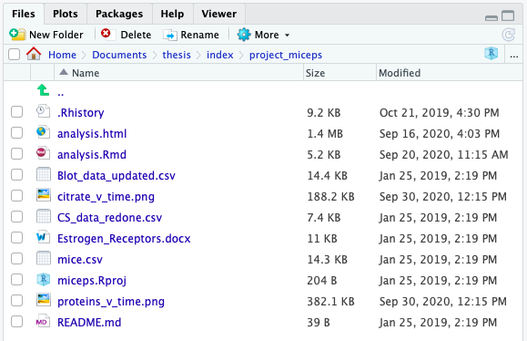
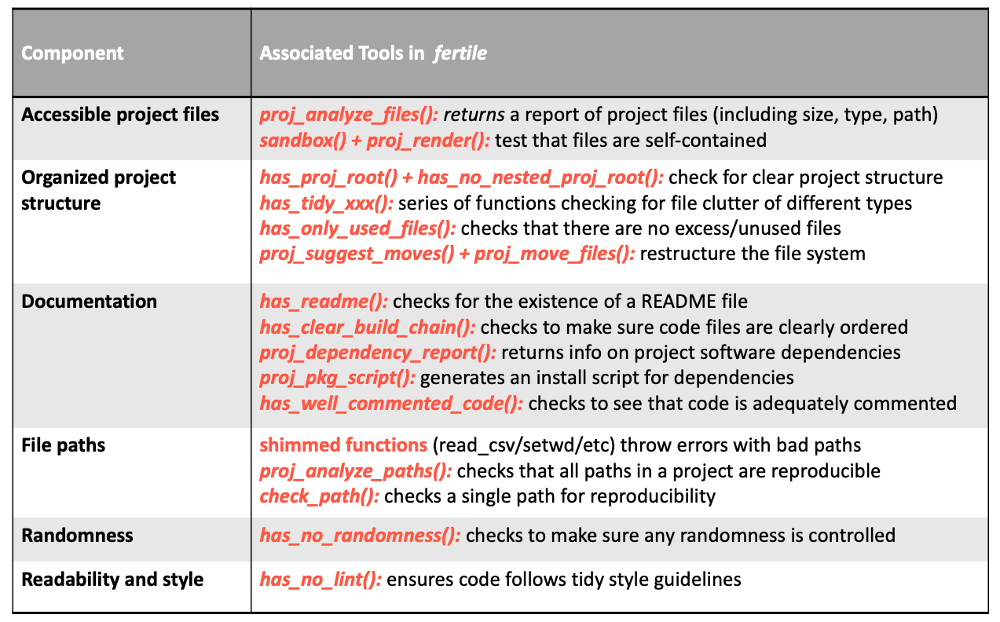
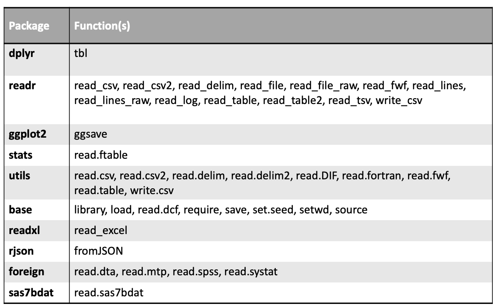

# `fertile`: My Contribution To Addressing Reproducibility {#my-solution}

##  `fertile`, An R Package Creating Optimal Conditions For Reproducibility

```{r, echo = FALSE, message = FALSE}
library(stringr)
wrapoutput <- function(output, width = 80) {
 message(paste(strwrap(output, width = width), collapse = "\n"))
}
```

What if it were possible to address the existing issues with both educational and software reproducibility solutions simultaneously? 

That is where my work comes in. In an attempt to produce meaningful change in the field of reproducibility, I have been developing `fertile`, a software package designed for `R` which helps users create optimal conditions for achieving reproducibility in their projects. 

```{r, echo = FALSE, out.width = "30%", fig.align = 'center', fig.cap = "fertile's Package Logo"}

```


`fertile` attempts to address the gaps in existing reproducbility solutions by combining software and education in one product. The package provides a set of simple, easy-to-learn tools that, rather than focus intensely on a specific area like other software programs, provide some information about all six major components of reproducibility. It is also designed to be incredibly flexible, offering benefits to users at any stage in the data analysis workflow and providing users with the option to select which aspects of reproducibility they want to focus on. 

`fertile` also contains several `R`-specific features, which address certain aspects of reproducibility that can be missed by external project development tools. It is designed primarily to be used on data analyses organized as `R` Projects (i.e. directories containing an `.Rproj` file) and contains several associated features to ensure that the project structure meets the standards discussed in the `R` community.

In addition, `fertile` is designed to be educational, teaching its users about the components of reproducibility and how to achieve them in their work. The package provides users with detailed reports on the aspects of reproducibility where their projects fell short, identifying the root causes and, in many cases, providing a recommended solution.

`fertile` is structured in such a way as to be understandable and operable to individuals of any skill level, from students in their first undergraduate data science course to experienced PhD statisticians. The majority of its tools can be accessed in only a handful of functions with minimal required arguments. This simplicity makes the process of achieving and learning about reproducibility accessible to a wide audience in a way that complex software programs or graduate courses requiring an advanced knowledge of research methods do not.

Reproducibility is significantly easier to achieve when all of the tools necessary to do so are located in one place. `fertile` provides this optimal all-inclusive structure, addressing all six of the primary components of reproducibility discussed in Chapter 1. We will consider `fertile`'s treatment of each of these components in turn, exploring its analysis of the sample R project shown below, titled "project_miceps":

```{r, echo = FALSE, out.width="100%", fig.cap="A Sample R Project"}

```


### Component 1: Accessibile Project Files

```{r, message = FALSE}
library(fertile)
```

`fertile` takes several steps to help users ensure that all of files necessary to run an analysis are provided in the project folder. 

#### File Overview

One of the fastest ways to gain an overview of the existing files (including data, code, and metadata) is with the `proj_analyze_files()` function. It lists all of the files in the project, along with their size, type, and relative path within the directory. This can help users quickly produce an overview of how many code, data, and auxilliary (image or text) files they have. 

 

```{r}
proj_analyze_files("project_miceps")
```

 

Users can also check for the existence of a README description file with `has_readme()`:

 

```{r}
has_readme("project_miceps")
```

 

#### Testing For Self-Containment

In order to truly check that a project is self contained, however, is is necessary to remove it from the environment it is located, ensuring that it can still run when cut off from the main file system.

The `sandbox()` function is designed to help facilitate this. `sandbox()` allows the user to make a copy of their project in a temporary directory that is isolated from the file system. 

 
```{r, echo=FALSE, message=FALSE}
library(tidyverse)
library(fertile)
```


```{r sandbox-1}
fs::dir_ls('project_miceps') %>% head(3)
```


```{r, sandbox-2}
temp_dir <- sandbox('project_miceps')
temp_dir
fs::dir_ls(temp_dir) %>% head(3)
```

 

Once a directory is sandboxed, users can run the `proj_render()` function, which checks all `.R` and `.Rmd` code files in the directory to ensure that they can compile properly, to ensure that their project is self-contained.

 

```{r, results = 'hide'}
proj_render(temp_dir)
```

 

If `proj_render()` executes without error, this indicates that all the necessary files are present. Users can also confirm this by checking the time stamp of the last successful render, captured in the `render_log_report()` function. If the time stamp matches the current time, the project successfully compiled.

 

```{r}
slice_tail(render_log_report(temp_dir))
```

 

### Component 2: Organized Project Structure

`fertile` provides a wide variety of features for managing the file system of a project. Nine of the package's fifteen primary reproducibility checks relate to file structure.

#### Clear Project Root

Two of these are focused on the `R project` aspect of the file system. `has_proj_root()` ensures that there is a single `.Rproj` file indicating a clear root directory for the project, while `has_no_nested_proj_root()` ensures that there are no sub-projects within. The recognition of a clear root directory is necessary to allow for file structure analysis and project restructuring as it provides a baseline directory to define relative file paths from.


#### No File Clutter

Six of the major checks, whose names begin with `has_tidy_` focus on file clutter, addressing one of the components of a clean file structure. They check to make sure that no audio/video, image, source, raw data, .rda, or .R files are found in the root directory of the project.

The last check that focuses on the file system is `has_only_used_files()`. One of the more complicated checks in `fertile`, this function checks to make sure that there are no extraneous files serving no purpose (that are not "used") included alongside the analysis. For this function to work properly, a clear definition of which files are considered as "used" is needed. In `fertile`, that definition includes the following:

* `.R`,`.Rmd`, and `.Rproj` files
* README files
* Data/text/image files whose file path is referenced, either as an input or output, in any of the `.R` or `.Rmd` files
* Outputs created by knitting any `.Rmd` files (`.html`, `.pdf`, or `.docx` files with the same name as the `.Rmd`)
* Files created by `fertile`. In an effort to capture information about dependencies, `fertile` creates a text file capturing the session information when a project is run and provides an option to generate an `.R` script that can install all of the packages referenced in a project's code. These files are considered "used."


 
```{r}
# List the files in the directory
fs::dir_ls("project_miceps")

# Check to see which are "used"
has_only_used_files("project_miceps")

```
 

#### Reorganizing File Structure

There are also several functions help with reshaping the entire project structure to a more reproducibile format. For example, `proj_suggest_moves()` provides suggestions for how to reorganize the files into folders.

 

```{r}
files <- proj_analyze_files("project_miceps")

proj_suggest_moves(files)
```

 

These suggestions are based on achieving the optimal file structure design for reproducibility, argued by @marwick2018packaging to be that of an `R` package (@coreteam-extensions, @hadley-packages), with an `R` folder, as well as `data`, `data-raw`, `inst`, and `vignettes`. Such a structure keeps all of the files separated and in clearly labeled directories where they are easy to find. Additionally, the extension of the `R` package structure to data analysis projects promotes standardization of file structure within the R community. 

Users can execute these suggestions individually, using the code snippets provided next to each file name when running `proj_suggest_moves()`, but they can also run them all together. `proj_move_files()` executes all of the suggestions from `proj_suggest_moves()` at once, building an `R` package style structure and sorting files into the correct folders by type.

Combined together, all of these functions make it simple to ensure that projects fall under a standard, simple, and reproducible structure with minimal clutter.

### Component 3: Documentation

  
High quality documentation, including the presence of a README file, comments explaining the code, a list of software packages an analysis is dependent on, and a method in which to understand which order to run code files in, is incredibly important to reproducibility. Without written guidance, individuals looking to reproduce results may not understand how to take all of the project components and combine them in the right way to produce the desired outcome. Additionally, code used without the proper dependencies and software versions, even if it is perfectly functional and correctly written, will often result in errors when compiled. 

`fertile` contains a variety of functions to ensure that projects are well documented.

#### README

One important component of documentation is the inclusion of a README file. A README is a text file that introduces and explains a project. Commonly, a project README contains background information necessary to understand a project. Some of the components that might be contained within are:

1. Background on the purpose of the project and the questions of interest.
2. Background on where the data used in the project came from and what they contain.
3. Information about installing and setting up the software necessary to run it.
4. A list of included files.
5. A description of how to run the project---for example, a summary of the order in which the included files should be run.
6. Contact information for the author of the project.

`fertile` ensures that a README is included alongside the user's project with the `has_readme()` function:

 

```{r}
has_readme("project_miceps")
```

 

#### Clear File Order

Another important component of documentation is that it must be clear in which order provided files should be run. While this information can be included as part of the README, it is sometimes provided via other methods---for example, through a `makefile`/`drakefile` (make-style file generated by the `Drake` package in `R`) or through a standardized naming or numbering convention of files. 

`has_clear_build_chain()` checks for these non-README methods of ensuring that file ordering is clear. `project_miceps`, since it only contains one code file, passes this check easily:

 

```{r}
has_clear_build_chain("project_miceps")
```

 

#### Software Dependencies

There are also several features focused on software dependencies. Every time the code contained within a project is rendered by `fertile`, the package generates a file capturing the `sessionInfo()` just after the code was run. This file contains information about the R version in which the code was run, the list of packages that were loaded, and their specific versions. 

The dependency information from `project_miceps` looks as follows:

 

```{r echo = FALSE, results = 'hide'}
proj_render("project_miceps")
```

```{r}
session_info <- "project_miceps/.software-versions.txt"
cat(readChar(session_info, 1e5))
```

 

Interactively, users can access this dependency summary using the function `proj_dependency_report()`. 

The `proj_pkg_script()` function builds off of this behavior, providing a method to simplify the process of installing the packages seen in the dependency report.  

When run on an `R` project directory, the function creates a `.R` script file that contains the code needed to install all of the packages referenced in the project, differentiating between packages located on CRAN and those located on GitHub.

 

```{r eval=TRUE, cache=TRUE, linewidth = 60}
install_script <- proj_pkg_script("project_miceps")
cat(readChar(install_script, 1e5))
```

 

Users interested in ensuring that their project is reproducible can provide alongside it both:

1. The text-based summary of dependencies produced by `proj_dependency_report()`.
2. The `.R` dependency installation script.

Then, anyone wanting to re-create the results would have the documentation necessary to do so alongside a quick and easy method to set up the required software. 

#### Code Commenting

In addition to README and dependency documentation, `fertile` also analyzes the quality of documentation provided directly alongside code. 

Code commenting---the process of placing human-readable descriptions next to code to explain what the code is doing---is incredibly important for ensuring that a project can be understood by someone other than its author. To ensure that their code is understandable, data analysts must regularly include comments throughout their project code files.

`has_well_commented_code()` is designed to check for this. The function reads through all `.R` and `.Rmd` files in a project directory and, for each, calculates the fraction of lines in the file that are comments. Files for which comments make up less than 10% of the written lines are flagged as poorly commented, warning users to make corrections and increase the number of comments in their code. 

The primary code file in `project_miceps`, "analysis.Rmd", is a great example of a poorly commented file. It only contains 6 lines of comments, while including over 100 lines of code. As such, it is flagged by `has_well_commented_code()`:

```{r}
has_well_commented_code("project_miceps")
```


What we *need*:

  - possibly a makefile generator? or improvements to order checking?
  

### Component 4: File Paths

`fertile` contains a variety of features designed to address issues with file paths. Several of these features happen proactively, warning users that they are entering a non-reproducible file path as it happens, while others can be accessed after a project has already been written.

#### Proactive Warnings When Coding

Proactively, `fertile` catches when an absolute path, or one leading outside of the project directory, is referenced in an input or output function and throws an error. 

This interactive behavior is one of the educational features of the package, as it immediately provides an informative message explaining to the user that such a path is not reproducible, giving the programmer an opportunity to learn and course-correct from there.

One of the important components of R package development, however, is that a package should not interfere too much with user behavior. Users who are trying to code in their console, for example, might still want to open a file if they know the path is not reproducible if they are just trying to take a quick look at some data.  

`fertile` accounts for this. Even though the package throws an error when non-reproducible paths are used, it also provides a solution for users to override this behavior and execute the command anyway. This is done through the error messaging system. The message provided when an error is thrown is custom created, responding to the command and path which triggered the error in the first place. For example, in the code below, `read.csv("~/Desktop/my_data.csv")`, gives a different message than `read_csv("../../../Desktop/my_data.csv")`.


```{r write_csv, include=FALSE}
readr::write_csv(mtcars, "~/Desktop/my_data.csv")
```

```{r fertile, message = FALSE, error = TRUE}
library(fertile)
file.exists("~/Desktop/my_data.csv")
read.csv("~/Desktop/my_data.csv")
read_csv("../../../Desktop/my_data.csv")
```

 
In addition to catching non-reproducible file paths, `fertile` also stops the user when they try to change the working directory. Unlike with input and output functions like `read_csv()`, which can take a variety of different file paths---some which may be reproducible and some not, `setwd()` is essentially guaranteed to break reproducibility, no matter what directory it is set to. As a result, `fertile` is particularly strict with it. When a call to `setwd()` is caught, `fertile` throws an error and does not provide an option to override. Rather, the user is given an alternative function (`here::here()`) to use that achieves the same behavior in a much more reproducible way.

```{r setwd, message=FALSE, error = TRUE}
getwd()
setwd("~/Desktop")
getwd()
```


#### Project Path Summaries

`fertile` also contains functionality that analyzes code for path information after it is written. For example, `proj_analyze_paths` goes through all of the paths used in a project's `.R` and `.Rmd` files and produces a report detailing which ones failed to meet reproducibility standards, explaining the problem, and providing a solution.

 

```{r}
proj_analyze_paths('project_miceps')
```

 

Paths can also be checked individually, or in groups, using `check_path()`.

 

```{r path checks, error = TRUE, message = FALSE}
# Path inside the directory
check_path("project_miceps")

# Absolute path (current working directory)
check_path(getwd())

# Path outside the directory
check_path("../README.md")
```

 

These functions, together, cover all of the reproducibility subcomponents involving file paths. Users are warned not to use absolute paths or paths pointing outside of the directory, both while they are coding and after the fact, and provided with a recommended solution to the problem if they do so. Additionally, users are prevented from using functions that will certainly break reproducibility and provided with safer alternatives. 

### Component 5: Randomness

The component of randomness is addressed by `fertile` in a reproducibility check function titled `has_no_randomness()`, which does the following: First, it checks code files to determine whether they have employed random number generation. This is confirmed by recording the random number generation seed prior to running the files, rendering the files, and then checking to see whether the seed has changed. If the seed has changed, that indicates that random number generation has occurred. Then, it determines whether whether any randomness present was semi-random (i.e. controlled and repeatable) or truly random, by checking whether the `set.seed()` function was called. If the randomness was semi-random, it is considered permissible and reproducible. Truly random code is flagged as dangerous.

Let us consider an example from `project_miceps`. The primary code file, `analysis.Rmd` contains the following code. In this code, we see that a data set is read in via `read_csv` and reformatted. Then, the `sample_frac()` function takes a random sample of 50% of the rows of the data.

 
```{r, message=FALSE, eval = FALSE}

mice <- read_csv("Blot_data_updated.csv") %>%
  transmute(time = `Time point`,
            sex = Sex,
            id = `Mouse #`,
            erb = `ERB Normalized Final`,
            era = `ERA Normalized Final`,
            gper = `GPER Normalized Final`) %>%
  mutate(day = case_when(
    time == 0 ~ -1,
    time == 1 ~ 0,
    time == 2 ~ 1,
    time == 3 ~ 3,
    time == 4 ~ 5,
    time == 5 ~ 7
  ),
  type = ifelse(time == 0, "control", "treatment")
  )
mice_tidy <- mice %>%
  select(-time) %>%
  gather(key = "protein", value = "amount", -day, -sex, -id, -type) %>%
  mutate(protein_label = factor(protein,
    labels = c("paste(ER, alpha)", "paste(ER, beta)", "GPER")))
```

```{r, message=FALSE, echo = FALSE}
library(dplyr)
library(tidyr)
mice <- read_csv("project_miceps/Blot_data_updated.csv") %>%
  transmute(time = `Time point`,
            sex = Sex,
            id = `Mouse #`,
            erb = `ERB Normalized Final`,
            era = `ERA Normalized Final`,
            gper = `GPER Normalized Final`) %>%
  mutate(day = case_when(
    time == 0 ~ -1,
    time == 1 ~ 0,
    time == 2 ~ 1,
    time == 3 ~ 3,
    time == 4 ~ 5,
    time == 5 ~ 7
  ),
  type = ifelse(time == 0, "control", "treatment")
  )
mice_tidy <- mice %>%
  select(-time) %>%
  gather(key = "protein", value = "amount", -day, -sex, -id, -type) %>%
  mutate(protein_label = factor(protein,
   labels = c("paste(ER, alpha)", "paste(ER, beta)", "GPER")))
```


```{r, eval = FALSE}
sample_frac(mice, 0.5)
```

 

However, there is no seed set in the file. As a result, `has_no_randomness()` returns as a failure for the project. Had a seed been set, however, the project would have passed.

 
```{r}
has_no_randomness('project_miceps')
```
 

`fertile`'s randomness-centered feature helps analysts know that their use of randomness is controlled, ensuring that functions involving random number generation will always produce the same output each time they are run.

### Component 6: Readability and Style

Though not an absolutely necessary component of reproducibility, code style can have a significant impact on how easy it is to follow the steps being taken in an analysis. The use of consistent and highly-readable style in code greatly simplifies and speeds up the process of understanding a data analysis project and repeating the steps included within. 

`fertile` addresses code style via the function `has_no_lint()`. This function checks code for compatibility with RStudio Chief Scientist Hadley Wikham's "tidy" code format, which promotes the following best practices:

* Line length should not exceed 80 characters
* There should not be trailing whitespace
* All infix operators (`=`, `+`, `-`, `<-`, etc) should have spaces on either side
* All commas should be followed by spaces
* There is no code left in the file that is commented out
* `<-` should be used instead of `=` to assign variables
* Opening curly braces should never go on their own line and should always be followed by a new line
* There should always be a space between right parenthesis and an open curly brace
* Closing curly braces should always be on their own line, unless followed by an `else` statement

Any issues with incompatibility that are found by `has_no_lint()` appear in a window by the RStudio console. This window lists the style inconsistencies found in each code document, showing both the description of the error and the line number where it occurred for each issue. This window is interactive; double-clicking on an error brings the user to exact location in the code where it occurred.

Let us consider an example. `project_miceps` contains an `RMarkdown` file titled `analysis.Rmd`, which contains some code involved with a data analysis. Some of the code is in tidy style but not all of it is. 

For example, line 71, part of a `ggplot` call, contains the following code:

 
```{r, eval = FALSE}
# Line 71 of `project_miceps/analysis.Rmd'

geom_hline(aes(yintercept = estimate + 1.96*std.error, color = sex), linetype = 3) + 
  
```
 

For this line, `has_no_lint()` finds the following inconsistencies with tidy style:

* Line 71: Lines should not be more than 80 characters.  

* Line 71: Put spaces around all infix operators.  

* Line 71: Trailing whitespace is superfluous.    

The first comes up because the true line length, including spaces, is 84 characters. The second comes up because the `*` between `1.96` and `std.error` is not surrounded by spaces. The third is flagged because there is an empty space after the `+` at the end of the line.

An even less tidy piece of code is that found on line 189, written as follows:

 
```{r}
# Line 189 of `project_miceps/analysis.Rmd'

if (length(mice) > 1){ holder_var = 1 }

```

 

For this line, `has_no_lint()` finds the following errors:

* Line 189: There should be a space between right parenthesis and an opening curly brace.  

* Line 189: Opening curly braces should never go on their own line and should always be followed by a new line.  

* Line 189: Use <-, not =, for assignment.  

* Line 189: Closing curly braces should always be on their own line, unless it's followed by an else.  

The first issue flagged is the fact that `){`, in the middle of the line, has no space in the middle. The second issue is flagged because the code to execute when the `if` statement is true (`holder_var = 1`) is on the same line as the `if` statement, rather than on its own line. The third error occurs because `holder_var` is defined using an `=`. And the fourth occurs because the closing curly brace is on the same line as other code rather than by itself.

These informative error messages provided by `fertile` help teach users to use consistent, tidy style in their code. They do so while making the learning process incredibly simple, allowing users to click and see exactly which symbol or character caused the error. In addition to providing a detailed explanation of the was in which the provided code is not tidy, `fertile` also suggests a simple and fast solution for resolving the inconsistencies all at once, recommending that users apply the `usethis::use_tidy_style()` function to format their code automatically.

### Summary of Reproducibility Components

As described in the previous sections, `fertile` addresses all six major components of reproducibility via a variety of functions. Some complex components have many associated functions attached to them, while others only have one. 

A summary of the six components of reproducibility and the functionalities in `fertile` associated with them is provided below.

```{r, echo = FALSE, out.width = '100%', fig.cap="Summary of Reproducibility Components and the Related Functionalities in 'fertile'"}

```


### User Customizability

`fertile` does not force its users into a box, instead allowing for a great deal of user choice in terms of which aspects of reproducibility to focus on. Users can run reproducibility tests at three different scales: 

1) Comprehensively, where all checks are run within a single function or two.

2) In groups, where functions focused on similar aspects of reproducibility are run together.

3) Individually, where only one reproducbility check is run at a time.

Users who want comprehensive behavior can access it through two primary functions, `proj_check()` and `proj_analyze()`. 

The `proj_check()` function runs all fifteen reproducibility tests in the package, noting which ones passed, which ones failed, the reason for failure, a recommended solution, and a guide to where to look for help. These tests, many of which were described in detail previously, include: looking for a clear build chain, checking to make sure the root level of the project is clear of clutter, confirming that there are no files present that are not being directly used by or created by the code, and looking for uses of randomness that do not have a call to `set.seed()` present. A full list is provided below:

 

```{r list-checks, tidy.opts=list(width.cutoff=60)}
list_checks()
```

 

The `proj_analyze()` function creates a report documenting the structure of a data analysis project, combining four key functions from `fertile` into one complete unit:

* `proj_analyze_packages()`, which captures a list of all packages referenced in the source code and which files they were referenced in
* `proj_analyze_files()`, which captures a list of all of the files located in the directory along with their type and size
* `proj_suggest_moves()`, which provides suggestions for how to reorganize files to create a more reproducible file structure
* `proj_analyze_paths()`, which captures a list of the non-reproducible file paths referenced in source code

 

```{r proj_analyze, tidy.opts=list(width.cutoff=60)}
proj_analyze('project_miceps')
```

 

Together, `proj_check()` and `proj_analyze()` cover a significant portion of all six major components of reproducibility.

Users wanting to focus on groups of checks can do so using the `proj_check_some()` function.
`proj_check_some()` leverages helper functions from `tidyselect` (@R-tidyselect) to allow users to call groups of similar checks together. `tidyselect` helpers tell `fertile` to call only the checks whose names meet certain conditions. The helper functions that can be passed to `proj_check_some()` are:

* `starts_with()`: Starts with a prefix.
* `ends_with()`: Ends with a suffix.
* `contains()`: Contains a literal string.
* `matches()`: Matches a regular expression.

For example, a variety of checks in `fertile` focus on making sure the project has a "tidy" structure--essentially that there are not files cluttered together all in one folder. Users interested in checking their tidyness can do so all at once using `proj_check_some()` as follows:

 


```{r echo=FALSE}
bad_file <- fs::path('project_miceps', "install_proj_packages.R")
if (file.exists(bad_file)) {
  fs::file_delete(bad_file)
}

```

```{r proj_check_some, warning = FALSE, tidy.opts=list(width.cutoff=60)}
proj_check_some("project_miceps", contains("tidy"))
```

 

Users might also attempt to call the two checks involving project roots together:

 
```{r}
proj_check_some("project_miceps", ends_with("root"))
```
 

Or, perhaps, they might want to run all the functions beginning with "has_only":

 
```{r}
proj_check_some("project_miceps", starts_with("has_only"))
```
 

If users do not want to run functions in groups, and prefer to run them individually, that option is also provided to them. Every check that makes up `check()` and every subcomponent of `project_analyze()`can be run individually. 

### Educational Features

Simply noting and correcting issues with reproducibility is not enough to produce lasting change in the scientific community. Data analysts and software users must also be educated on why their choices were not reproducible so that they do not fall victim to those mistakes again in the future, but also so that they can share their knowledge and experience with others in the scientific community.

`fertile` prioritizes this idea of reproducibility education throughout many of its functionalities.

One of the major ways through which `fertile` educates is users is a system of command tracking and interactive messaging. As long as `fertile` is loaded in `R`, the package records when commands that have the potential to affect reproducibility are run in the console. 

As soon as a dangerous function is called, `fertile` alerts the user of their mistake and provides suggestions for alternative solutions. This behavior, explained in more detail in Chapter 2.2.4, gives users immediate feedback on their behavior. In addition to assisting users in the moment, this method has also been shown to increase long-run retention of information when compared with feedback after the fact (@epstein2002immediate).

Users interested in looking back at their past choices and mistakes can do so as well. The `log_report()` function provides access to a log listing the commands with a link to reproducibility that have been called.


 

```{r read-csv, message=FALSE, include=FALSE}
library(purrr)
library(forcats)
read_csv(fs::path('project_miceps', "mice.csv"))
```

```{r log-report}
log_report()
```

 

Depending on how much history they want to keep track of, users have the option to clear the log and start from scratch via the function `log_clear()`.

In addition to this educational logging behavior, the reproducibility checks contained in the `check()` function also include educational messages. We consider several examples below:

* `has_no_randomness()`, when it fails, tells users that their code uses randomness and they should use the `set.seed()` function to control it.

* `has_only_used_files()`, when it fails, tells users that there are files present in the directory not being used for any purpose and provides a function (`fs::file_delete`) to use in order to remove them.

* `has_no_lint()`, when it fails, provides users a list of all of the ways in which their code fails to follow tidy style and points them to the exact lines and characters in the code where the mistakes occurred.

* `has_tidy_images`, when it fails, tells users that it has found files in the root directory which add clutter and recommends that they be moved to an `img/` directory.

Users are provided with an informative message about their issue but are not always provided a fully automated solution. This behavior encourages them to learn as they have to execute the suggested solution themselves.

However, even though `fertile` often requires users to take their own actions, that does not mean that the package requires users to be of high skill level to use. `fertile` is designed in such a way so its educational benefits can be achieved with relative simplicity and minimal effort so that even users brand new to `R` can gain knowledge and awareness of reproducibility from using it. 

For example, the interactive messaging features require no effort beyond the loading of the package with `library(fertile)` to activate. And many of the educational benefits contained within the checks can be gained all at once as well, with a single call of the `check()` function. Users looking for more customizability have the option to go into more detail with the more complex functions like `sandbox()`, but they are not necessary for users to gain benefit from the package. 


## How `fertile` Works

In the world of `R` packages, `fertile`'s behavior is rather unusual. Almost no other packages manipulate their users' `R` environments or file structure, instead remaining relatively self-contained. This unique behavior necessitates the use of several non-traditional techniques, described below.

### Shims

Much of the functionality in `fertile` is achieved by writing `shims`. In their application to `fertile`, shims can be defined as functions that transparently intercept users' intended actions and slightly alter their execution. 

`fertile` contains shims for a variety of common functions that may affect reproducibilty, including those that read and write files, load libraries, and set random number generation seeds. A full list of shimmed functions, organized by their original package, is provided below:

```{r echo = FALSE, out.width = '100%', fig.cap="List of Functions Shimmed by 'fertile'"}

```


When users perform actions that may threaten reproducibility, the package's shimmed functions intercept the user's commands and perform various logging and checking tasks before executing the desired function.

This allows `fertile` to warn users when they make mistakes and also to keep track of past behavior via a log of previously entered commands.

The process for writing a shim is as follows:

1. Identify an `R` function that is likely to be involved in operations that may break reproducibility. Popular functions associated with only one package (e.g., `read_csv()` from `readr`) are ideal candidates.

2. Create a function in `fertile` with the same name that takes the same arguments (and always the dots `...`).

3. Write this new function so that it: 
  a) captures any arguments, 
  b) logs the name of the function called, 
  c) performs any checks on these arguments, and 
  d) calls the original function with the original arguments. Except where warranted, the execution looks the same to the user as if they were calling the original function.
  
Most shims, when written, are relatively simple. Several, such as that for `library()` are more complex, but many follow the same basic format that can be seen in this example for`read_csv()`:

 

```{r}
fertile::read_csv
```

 

This functionality all occurs without the knowledge of the user. Consider the example of `read_csv()`. `read_csv()` is a very popular function from the `readr` package for reading in data files. Users with both `readr` and `fertile` loaded, will experience the following. The user will call `read_csv()` as normal, thinking that they are calling `readr::read_csv()`. However, they will actually be calling `fertile::read_csv()`, a very similar function with the same name. `fertile::read_csv()` will then capture the file path the user provided and check whether it is reproducible. If it is deemed okay, the function will execute as intended and read in the data just as `readr::read_csv()` would. If it is deemed non-reproducible, the function will return an error telling the user to use an alternate file path. Either way, `fertile` will record that the user called `read_csv()` and note the path that was provided to it for future reference.

This behavior, however, is dependent `fertile` remaining at the top of the `search()` path so that its functions are called preferentially over the original functions that it has shimmed. In order to ensure that the `fertile` versions of functions ("shims") always supersede ("mask") their original namesakes when called, `fertile` uses its own shims of the `library` and `require` functions to  manipulate the `R` `search` path so that it is always located in the first position. 

In the `fertile` version of `library()`,`fertile` is detached from the search path, the requested package is loaded, and then `fertile` is reattached. This ensures that when a user executes a command, `R` will check `fertile` for a matching function before considering other packages. 

### Hidden Files

In order to store and analyze information about user behavior and code structure, `fertile` utilizes three different types of hidden files, two of which are `.csv` format and one of which is a text file. The hidden `.csv` files for `project_miceps` can be seen below:

```{r}
fs::dir_ls("project_miceps", all = TRUE, glob = "*_log.csv")
```

The interactive log (`.fertile_log.csv`), accessible via `log_report()`, is created as soon as a user executes their first piece of code that could threaten reproducibility. This file tracks all of the shimmed functions executed by the user, either in the console or when running code chunks by hand (rather than knitting a file). It reports the function called, the relevant argument passed in (either a file path or `R` package name), and the time stamp of when the function was executed. Users can clear the data from this file and start fresh at any time with `log_clear()`.

The render log (`.fertile_render_log.csv`), accessible via `render_log_report()`, has a similar structure to the interactive log but is not under the control of the user. It tracks information about the code contained within `.R` and `.Rmd` files within the project a user is testing for reproducibility. A new render log file can be generated in one of three different ways:

1. The first time a user runs one of the major reproducibility checks from `fertile`, such as `proj_check()`, `proj_analyze()`, or one of the smaller checks within that requires access to the contents of code files.

2. Any time a check involving code is called in `fertile`, the package checks to see whether any code files have been updated since the last time a render log was generated. If so, a new render log is generated.

3. The user can generate a new file manually at any time by executing the `proj_render()` command.

The render log contains information used to run many of the checks in `fertile`. It captures the random number generator seed before and after executing code, notes which packages and files are accessed and the function with which they were called, and contains a timestamp of the last time the code was run by `fertile`. Users cannot erase it easily.

```{r}
render_log_report("project_miceps")
```

These files, integral to many of the functionalities in `fertile`, are not visible when looking at the file system. Users can only access them with functions provided by fertile, and user permissions are quite restrictive. Except for removing the command history in the interactive log, users cannot modify their contents, and neither the render log nor the interactive log can be deleted without the user modifying their file system. This prevents the files from mistakenly being tampered with, potentially impairing their functionality, and ensures that `fertile` always retains accurate information of user behavior. 

In addition to the two log files, `fertile` keeps a third hidden file to track project dependencies. Described in detail in the section on documentation, this file keeps track of the software setup that a project is run under. A new version is generated every time `fertile` compiles the project code files or when users request to view the file (via a special access function).  Like the log files, however, there is no simple way to manually modify or delete the file, ensuring that it does not accidentally get changed in a way that would damage reproducibility.

### Environment Variables

The shims in `fertile` are designed to be able to write to both the interactive and render logs. That way, no matter whether a user calls `read_csv()` interactively or writes it in their code file, `fertile` will still take note of the fact that the action has happened. 

Given the different purposes of each file, however, it is important that `fertile` be able to identify when a function execution should be saved to the interactive log versus when it should be saved to the render log.

This information is tracked via a logical environment variable: `FERTILE_RENDER_MODE`. When `FERTILE_RENDER_MODE` is `TRUE`, executed shims are saved to the render log. When it is `FALSE`, they are saved to the interactive log.

Since `fertile` is designed to always be capturing information about interactive user behavior, `FERTILE_RENDER_MODE` is `FALSE` by default. 

It is only changed to `TRUE` when `fertile` is executing functions that involve the rendering of `.R` and `.Rmd` code files. At the start of all such functions, `fertile` sets the environment variable to `TRUE`, executes the majority of the function, and then sets it back to `FALSE` before exiting. This ensures that as soon as the function has finished running, all new commands get executed on the interactive log, rather on the render log which was just generated. 

The example of `has_only_portable_paths()` illustrates this functionality. We see several clear steps to this function:

1. The environment variable is set to `TRUE`, so that `fertile` knows to write any information about shimmed functions to the render log.

2. If a render log does not yet exist or the project has been updated since the last time one was generated, then the project is rendered with `proj_render()`, generating a new render log.

3. This render log is read to find information about the file paths that were captured when executing the code files. 

4. `fertile` checks to see if the paths are portable and outputs a a list of the ones that are not, if any, in addition to some information about how to correct that.

5. The environment variable is set back to `FALSE` so that interactive behavior is once again captured. 

```{r}
has_only_portable_paths
```

### The Dots (...)

`fertile` utilizes the dots (...), which allow a function to accept additional arguments beyond those pre-defined in the function, to facilitate much of its behavior. The two primary locations the dots are used are in shims, the file path messaging system, and the `proj_check_some()` function. 

Many of the shimmed functions in `fertile` accept a large number of arguments. Consider `read_csv`. The function requires only one argument (`file`) but allows for up to 14. 

```{r}
readr::read_csv
```

When users call the shimmed version of `read_csv`, `fertile` does not need to process any arguments other than `file`, since that is the only piece of information directly relevant to reproducibility. Instead of defining all of the arguments once again, `fertile`'s `read_csv` is written to accept a file name and the dots , which then capture and save the additional input provided by the user. `fertile` checks the file path, and then uses the saved dots to then execute `readr::read_csv` the way that the user originally intended. 

```{r}
fertile::read_csv
```

The majority of shims have a similar structure. Since almost all shimmed functions in `fertile` take a large number of arguments, the `fertile` versions utilize the dots to simplify the process of capturing this user input and saving it for execution later. 

The dots are also used in the interactive file path messaging system, which notifies the user when they reference an absolute path or one leading outside of their project directory by throwing an error and providing an informative warning message. They are used in combination with shims to capture information about the user action that caused the error and to pass this information to the messaging system. This ensures that the override code provided at the end of the error message is customized to the user's behavior. In the example below, the warning message recognizes that `read.csv` was called with the path `~/Desktop/my_data.csv`, and incorporates that into the suggested code:

```{r}
read.csv("~/Desktop/my_data.csv")
```


Finally, the dots play a big role in the `proj_check_some` function. Recall that `proj_check_some` allows users to run a selection of `fertile`'s checks by calling a `tidyselect` helper to pull out a subset of checks with names matching a certain definition. 

This function, which accepts the arguments "(path,...)," operates by allowing the users to pass in their `tidyselect` call to the dots. The list of available checks are converted into the columns of a dataframe, then passed through `dplyr::select(...)`, where the dots contain the information about the user's `tidyselect` call. Then, all of the checks matching the `tidyselect` call are run on the provided directory path. 

This functionality, along with the other methods of shims, hidden files, and environment variables, helps improve the user experience of `fertile`. These unconventional techniques allow for the reliable tracking of user behavior behind the scenes and provide functions, like `proj_check_some`, that are intuitive for the user to operate.

## Summary

Recall the list of features necessary for an effective reproducibility tool that were defined at the end of Chapter 1. Many of the tools and teaching methods considered previously fail to meet these standards: they are often complicated and/or narrow in scope. `fertile`, on the other hand, has none of these problems. Rather, the package meets all of the defined conditions for effectiveness:

**1) Be simple, with a small library of functions/tools that are straightforward to use.**

`fertile` is very simple to use. Most of the package's features can be achieved with just two functions: `proj_analyze()` and `proj_check()`. The the interactive warning features---which throw errors when users reference absolute paths or those leading outside of the project directory---are even more straightforward. As soon as `fertile` is loaded, they are automatically enabled and require no additional effort from the user. Additionally, the operation of the functions themselves is quite simple---most functions in the package require only one argument: the path to the directory that the user wants to run the function on.

**2) Be accessible to a variety of users, with a relatively small learning curve.**

`fertile` has very few barriers to entry. The package only requires that its users be familiar with installing and loading packages from GitHub, executing functions in the console, and creating R projects, all of which can be learned in a handful of quick web searches. Running  `proj_check_some()` successfully would also require knowledge of the `tidyselect` helpers (`starts_with()`, `contains()`, etc.), but that function is not necessary for use in any way. Users who were unfamiliar with its behavior could simply choose just to run a handful of individual functions instead and achieve the same results. 

** 3) Be able to address a wide variety of aspects of reproducibility, rather than just one or two key issues.**

`fertile` contains functions that address all six primary components of reproducibility (see Fig. 2.2). Some components, which are more complicated and have a variety of smaller parts---such as documentation---have more functions associated with them. Randomness, the simplest component, has just one. While there are a variety of different functions for each component, it is not necessary for them to all be run independently. If a user is interested in checking all six components simultaneously, running `proj_analyze()`, `proj_check()`, and `proj_dependency_report()` together will achieve this goal. 

**4) Have features specific to a particular coding language that can address that language's unique challenges.**

`fertile` contains features to address the package system in R.

R is an open-source software that relies on packages (collections of functions) to achieve much of its functionality. Users who are looking to expand the available functions can contribute software packages to the community for public use. These packages are typically hosted either on the Comprehensive R Archive Network (CRAN) or on GitHub. Once a package is available on either site, any R user can download it and install it on their local R version. 

Most data analyses in R are dependent on a variety of packages. Depending on the complexity and topic of the analysis, the exact number may vary, but most analyses rely on at least a handful to operate successfully.

The challenge with this system is that R packages are updated constantly by their creators. Users who go a few weeks without updating their software might find that dozens of their packages have updates available. Due to the frequency of updates, it is a common occurrence for code that once worked to stop functioning due to a change in the functionality of one of the packages it is dependent on. 

As a result of this, tracking dependencies in R is more important than in some other coding languages. `fertile` attempts to address this through its dependency-tracking features (`proj_pkg_script()` and `proj_dependency_report()`), which together help the user of a package record the exact package versions that their project is dependent on and simplify the process of installing these dependencies by identifying which came from GitHub and which came from CRAN and creating a script with which to install them.

Another R-specific feature that `fertile` addresses is randomness. Randomness is incredibly important in statistics. Many statistical methods rely on random sampling in some way, and as a result, R---due to its purpose as a statistics-specific coding language---contains a wide variety of functions that use random number generation. In their default states, these functions produce a different result each time, and as a result are an inherent threat to reproducibility. In order to account for this, `fertile` contains the `has_no_randomness()` function, which reads scripts to ensure that any randomness (if present), is controlled (made pseudo-random) and reproducible.

**5) Be customizable, allowing users to choose for themselves which aspects of reproducibility they want to focus on.**

As discussed in Chapter 2.1.8, `fertile` is highly customizable, providing users with a wide variety of options for how they can run the package's reproducibility tests. The main reproducibility checks can be run all at once (using `proj_check()`), in groups (using `proj_check_some()`), or individually. Users who only want basic information can rely on only `proj_analyze()` and `proj_check()`, while those looking for more advanced reproducibility information can delve into the project dependency functions, as well as `sandbox()` + `proj_render()`, to ensure that projects are completely self contained.

**6) Be educational, teaching those that use it about why their projects are not reproducible and how to correct that in the future.**

`fertile` contains many different educational features. All of the reproducibility checks, when they fail, produce an informative warning message detailing where the failure occurred and providing a solution for how to address it. Additionally, the interactive warning system plays a big role in reproducibility education. Users are stopped immediately any time they use a non-reproducible file path and told why their path is problematic. This helps educate users on the correct use of file paths, ensuring that such mistakes do not happen many times.

**7) Be applicable to a wide variety of domains and users.**

