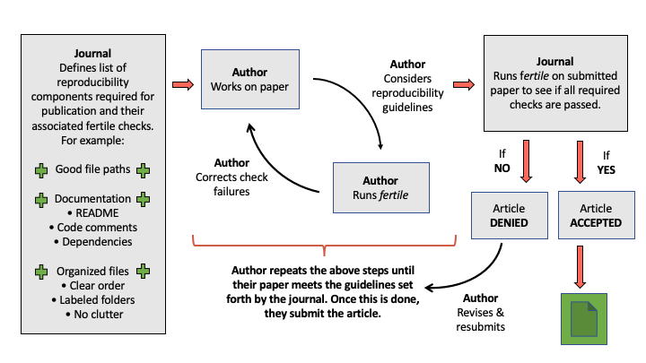
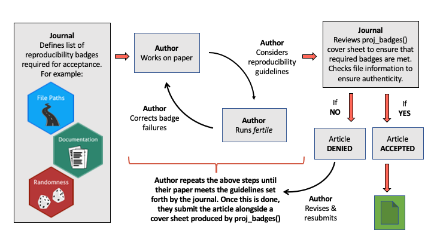
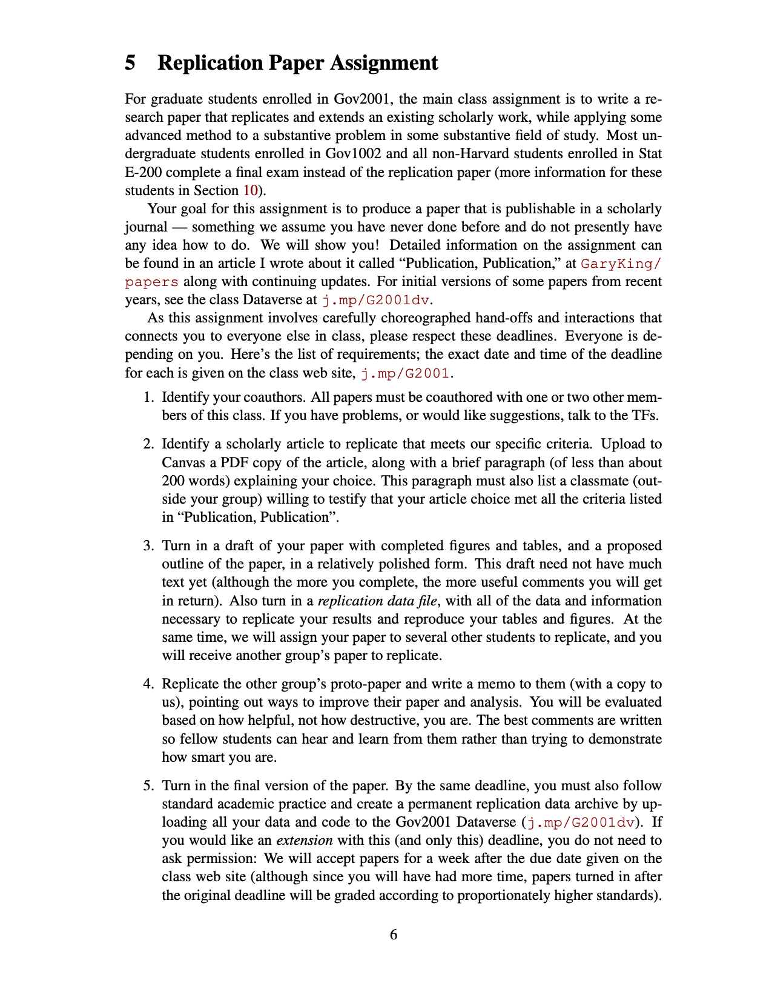
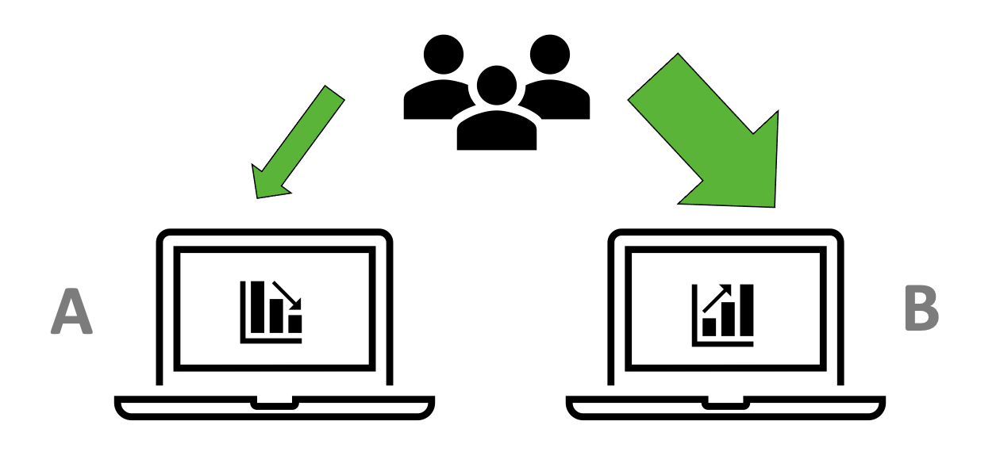

```{r, echo = FALSE}
library(formatR)
opts_chunk$set(tidy.opts=list(width.cutoff=80),tidy=TRUE)
```


# Incorporating `fertile` Into The Greater Data Science Community {#applications}

Finding a solution to addressing reproducibility on a widespread scale is a challenging problem. Attempts to do so--in academic publishing, software, and data science education--have made some progress, but many solutions have significant flaws. Primarily, they either:

A) Only address one small aspect of reproducibility--for example, software that focuses on version control or a set of journal guidelines requesting only that code and data be provided, but giving no further detail. 

\begin{center}
OR
\end{center}

B) Are challenging, time consuming, and/or burdensome to implement--for example, extensive journal guidelines, complex software packages with confusing functions, or academic courses on reproducibility that are only accessible to masters' students and take time away from other topics.

`fertile` is an attempt to address reproducibility in a way that does not fall victim to either of these challenges. Rather than focus on one area of expertise, `fertile` contains features focused on each of the six major components of reproducibility. Its self-contained nature allows users to address all aspects of reproducibility in one package; users can achieve near- or complete reproducibility with just a single piece of software. 

`fertile` also makes the processes of both achieving *and* checking reproducibility simple and fast. Those looking to check whether a project is reproducible can almost instantaneously receive a full report of where the project succeeds and where it fails, and those looking to improve their reproducibility can receive and act on `fertile`'s clear suggestions with minimal effort. Some of the package's features are enabled automatically and most others can be accessed with only a handful of functions, all of which are very simple in function. 

Additionally, `fertile` does not just provide a report on reproducibility and leave it at that. Instead, it attempts to teach its users the concepts of reproducibility in the same way that reproducibility-focused classes are meant to do. Users receive instant feedback when making mistakes and, when checking work after writing it, receive reports clearly indicating where issues were found, why they occurred, and how to correct them. 

It is also highly customizable, allowing users to utilize the tool in the way that fits their needs best. Those who want to focus their reproducibility checking in a certain direction have that option and those who want widespread overviews can also have their needs meet. Users who are interested in going beyond the base functionality of `proj_analyze` and `proj_check` also have additional functions at their disposal that they can use to check reproducibility, file paths, file types, etc.


## Potential Applications of `fertile`

These features make `fertile` an excellent tool for addressing the issue of scientific reproducibility on a widespread scale. `fertile` can provide a variety of benefits to users in all different application domains and with all different experiences. In this chapter, we consider the many potential uses of the package.

### In Journal Review

As discussed in Chapter 1, Academic journals have a significant reproducibility problem. In an attempt to address this, many journals have instituted reproducibility policies for submitting researchers to follow. Although a variety of journals have these policies, particularly in the Statistical and Data Sciences, very few actually go through the process of verifying that the standards are met. Authors, finding it to to be a complicated and challenging task, will often not take the necessary steps to make their work truly reproducible. And journals, given the amount of time and money required to verify submissions' reproducibility, will often give submitting authors the benefit of the doubt in assuming that their work is reproducible as long as some code and/or data has been provided. This results in the publishing of many articles that claim to be reproducible in theory, but do not meet such standards when tested in practice.

`fertile` could provide significant assistance with this process. Journals could integrate `fertile` into their article review workflow, ensuring that certain reproducibility checks were passed before an article could be accepted.

Depending on the level of detail with which the journal wanted to examine reproducibility, the integration could be done in a variety of ways. Here, we'll consider two:

1. Journal reviewers run `fertile` on every submitted `R` project.

Journals that desire a detailed summary of the reasons for reproducibility failure (such as information that one specific file was not commented enough)---and whose editors were willing to put in a little bit of time to collect this information---could choose to run `fertile` on all submitted papers that included `R` code.

They could require a list of checks to pass and provide a list of exceptions for cases in which checks could fail---for instance, a journal could state that even though they support good documentation, they do not require code to be fully commented. 

Authors could run `fertile` on their work before submitting it to a journal to ensure that they passed the required list of checks and that any failures they saw were accounted for in the journal exceptions. Then journals, in order to ensure that authors followed the provided reproducibility guidelines, could run `fertile` on each submitted article as part of the review process. If the required checks were passed, the article could be accepted, but if they failed it would be rejected.

Although it would require some effort on the journal's side, this would still be a very fast process: as long as a journal required that all submissions in `R` be in the `R Project` format, one reviewer could load the submission, run `fertile`, and receive a summary of the submission's reproducibility in a matter of minutes. 


```{r, echo = FALSE, out.width = '100%', fig.cap="Potential 'fertile' Journal Review Process"}

```

2. Journal reviewers do not run `fertile` on each project, but instead require submitting authors to include a `fertile` summary sheet showing the reproducibility badges awarded to their work.

Some journals may desire a reproducibility summary, but not require details as specific as the exact reasons for failure. These journals could run a simplified approach to reproducibility review. Rather than spend the additional time to run `fertile` on every submission and review the reasons for check failure, the journals could instead require that authors include a cover sheet---produced by the `proj_badges()` function---with their submission. 

This cover sheet would show which of the six primary reproducibility components were met and which ones failed, a short summary of specific checks that were not successful, and information about the cover sheet's generation: who generated it, when, and with which files. 

Journals could place an acceptance requirement that articles achieve a certain subset of badges---for instance, file paths, randomness, and documentation. Submitting authors would run `fertile` on their end to see which badges they passed. Once they met the requirements, they could run `proj_badges()` to generate an article cover sheet. This cover sheet would then be submitted alongside the article and considered as part of the review process. All that reviewers would need to do to ensure that reproducibility requirements are met would be to look at the cover sheet to see which badges the project achieved and check the cover sheet generation information to ensure that it was truly produced by the project that the author says it was produced by. 

```{r, echo = FALSE, out.width = '100%', fig.cap="Another Potential 'fertile' Journal Review Process"}

```


Both of these processes would be much faster than that employed currently at the American Journal of Political Science, which goes through a thorough, multi-week-long reproducibility confirmation procedure for all submitted articles. Submitting researchers would know exactly which goals they were trying to achieve. They could download `fertile` on their own, run it on their project, check to see if their goals are met, and take the recommended steps to address failures if not. Then, upon submission, journals would only need to take minimal steps to ensure that those standards were met.

For journals that currently spend little effort on ensuring the reproducibility of submitted articles,`fertile` could provide significant benefit for minimal cost. Rather than spending money to hire a reproducibility editors, any journal board wanting to improve their publication's reproducibility could instead choose to implement `fertile`---for free---as part of the review workflow.

Journals that already have designated reproducibility editors, such as *Biostatistics* and the *Journal of the American Statistical Association*, could also see benefits from `fertile`(@journal-biostats, @jasa-rep-editors). The integration of `fertile` could speed up the review process, allowing the editors to review more papers for reproducibility adherence in a shorter time.

Although this would only address a small aspect of reproducibility--that involving data analysis projects written in R--it would provide a significant time- and money-saving impact for both authors and reviewers in that domain.


### For Teaching Reproducibility

`fertile` could also be integrated into Statistical and Data Sciences coursework in order to educate students on topics of reproducibility. 

Many of the existing programs to teach reproducibility are courses focused on replication studies, where students must take a published paper and replicate the steps within completely. This process, which includes requesting the necessary data and code files from the original author(s) and sometimes even expanding the existing analysis further, often requires that participants have knowledge of data analysis and the scientific research process to be successful. As a result, such courses focused on reproducibility tend to exist only at the graduate level.

Undergraduate students, therefore, do not get exposed to reproducibility very often. There are a few exceptions--for instance, introductory courses at Smith College and Duke University that integrate RMarkdown to promote reproducible workflows--but overall, reproducibility is not covered in data science courses the undergraduate level.

`fertile` could help change this, allowing for many more colleges and universities to integrate reproducibility into their courses. The barriers to entry for using and benefiting from the package are very low, requiring only that participating students have:

* R and RStudio installed on their computer
* Knowledge of how to install a package from GitHub and load it into their environment
* Knowledge of how to create an R project
* Knowledge of how to run basic functions and input simple file paths

Though the process may entail some confusion and troubleshooting at first, even those brand new to `R` could succeed in overcoming these barriers in only a few days of class. As a result, `fertile` could provide professors with an opportunity to teach reproducibility concepts in introductory level courses. 


```{r, echo = FALSE, out.width = '100%', fig.cap = "The Replication Assignment From Harvard Professor Gary King's Gov 2001 Graduate Course", fig.subcap="Source: https://projects.iq.harvard.edu/files/gov2001/files/syllabus.pdf"}

```


`fertile` could easily integrate into coursework in a similar way to how RMarkdown was integrated at Smith College and Duke University. While there is not only one way to utilize the software in class, a potential use of `fertile` could look as follows:

At the beginning of their courses, the professor provides their students with a brief introduction to reproducibility, including its importance and a basic description of how it is achieved. Shortly after, they introduce R Projects and the `fertile` package, explaining that they are tools to help with reproducibility. Then, they institute a requirement for all submitted homework assignments in the course: students must create and submit their work in the R Project format, but prior to submission must run `fertile` on their project to ensure that it passes reproducibility standards. When reproducibility errors inevitably occur, they can be used as teaching moments: the professor can share the error, explain why it happened, walk through `fertile`'s response to it, and interactively work with students to illustrate how it can be fixed.

The integration of `fertile` in this way would be an excellent method to introduce students to reproducibility concepts early on in their data science education, but at a low cost to the professor. 

There are a variety of benefits to introducing students to reproducibility sooner, rather than later--in graduate school or through independent research on the topic:

* Teaching reproducibility early on gives students important research tools and understanding before they conduct any of their own important analysis.

* Practicing before students are believed to be skilled and highly educated in data science gives them an opportunity to fail and learn without fear of judgment.

* Integrating concepts early helps ingrain them in the minds of students, ensuring that reproducibility begins to come naturally to them.

These students would then be prepared for entering the research world and contributing to data science work in a transparent and reproducible way. 


### In Other Areas

`fertile` can also provide benefits in other domains. Though not an exhausted list, some of the potential uses of the software are: 

* *Private Companies*: Data analysis-focused companies could require their employees to use `fertile` to check the reproducibility of their projects before presenting them to clients. This would help such companies ensure that clients could trust the results that were being produced. 

* *Conferences*: Similar to academic journals, conferences promoting open research could require that papers written in `R` pass a `fertile` check as a condition for acceptance. Even if there were an exception given for those using confidential/identifiable data, this would likely increase the overall reproducibility of conference papers significantly.

* *Informal Data Analysis*: A lot of content in the `R` community is created purely for fun and interest. Outside of work, many `R` users will create data visualizations or analyses for their own private blogs or their twitter. Sometimes, users will also participate in community events like Tidy Tuesday, a weekly social project where a data set is posted and users are asked to analyze it and create a visualization of their choice. Many people use these informal analyses as an opportunity for learning and discussion, often sharing them on social media to try and get feedback on their work. Ensuring that the work is reproducible would facilitate this process. Users could run their project files through `fertile` to check that they are reproducible and post a link to download them. This would then allow others to run the code on their own to understand how it works and more easily be able to make suggestions as to how to improve it!  

```{r, echo = FALSE, out.width = '100%', fig.cap = "The Logo For Popular Tidy Tuesday Event"}
knitr::include_graphics("figure/tidytuesday.png")
```

`fertile` is versatile in its applicability. It can be used anywhere from informal data analysis projects to academic journal review. 


## Testing fertile in the Real World: Experimental Design and Analysis

### Background

Many of the suggested uses for `fertile` in the previous section are hypothetical, included for the purpose of demonstrating the potential that the package could have. Without experimentation or testing, though, it is difficult to know just how successful `fertile` would be when employed for any given purpose. 

In order to gain a better understanding of the practical effects of using `fertile` in a real life scenario, Professor Baumer and I decided to conduct an experiment (approved by Smith College IRB, Protocol #19-032). We were interested in testing whether the integration of `fertile` into an introductory data science course might have an effect on students' learning of reproducibility concepts. 

After designing our experimental structure, working out technical mechanics, and creating the necessary materials, we chose to use the following two course sections for our study:

1. Introduction to Data Science (SDS 192), Fall 2020 Semester
2. Introduction to Data Science (SDS 192), January-Term 2021

There were several motives for selecting these specific courses:

- They were both being taught by Prof. Baumer, which made it easy to ensure that everything went smoothly by removing the need to interact with a 3rd party.
- They were two different sessions of the same course, with essentially identical material, ensuring that we could compare results from each section of the experiment. 
- They involved introductory data science students, one of the groups that were of most interest as we wanted to ensure that `fertile` could provide benefit to users of all skill levels. 
- They were somewhat larger than many other classes in the Statistical and Data Sciences department, providing an opportunity for more data collection. 


### Experimental Design

For the experimental structure, we chose to complete a randomized controlled trial (RCT) since RCT designs can be used to conclude causality and are designed in such a way as to limit bias in the results. 

Our goal was to determine whether students who had `fertile` installed and loaded on their R Studio applications would learn more about reproducibility throughout the course than students who did not, or whether there was instead no difference or even a negative effect.

In order to measure this potential effect, we opted to use reproducibility "tests," forms containing multiple choice and select-all-that-apply questions about different aspects of reproducibility that are focused on in `fertile`. 

We used two different testing structures for our two experimental sections--partially due to challenges which led to our first experiment session starting on a slight delay, but also so that we could compare which structure worked more effectively. While the primary goal of the experiment was to determine the effect of `fertile`, a secondary interest was in the experimental method itself--a new method that we developed, which has implications beyond purely this case. 

- Structure #1 (Used in Fall 2020): Students received a reproducibility test at the end of the semester to test their knowledge after the course. Final scores were compared between students who had `fertile` installed and loaded and those who did not.

- Structure #2 (Used in January Term 2021): Students received a reproducibility test both at the beginning of the course *and* at the end of the course in order to test their *change* in knowledge. *Differences in scores* were compared to see if any given group learned more, less, or the same.

Although the testing structures were different across the two different sections, the reproducibility tests were identical.

To reduce bias to a maximum degree, we opted to use blinding, in which participants were unaware of whether they had received the experimental or control condition--in this case, whether they had `fertile` installed and loaded while working on course assignments, or whether they didn't.

To achieve the desired blinding, we decided to use some unique features of R packages which allowed us to give all students in the course the same software, but have it behave differently when loaded, depending on which experimental group the student was a part of. 
This technique is described in the step by step experimental structure, explained below: 

1.Students were given a form at the start of the semester asking whether they consented to participate in a study on data science education. Additionally, information was collected about the previous number of courses that student had taken in data/computer science fields, which we believed might impact their knowledge of reproducibility. 

In order to successfully consent, students had to provide a unique computer identifier, collected through either the command `Sys.getenv("LOGNAME")` or `Sys.getenv("USERNAME")`, depending on the student's operating system. This identifier was collected in order to ensure that students could be individually identified and therefore assigned effectively to treatment or control groups. 

2. To maintain student privacy, the unique identifiers were then transformed into hexadecimal strings via the `md5()` hashing function. While these hashed sequences have meaning in the students' computers and the course software program, to those without the original identifier, they appear only as a meaningless string of letters and numbers.

3. These hexadecimal strings, which correspond to unique students, were then randomly assigned into equally sized groups, one experimental group that receives the features of `fertile` and one group that receives a control.

4. The students in the course were then asked to download a package called `sds192` (the course number and prefix), which was created for the purpose of this trial. The package contained several templates and data sets that were necessary for use in the course, so all students in the class--regardless of their experimental status--needed to install it.

The `sds192` package operated by leveraging an `.onAttach()` function to scan the `R` environment of each student *each time the package is loaded*, collect their unique identifier--again, via `Sys.getenv("LOGNAME)` or `Sys.getenv("USERNAME")`-- and run it through the same hashing algorithm as before. This function came pre-coded with the hashed identifiers of all of the students, grouped by whether they had been assigned to the experimental or the control group. 

Each time a student's hashed identifier was collected (every time they loaded the `sds192` package for class), it was then compared with the provided groups to determine how the package should function for that individual.

The structure of this function can be seen below:

```{r, eval = FALSE}

# .onAttach() from the sds192 package
# Run automatically any time the sds192 package is loaded

.onAttach <- function(libname, pkgname) {

  # The experimental group gets `fertile` loaded secretly
  if (is_experimental()) {
    suppressMessages(library(fertile))
  }
}

is_experimental <- function(logname = whoami::username()) {
  
  # Students are placed into experimental and control
  # groups but remain anonymous
  fertile_group <- c(
    "f7b0a9d5117b88cecec122f8ba0e52fb",
    "4d0295a810fb8491f91f914771572485",
    "36211a1f19f82ae07aed990b671c9b20",
    "b5d2b72b4f36f3afdce32a8409dc6ea0",
    "d498227fd9e6a4c42494bbebc42f6aa8",
    # ... and so on
  )
  control_group <- c(
    "9aa36583f54766205850428e8f1a4c89", 
    "f03020938b31818063c79d2422755183", 
    "7ec57b1f2bca9ac1e702fb68427b781b", 
    "e5e30623e9d09d29ded851b7fb40cb51", 
    "592572bb9fce168f37117fd0d6e0e5ee",
    # ... and so on
 
  )
  

  digest::digest(logname, algo = "md5") %in% fertile_group
  
}
```


5. The experimental group received the basic `sds192` package, which consisted of some data sets and `R` Markdown templates necessary for completing homework assignments and projects in the class, but also loaded `fertile` silently in the background. The package's proactive features were enabled, and therefore users would receive warning messages when they used absolute or non-portable paths or attempted to change their working directory. The control group received only the basic `sds192` package, including its data sets and `R` Markdown templates.

6. [January Term 2021 Only] Students then took a reproducibility test prior to fully starting the course, which tested their knowledge before completing the class.

7. The students then completed their coursework as normal, regularly using the `sds192` package for projects and homework assignments.

8. [Both Fall 2020 and January Term 2021] The last step was for students to take a reproducibility test at the end of the course, to measure their knowledge of the subject after having completed the coursework and used the `sds192` package.

### Results

In order to understand the results, it is important to understand the structure of the experimental reproducibility "test" and the way in which each student's answers were scored.

The test consisted of two primary sections:

1. A set of six questions on RStudio projects, two of which were select-all-that-apply, and four of which were multiple choice. These questions tested students knowledge of RStudio projects, their understanding of which file paths they could include in code submitted in project format, and their awareness of the dangers of changing working directories while coding.

2. A set of three questions about file paths, all of which were select-all-that apply. These questions tested students' knowledge of the difference between absolute and relative paths and their understanding of which paths are reproducible.

For reference, the full list of questions is provided in Appendix B.

For each test submission, every question was scored individually and then scores for each section (projects and paths) were calculated, as well as an overall total score. 

The following method was used to compute scores:

- For each question, students would start at a score of zero. Based on their answers, points would then be added, subtracted, or stay constant. 

- On select-all-that apply questions, the following scoring rules were used. This meant that students who answered some things correctly, but other things incorrectly, could still receive negative or neutral scores, based on the overall analysis of how correct they were:
     - Each correct box that was checked --> +1 Point
     - Each incorrect box that was checked --> -1 Point
     - Each box not checked but should have been --> No change (0)
     
- On multiple choice questions, the scoring rules were slightly different. This was due to the inclusion of an option for "I'm not sure," which was included as a way to discourage random guessing and ensure that students were answering based on their actual knowledge.
     - If the correct answer was selected --> +1 Point
     - If the incorrect answer was selected --> -1 Point
     - If the student expressed uncertainty ("I'm not sure") --> No change (0)
     
This method meant that individual questions could have negative, positive, or neutral scores, and total scores could vary quite dramatically, from large negative scores (<-10) for students who regularly answered incorrectly to large positive scores for those who often answered correctly (>10).


```{r, echo = FALSE,  message = FALSE}
library(readr)
library(tidyverse)


fall2020 <- readr::read_csv("data/Fall_2020_Single_Post_test.csv")
jterm2021 <- readr::read_csv("data/JTerm_2021_Pre_Post.csv")
jterm2021$Test <- factor(jterm2021$Test, levels = c("Pre", "Post"))

```

#### Fall 2020 Results

The data from Fall 2020, after being scored and cleaned up, looked as follows:

```{r, eval = FALSE}
glimpse(fall2020)
```

\small
```{r, echo = FALSE, fig.cap = 'Fall 2020 Data'}
glimpse(fall2020)
```
\normalsize

There were 18 students who completed the reproducibility test, split evenly into two groups of 9, and 15 variables per student. Since the Fall 2020 section of the experiment contained only one reproducibility test, each student only has one associated observation in the data.

1. `User_Hash`: Hashed identifiers, representing unique students.
2. `Group`: A categorical variable summarizing whether the student was in the experimental (`fertile`) or control group.
3. `Previous_Classes`: The number of previous data science / computer science courses the student had taken at the start of the semester.
4-12. `Qx_Points`: The number of points scored on each individual question.
13. `Projects_Total`: The total number of points scored on the six questions associated with R Projects.
14. `Paths_Total`: The total number of points scored on the three questions associated with file paths.
15. `Overall_Total`: The total combined score of all nine questions.

The de-identified data, including all 15 variables of interest, are available with open access at https://github.com/ambertin/thesis.

The score averages for both groups of students were as follows:

```{r, echo = FALSE, fig.cap = 'Table: End of Course Reproducibility Test Averages by Group, Fall 2020'}
fall2020 %>% 
  group_by(Group) %>%
  summarize(Projects_Avg = mean(Projects_Total),
            Paths_Avg = mean(Paths_Total),
            Overall_Avg = mean(Overall_Total))

```

These numbers, combined with the visual below seem to indicate, at least in this small sample, that the `fertile` group actually performed slightly worse, overall, than the `control` group.

```{r, echo = FALSE, fig.cap = 'Bar Chart: End of Course Reproducibility Test Averages by Group, Fall 2020', fig.height = 3, fig.width = 5}
library(RColorBrewer)

fall2020_averages <- fall2020 %>% 
  group_by(Group) %>%
  summarize(Projects_Total = mean(Projects_Total),
            Paths_Total = mean(Paths_Total),
            Overall_Total = mean(Overall_Total)) %>%
  pivot_longer(cols = 2:4, names_to = "Question_Average")

ggplot(fall2020_averages, aes(x = Group, fill = Group, y = value)) + 
  facet_wrap(~Question_Average) + 
  geom_col() +
  ylab("Average Score") +
  scale_fill_brewer(palette = "Paired") +
  xlab(NULL)
```

Looking at the overall total score (`Overall_Total`), this was true even when controlling for the number of relevant courses taken previously:

```{r, echo = FALSE, fig.cap = 'Scatterplot: Previous Coursework vs Total Reproducibility Test Score, Fall 2020', fig.height = 3, fig.width = 5}
ggplot(fall2020, aes(x = Previous_Classes, y = Overall_Total, col = Group)) + 
  geom_point(size = 4) +
  scale_color_brewer(palette = "Paired")
```

However, when analyzed mathematically, the results appear less negative. A t-test and analysis of variance (ANOVA) conducted on the simple regression model $Overall_Total ~ Group$ both indicate that, although there is a potential negative trend between the use of `fertile` and a student's score on the reproducibility test, there is not enough evidence to conclude that this relationship was *not* just the product of chance. The p-values of 0.117 are not below the threshold of 0.05 used to determine statistical significance.

```{r, echo = FALSE, fig.cap = 'Simple Linear Regression T-Test Results, Fall 2020'}
fall_model <- lm(Overall_Total ~ Group, data = fall2020)
summary(fall_model)
```


```{r, echo = FALSE, fig.cap = 'Simple Linear Regression ANOVA Results, Fall 2020'}
anova(fall_model)
```

#### January Term 2021 Results

We see a similar story with the data from January Term 2021, though the structure of the data set is different.

The January Term data looks as follows:

```{r, eval = FALSE}
glimpse(jterm2021)
```

\small
```{r, echo = FALSE, fig.cap = 'January Term 2021 Data'}
glimpse(jterm2021)
```
\normalsize

It has many of the same features as the Fall 2020 data, though there are a few differences.

1. This data set contains data on 38 students, rather than 18.
2. Each student has two rows of data that correspond to them, rather than just one.
3. There are two new variables, `Student_ID` and `Test`. `Student_ID` is an index, used to keep track of which rows belong to the same student. This was created as an alternative to `User_Hash` as we found that users of Smith College-provided laptop computers would occasionally have non-unique hashed IDs. `Test` has either the value "Pre" or "Post", identifying which test the row corresponds to--the test at the beginning of the course, or the one at the end, respectively. 

Just as with the Fall 2020 data, these de-identified data are available publicly at https://github.com/ambertin/thesis.

When calculating the difference in reproducibility test scores between the end ("Post") and beginning ("Pre") of the course, the story looks a little bit less negative than before, but once again there does not appear to be much strong evidence in favor of `fertile`. 

For the questions about file paths, there appears to be no difference in the average score at the beginning and end of the course for either group. For the questions about R Projects, the `fertile` group had slightly higher average score differences but not by that much (1.92). For the overall total number of points, the score differences were very similar (2.15 for the `control` group and 2.22 for `fertile`).

```{r, echo = FALSE, message = FALSE, fig.cap = "Average Score Difference Between Beginning/End of Course, January Term 2021"}
pre_post_differences <- jterm2021 %>% group_by(Student_ID, Group, Previous_Classes) %>%
  summarize(pre_total = ifelse(Test == "Pre", Overall_Total, NA),
            post_total = ifelse(Test == "Post", Overall_Total, NA),
            pre_projects = ifelse(Test == "Pre", Projects_Total, NA),
            post_projects = ifelse(Test == "Post", Projects_Total, NA),
            pre_paths = ifelse(Test == "Pre", Paths_Total, NA),
            post_paths = ifelse(Test == "Pre", Paths_Total, NA)) %>%
  group_by(Student_ID, Group, Previous_Classes) %>%
  summarize(Total = na.omit(post_total) - na.omit(pre_total),
            Projects = na.omit(post_projects) - na.omit(pre_projects),
            Paths = na.omit(post_paths) - na.omit(pre_paths)) %>%
  pivot_longer(cols = 4:6, names_to = "Question_Group", values_to = "Score_Difference")


pre_post_differences %>%
  group_by(Group, Question_Group) %>%
  summarize(Avg_Score_Difference = round(mean(Score_Difference), 2))

```

When considering the distribution of test scores, in addition to just the pure difference, we see a pattern where those students in the `fertile` group appeared to score worse than the `control` group, on average. Yet, when considered all together, the `fertile` group's scores improved slightly more over the time of the course than the `control` group's.

This evidence appears to strengthen the previous claim--using the Fall 2020 data--that the potential negative relationship between reproducibility test score and use of `fertile` is likely a product of random chance. In both experimental sections, Fall and January Term, students in the `fertile` group performed slightly worse than the `control` group on the reproducibility tests taken at the end of the course. However, the additional evidence from the January Term "Pre-Test" appears to indicate that the reason for that lower score might be just that they started from a lower point of knowledge at the beginning, rather than that `fertile` directly affected their scores.


```{r, echo = FALSE, fig.cap = "Boxplot: Pre- and Post-Test Score Distributions by Group, January Term 2021", fig.height = 3, fig.width = 5}
group_scores <- jterm2021 %>% select(1:5, 15:17) %>%
  rename(Projects = "Projects_Total",
         Paths = "Paths_Total",
         Overall = "Overall_Total") %>%
  pivot_longer(cols = 6:8,
               names_to = "Question_Group",
               values_to = "Score")

ggplot(group_scores, aes(x = Test, y = Score, fill = Group)) +
  geom_boxplot() +
  facet_wrap(~Question_Group) +
  scale_fill_brewer(palette = "Paired")
```

We can also view the difference in scores on a more individual level. Below, we see the score differences (looking purely at `Overall_Total`, rather than just `Paths` or `Projects`) of all 38 students in the January Term study, ordered from lowest score differential (those who performed worse on their Post-Test than their Pre-Test), to highest.

```{r, echo = FALSE, fig.cap = 'Bar Chart: Pre- and Post-Test Score Differences For All Individuals, January Term 2021', fig.height = 3, fig.width = 5}
jterm_model_data <- pre_post_differences %>% 
  filter(Question_Group == "Total")

ggplot(jterm_model_data, aes(x = reorder(Student_ID, Score_Difference), y = Score_Difference, fill = Group)) + 
  geom_col(color = 'black') + 
  geom_hline(yintercept = 0) + 
  theme(axis.text.x = element_blank(), 
        axis.ticks.x = element_blank()) + 
  xlab(NULL) +
  scale_fill_brewer(palette = "Paired")
```

As we can see, the majority of students improved on their reproducibility knowledge throughout the course. However, some students actually performed significantly worse over time. While students in both the `fertile` and `control` group had negative performances such as these, more of the highly-negative showings came from those in the `control` group. There is one outlier who appears to have performed significantly worse on their Post-Test than their Pre-Test. When looking at students who performed better over the course, the distribution is slightly more balanced. The two students who made the most improvement, however, were both in the `control` group. 

Once again, there is not much evidence that `fertile` is providing a significant benefit, and the outlier on the left indicates that the reason for the slight edge of `fertile` in terms of average score differences might just be due to one student skewing the `control` group's averages.

It is also interesting to examine the relationship between the number of previous courses taken by students and their performance on the reproducibility tests.

Below, we see a graphical representation of the number of previous courses taken by each student and the difference between their overall total score on their Pre- and Post-Tests.

Although it is challenging to make any strong claims with so few data points, one interesting pattern emerges. For the `control`, group, previous experience did not appear to be an indicator of stronger performance or overall learning throughout the course. In some cases, overall performance of students with several previous classes was worse on the Post-Tests than the Pre-Tests. However, with the `fertile` group, there does appear to be a slight positive relationship between the number of previous classes and the test scores. On average, the `fertile` group always performed better on their Post-Tests than on their Pre-Tests.

```{r, echo = FALSE, message = FALSE, warning = FALSE, fig.cap = 'Scatterplot: Previous Coursework Experience vs Reproducibility Score by Group, January Term 2021', fig.height = 3, fig.width = 5}
ggplot(jterm2021, aes(x = Previous_Classes, y = Overall_Total, color = Test)) + 
  geom_point() +
  geom_smooth(se = FALSE) +
  facet_wrap(~Group) +
  scale_color_brewer(palette = "Paired")
```

Although, visually, it does not seem as though `fertile` provided a statistically significant benefit (or change at all) in student knowledge of reproducibility across the semester, statistical tests are necessary to solidify the analysis.

After constructing a simple regression model, predicting overall `Score_Difference` based on `Group` (`fertile` or `control`), and running a t-test and analysis of variance, we once again find that there is not enough evidence to argue that `fertile` provides any benefit in terms of performance on the reproducibility tests. This can be seen with the high p-values of over 0.96, indicating an approximately 96% probability that the slight positive relationship between being in the `fertile` group and the difference in reproducibility test scores across the semester was just due to chance.


```{r, echo = FALSE, fig.cap = 'Simple Linear Regression T-Test Results, January Term 2021'}

jterm_model <- lm(Score_Difference ~ Group, data = jterm_model_data)

summary(jterm_model)
```


```{r, echo = FALSE, fig.cap = 'Simple Linear Regression ANOVA Results, January Term 2021'}
anova(jterm_model)
```

Adding in a second variable, the number of previous related courses taken by the student, we see the same story. Neither the student's experimental group, nor their number of previous classes have a statistically significant relationship with score difference, holding the other variable constant.


```{r, echo = FALSE, fig.cap = 'Multiple Linear Regression T-Test Results, January Term 2021'}
jterm_model_mr <- lm(Score_Difference ~ Group + Previous_Classes, data = jterm_model_data)

summary(jterm_model_mr)

```


### Limitations

Although the findings of the `fertile` experiment are interesting, they come with many caveats and should be treated with caution.

For one, the sample sizes of both experimental sections were very small. The first only contained data on 18 students, while the second on only 38. While sample sizes like these may provide some evidence of the existence of experimental relationships, conclusive statements should not be made without additional data. 

Second, the fact that the environment for the experiment was an active classroom came with several challenges. Although we wanted students in the experimental group to independently learn from `fertile` the classroom setting meant that students who had questions about some of the errors that appeared as a result of having `fertile` loaded would sometimes bring them to Professor Baumer. As the course instructor, he would then be impelled to help them, explaining concepts and clarifying the meaning of any errors, at the expense of any potential effect on the experimental results. 

Additionally, students in a classroom have the unfortunate characteristic---in experimental terms---of not being fully independent from one another. Students regularly communicated with each other, asking and answering questions, on a course `Slack` channel and also worked in groups on many of the class projects. This meant that they could spread knowledge; experiences from the `fertile` group could be disseminated to the `control` group and vice versa. Any sort of cross-contamination could be a potential threat to the validity of the experimental results, as independence is a key assumption necessary for linear regression.

Although independence is at risk, many of the other assumptions for linear regression appear to be mostly met---with the caveat, of course, that there are not enough data points to make a definitive conclusion.

In the residuals versus fitted values and normal quantile-quantile plots for the Fall 2020 and January Term 2021 data, displayed below in that order, there do not appear to be any trends indicating an egregious lack of adherence to regression conditions.

```{r, echo = FALSE, fig.show="hold", out.width="50%", fig.cap = 'RvF and QQ Plots for Fall 2020 (Top) January Term 2021 (Bottom) Simple Linear Regression Models'}
plot(fall_model, which = c(1,2)) 
plot(jterm_model, which = c(1,2))
```


Then, there is the additional limitation that, although this experimental structure tests the pure educational power of `fertile`, it does not accurately represent the ways in which `fertile` would be used in practice.

Those who use R packages for their own benefit do so with specific intention and knowledge that they are doing so. In practice, unless attempting to do some sort of software testing, no one will use a package that they do not know is loaded. 

In order to create an effective experimental environment, however, concessions must be made. If `fertile` were tested in its natural use state, where students were aware that they were using it, it would introduce the possibility of significant bias in the results. Students in the `fertile` group, for example, might change their behavior, knowing that their software is designed to improve reproducibility, and pursue extra research into the topic, affecting their test performance. We do not know, from this data, whether `fertile` has significant benefits in its standard practice. All we can conclude from this study is that in the specific conditions that `fertile` was used in this course, there was no evidence that the package's interactive reproducibility messaging provides learning benefits when used without students' knowledge.

Finally, there is the fact that the results of this experiment cannot be generalized beyond the Smith College Introduction to Data Science course. In no way Smith's SDS 192 course representative of the wider undergraduate introductory data science community. Smith classes have a very different student makeup than courses at most other institutions---with the distinct feature of being non-male-dominated---and the curriculum is also not consistent with other schools. As a result, the findings of this study can not realistically be extended beyond Smith. In order to gain a better understanding of `fertile`'s performance in the environments of other colleges and universities, additional studies would be necessary.

### Implications 

Although the conclusions from this experiment are not particularly dramatic or exciting, the implications of the study extend far beyond just this software.

#### Implications for the Future of `fertile`

Through this experiment, we did not discover any significant relationship between students' blind use of `fertile`'s interactive warning system and their knowledge or learning of reproducibility across the time span of the Introduction to Data Science (SDS 192) course. 

This is not particularly good news, but it is also not bad news. `fertile` does not appear to have a negative effect on students' learning, rather just neutral. 

Additionally, this experiment does not test `fertile` in its natural environment---use by an individual who has specifically chosen to use it and studied the documentation in order to understand how it works---or consider the ways in which `fertile` fills current gaps in software that exist in the `R` community.

Despite `fertile`'s lack of success in the experiment, it has been recognized elsewhere as a helpful tool with the potential to positively help the `R` community:

- An article written by myself and Professor Baumer, which details the background, implications, and operation of the package was accepted at the 2020 American Statistical Association's Symposium on Data Science and Statistics and, in early 2021, published in the Wiley journal *Stat* (@bertin2021creating).

- Several influential and popular people in the `R` community have liked and shared some of the work related to `fertile` on social media:
  - Hadley Wickham (Chief Scientist at RStudio)
  - Jenny Bryan (Software engineer at RStudio)
  - Tom Mock (Customer success team at RStudio)
  - Michael Lopez (Director of Data and Football Analytics at the NFL)
  - Ron Yurko (Known for creating an extremely popular R package, alongside other work in sports analytics)
  - Sharla Gelfand (Freelance developer, speaker, and organizer of R Ladies Toronto, with a focus on reproducibility)
  - Ben Marwick (Author of some of the reproducibility-focused content discussed in the literature review)
  
As the project continues to spread and be shared, we hope to find a dedicated community of users who find benefit in its software tools and see an increased shift toward reproducibility in the `R` community.

#### Implications for the Experimental Design in Other Applications

Although this particular experiment did not produce any particularly interesting results, it has produced some exciting ideas for the future of software testing. 

As far as I am aware, the experimental design developed by myself and Professor Baumer is the first of its kind---a structure designed to test the difference between two versions of `R` software without the experimental participants being aware. 

Typically, `R` package testing is primarily anecdotal: a developer will release a software update, request testing and relevant feedback from users, and make edits based on those responses. This method can be effective, but it does not have the same scientific backing behind it as experimental testing does. 

If this experimental design gained traction in the `R` community, it could pave the way for scientific A/B testing of `R` packages.

A/B testing is an experimental methodology focused on user experience. In an A/B test, designers compare two different versions of a product, randomly assigning participants to groups to determine which version they will receive. Using statistical hypothesis testing, the researchers attempt to identify which software version was most successful. 

```{r, echo = FALSE, out.width = '100%', fig.cap = "Scientific A/B Testing"}

```


One of the most popular applications of this form of testing is in marketing. Product sellers, in an attempt to drive traffic to their website and maximize profits, will test several different methods of advertising or web design to see which one results in the most clicks and/or purchase. 

Though popular in the marketing industry, A/B testing has the potential to have a positive impact in any software-related domain, including `R` package development. 

This will be particularly useful for those `R` developers looking to build a deeper scientific understanding of how to code more effectively, and may pave the way for more research-based improvements to software written in the `R` language.

