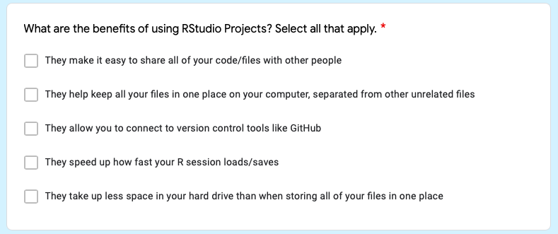
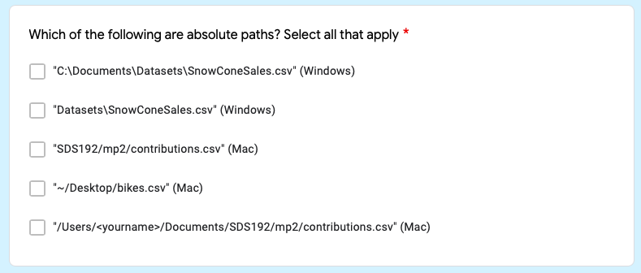

# Incorporating `fertile` Into The Greater Data Science Community {#applications}

Finding a solution to addressing reproducibility on a widespread scale is a challenging problem. Attempts to do so--in academic publishing, software, and data science education--have made some progress, but many solutions have significant flaws. Primarily, they either:

A) Only address one small aspect of reproducibility--for example, software that focuses on version control or a set of journal guidelines requesting only that code and data be provided, but giving no further detail. 

\begin{center}
OR
\end{center}

B) Are challenging, time consuming, and/or burdensome to implement--for example, extensive journal guidelines, complex software packages with confusing functions, or academic courses on reproducibility that are only accessible to masters' students and take time away from other topics.

`fertile` is an attempt to address reproducibility in a way that does not fall victim to either of these challenges. Rather than focus on one area of expertise, `fertile` contains features focused on each of the six major components of reproducibility. Its self-contained nature allows users to address all aspects of reproducibility in one package; users can achieve near- or complete reproducibility with just a single piece of software. 

`fertile` also makes the processes of both achieving *and* checking reproducibility simple and fast. Those looking to check whether a project is reproducible can almost instantaneously receive a full report of where the project succeeds and where it fails, and those looking to improve their reproducibility can receive and act on `fertile`'s clear suggestions with minimal effort. Some of the package's features are enabled automatically and most others can be accessed with only a handful of functions, all of which are very simple in function. 

Additionally, `fertile` does not just provide a report on reproducibility and leave it at that. Instead, it attempts to teach its users the concepts of reproducibility in the same way that reproducibility-focused classes are meant to do. Users receive instant feedback when making mistakes and, when checking work after writing it, receive reports clearly indicating where issues were found, why they occurred, and how to correct them. 

It is also highly customizable, allowing users to utilize the tool in the way that fits their needs best. Those who want to focus their reproducibility checking in a certain direction have that option and those who want widespread overviews can also have their needs meet. Users who are interested in going beyond the base functionality of `proj_analyze` and `proj_check` also have additional functions at their disposal that they can use to check reproducibility, file paths, file types, etc.


## Potential Applications of `fertile`

These features make `fertile` an excellent tool for addressing the issue of scientific reproducibility on a widespread scale. `fertile` can provide a variety of benefits to users in all different application domains and with all different experiences. In this chapter, we consider the many potential uses of the package.

### In Journal Review

As discussed in Chapter 1, Academic journals have a significant reproducibility problem. In an attempt to address this, many journals have instituted reproducibility policies for submitting researchers to follow. Although a variety of journals have these policies, particularly in the Statistical and Data Sciences, very few actually go through the process of verifying that the standards are met. Authors, finding it to to be a complicated and challenging task, will often not take the necessary steps to make their work truly reproducible. And journals, given the amount of time and money required to verify submissions' reproducibility, will often give submitting authors the benefit of the doubt in assuming that their work is reproducibile as long as some code and/or data has been provided. This results in the publishing of many articles that claim to be reproducible in theory, but do not meet such standards when tested in practice.

`fertile` could provide significant assistance with this process. Journals could integrate `fertile` into their article review workflow, ensuring that certain reproducibility checks were passed before an article could be accepted.

Depending on the level of detail with which the journal wanted to examine reproducibility, the integration could be done in a variety of ways. Here, we'll consider two:

1. Journal reviewers run `fertile` on every submitted `R` project.

Journals that desire a detailed summary of the reasons for reproducibility failure (such as information that one specific file was not commented enough)---and whose editors were willing to put in a little bit of time to collect this information---could choose to run `fertile` on all submitted papers that included `R` code.

They could require a list of checks to pass and provide a list of exceptions for cases in which checks could fail---for instance, a journal could state that even though they support good documentation, they do not require code to be fully commented. 

Authors could run `fertile` on their work before submitting it to a journal to ensure that they passed the required list of checks and that any failures they saw were accounted for in the journal exceptions. Then journals, in order to ensure that authors followed the provided reproducibility guidelines, could run `fertile` on each submitted article as part of the review process. If the required checks were passed, the article could be accepted, but if they failed it would be rejected.

Although it would require some effort on the journal's side, this would still be an incredibly fast process: as long as a journal required that all submissions in `R` be in the `R Project` format, one reviewer could load the submission, run `fertile`, and receive a summary of the submission's reproducibility in a matter of minutes. 


```{r, echo = FALSE, out.width = '100%', fig.cap="Potential 'fertile' Journal Review Process"}
knitr::include_graphics("figure/journal-process.png")
```

2. Journal reviewers do not run `fertile` on each project, but instead require submitting authors to include a `fertile` summary sheet showing the reproducibility badges awarded to their work.

Some journals may desire a reproducibility summary, but not require details as specific as the exact reasons for failure. These journals could run a simplified approach to reproducibility review. Rather than spend the additional time to run `fertile` on every submission and review the reasons for check failure, the journals could instead require that authors include a coversheet---produced by the `proj_badges()` function---with their submission. 

This cover sheet would show which of the six primary reproducibility components were met and which ones failed, a short summary of specific checks that were not successful, and information about the cover sheet's generation: who generated it, when, and with which files. 

Journals could place an acceptance requirement that articles achieve a certain subset of badges---for instance, file paths, randomness, and documentation. Submitting authors would run `fertile` on their end to see which badges they passed. Once they met the requirements, they could run `proj_badges()` to generate an article coversheet. This coversheet would then be submitted alongside the article and considered as part of the review process. All that reviewers would need to do to ensure that reproducibility requirements are met would be to look at the cover sheet to see which badges the project achieved and check the cover sheet generation information to ensure that it was truly produced by the project that the author says it was produced by. 

```{r, echo = FALSE, out.width = '100%', fig.cap="Another Potential 'fertile' Journal Review Process"}
knitr::include_graphics("figure/journal-process-2.png")
```


Both of these processes would be much faster than that employed currently at the American Journal of Political Science, which goes through a thorough, multi-week-long reproducibility confirmation procedure for all submitted articles. Submitting researchers would know exactly which goals they were trying to achieve. They could download `fertile` on their own, run it on their project, check to see if their goals are met, and take the recommended steps to address failures if not. Then, upon submission, journals would only need to take minimal steps to ensure that those standards were met.

For journals that currently spend little effort on ensuring the reproducibility of submitted articles,`fertile` could provide significant benefit for minimal cost. Rather than spending money to hire a reproducibility editors, any journal board wanting to improve their publication's reproducibility could instead choose to implement `fertile`---for free---as part of the review workflow.

Journals that already have designated reproducibility editors, such as *Biostatistics* and the *Journal of the American Statistical Association*, could also see benefits from `fertile`(@journal-biostats, @jasa-rep-editors). The integration of `fertile` could speed up the review process, allowing the editors to review more papers for reproducibility adherence in a shorter time.

Although this would only address a small aspect of reproducibility--that involving data analysis projects written in R--it would provide a significant time- and money-saving impact for both authors and reviewers in that domain.


### For Teaching Reproducibility

`fertile` could also be integrated into Statistical and Data Sciences coursework in order to educate students on topics of reproducibility. 

Many of the existing programs to teach reproducibility are courses focused on replication studies, where students must take a published paper and replicate the steps within completely. This process, which includes requesting the necessary data and code files from the original author(s) and sometimes even expanding the existing analysis further, often requires that participants have knowledge of data analysis and the scientific research process to be successful. As a result, such courses focused on reproducibility tend to exist only at the graduate level.


```{r, echo = FALSE, out.width = '100%', fig.cap = "The Replication Assignment From Harvard Professor Gary King's Gov 2001 Graduate Course", fig.subcap="Source: https://projects.iq.harvard.edu/files/gov2001/files/syllabus.pdf"}
knitr::include_graphics("figure/gov-2001-replication.png")
```


Undergraduate students, therefore, do not get exposed to reproducibility very often. There are a few exceptions--for instance, introductory courses at Smith College and Duke University that integrate RMarkdown to promote reproducible workflows--but overall, reproducibility is not covered in data science courses the undergraduate level.

`fertile` could help change this, allowing for many more colleges and universities to integrate reproducibility into their courses. The barriers to entry for using and benefitting from the package are very low, requiring only that participating students have:

* R and RStudio installed on their computer
* Knowledge of how to install a package from GitHub and load it into their environment
* Knowledge of how to create an R project
* Knowledge of how to run basic functions and input simple file paths

Though the process may entail some confusion and troubleshooting at first, even those brand new to `R` could succeed in overcoming these barriers in only a few days of class. As a result, `fertile` could provide professors with an opportunity to teach reproducibility concepts in introductory level courses. 

`fertile` could easily integrate into coursework in a similar way to how RMarkdown was integrated at Smith College and Duke University. While there is not only one way to utilize the software in class, a potential use of `fertile` could look as follows:

At the beginning of their courses, the professor provides their students with a brief introduction to reproducibility, including its importance and a basic description of how it is achieved. Shortly after, they introduce R Projects and the `fertile` package, explaining that they are tools to help with reproducibility. Then, they institute a requirement for all submitted homework assignments in the course: students must create and submit their work in the R Project format, but prior to submission must run `fertile` on their project to ensure that it passes reproducibility standards. When reproducibility errors inevitably occur, they can be used as teaching moments: the professor can share the error, explain why it happened, walk through `fertile`'s response to it, and interactively work with students to illustrate how it can be fixed.

The integration of `fertile` in this way would be an excellent method to introduce students to reproducibility concepts early on in their data science education, but at a low cost to the professor. 

There are a variety of benefits to introducing students to reproducibility sooner, rather than later--in graduate school or through independent research on the topic:

* Teaching reproducibility early on gives students important research tools and understanding before they conduct any of their own important analysis.

* Practicing before students are believed to be skilled and highly educated in data science gives them an opportunity to fail and learn without fear of judgement.

* Integrating concepts early helps ingrain them in the minds of students, ensuring that reproducibility begins to come naturally to them.

These students would then be prepared for entering the research world and contributing to data science work in a transparent and reproducible way. 


### In Other Areas

`fertile` can also provide benefits in other domains. Though not an exhausted list, some of the potential uses of the software are: 

* *Private Companies*: Data analysis-focused companies could require their employees to use `fertile` to check the reproducibility of their projects before presenting them to clients. This would help such companies ensure that clients could trust the results that were being produced. 

* *Conferences*: Similar to academic journals, conferences promoting open research could require that papers written in `R` pass a `fertile` check as a condition for acceptance. Even if there were an exception given for those using confidential/identifiable data, this would likely increase the overall reproducibility of conference papers significantly.

* *Informal Data Analysis*: A lot of content in the `R` community is created purely for fun and interest. Outside of work, many `R` users will create data visualizations or analyses for their own private blogs or their twitter. Sometimes, users will also participate in community events like Tidy Tuesday, a weekly social project where a data set is posted and users are asked to analyze it and create a visualization of their choice. Many people use these informal analyses as an opportunity for learning and discussion, often sharing them on social media to try and get feedback on their work. Ensuring that the work is reproducible would facilitate this process. Users could run their project files through `fertile` to check that they are reproducible and post a link to download them. This would then allow others to run the code on their own to understand how it works and more easily be able to make suggestions as to how to improve it!  

```{r, echo = FALSE, out.width = '100%'}
knitr::include_graphics("figure/tidytuesday.png")
```

`fertile` is incredibly versatile in its applicability. It can be used anywhere from informal data analysis projects to academic journal review. 


## Testing Fertile in the Real World: Experimental Design and Analysis

### Background

Many of the suggested uses for `fertile` in the previous section are hypothetical, included for the purpose of demonstrating the potential that the package could have. Without experimentation or testing, though, it is difficult to know just how successful `fertile` would be when employed for any given purpose. 

In order to gain a better understanding of the practical effects of using `fertile` in a real life scenario, Professor Baumer and I decided to conduct an experiment (approved by Smith College IRB, Protocol #19-032). We were interested in testing whether the integration of `fertile` into an introductory data science course might have an effect on students' learning of reproducibility concepts. 

After designing our experimental structure, working out technical mechanics, and creating the necessary materials, we chose to use the following two course sections for our study:

1. Introduction to Data Science (SDS 192), Fall 2020 Semester
2. Introduction to Data Science (SDS 192), January-Term 2021

There were several motives for selecting these specific courses:

- They were both being taught by Prof. Baumer, which made it easy to ensure that everything went smoothly by removing the need to interact with a 3rd party.
- They were two different sessions of the same course, with essentially identical material, ensuring that we could compare results from each section of the experiment. 
- They involved introductory data science students, one of the groups that were of most interest as we wanted to ensure that `fertile` could provide benefit to users of all skill levels. 
- They were somewhat larger than many other classes in the Statistical and Data Sciences department, providing an opportunity for more data collection. 


### Experimental Design

For the experimental structure, we chose to complete a randomized controlled trial (RCT) since RCT designs can be used to conclude causality and are designed in such a way as to limit bias in the results. 

Our goal was to determine whether students who had `fertile` installed and loaded on their R Studio applications would learn more about reproducibility throughout the course than students who did not, or whether there was instead no difference or even a negative effect.

In order to measure this potential effect, we opted to use reproducibility "tests," forms containing multiple choice and select-all-that-apply questions about different aspects of reproducibility that are focused on in `fertile`. 

We used two different testing structures for our two experimental sections--partially due to challenges which led to our first experiment session starting on a slight delay, but also so that we could compare which structure worked more effectively. While the primary goal of the experiment was to determine the effect of `fertile`, a secondary interest was in the experimental method itself--a new method that we developed, which has implications beyond purely this case. 

- Structure #1 (Used in Fall 2020): Students received a reproducibility test at the end of the semester to test their knowledge after the course. Final scores were compared between students who had `fertile` installed and loaded and those who did not.

- Structure #2 (Used in January Term 2021): Students received a reproducibility test both at the beginning of the course *and* at the end of the course in order to test their *change* in knowledge. *Differences in scores* were compared to see if any given group learned more, less, or the same.

Although the testing structures were different across the two different sections, the reproducibility tests were identical.

To reduce bias to a maximum degree, we opted to use blinding, in which participants were unaware of whether they had received the experimental or control condition--in this case, whether they had `fertile` installed and loaded while working on course assignments, or whether they didn't.

To achieve the desired blinding, we decided to use some unique features of R packages which allowed us to give all students in the course the same software, but have it behave differently when loaded, depending on which experimental group the student was a part of. 
This technique is described in the step by step experimental structure, explained below: 

1.Students were given a form at the start of the semester asking whether they consented to participate in a study on data science education. Additionally, information was collected about the previous number of courses that student had taken in data/computer science fields, which we believed might impact their knowledge of reproducibility. 

In order to successfully consent, students had to provide a unique computer identifier, collected through either the command `Sys.getenv("LOGNAME")` or `Sys.getenv("USERNAME")`, depending on the student's operating system. This identifier was collected in order to ensure that students could be individually identified and therefore assigned effectively to treatment or control groups. 

2. To maintain student privacy, the unique identifiers were then transformed into hexadecimal strings via the `md5()` hashing function. While these hashed sequences have meaning in the students' computers and the course software program, to those without the original identifier, they appear only as a meaningless string of letters and numbers.

3. These hexadecimal strings, which correspond to unique students, were then randomly assigned into equally sized groups, one experimental group that receives the features of `fertile` and one group that receives a control.

4. The students in the course were then asked to download a package called `sds192` (the course number and prefix), which was created for the purpose of this trial. The package contained several templates and data sets that were necessary for use in the course, so all students in the class--regardless of their experimental status--needed to install it.

The `sds192` package operated by leveraging an `.onAttach()` function to scan the `R` environment of each student *each time the package is loaded*, collect their unique identifier--again, via `Sys.getenv("LOGNAME)` or `Sys.getenv("USERNAME")`-- and run it through the same hashing algorithm as before. This function came pre-coded with the hashed identifiers of all of the students, grouped by whether they had been assigned to the experimental or the control group. 

Each time a student's hashed identifier was collected (every time they loaded the `sds192` package for class), it was then compared with the provided groups to determine how the package should function for that individual.

The structure of this function can be seen below:

```{r, eval = FALSE}

# .onAttach() from the sds192 package
# Run automatically any time the sds192 package is loaded

.onAttach <- function(libname, pkgname) {

  # The experimental group gets `fertile` loaded secretly
  if (is_experimental()) {
    suppressMessages(library(fertile))
  }
}

is_experimental <- function(logname = whoami::username()) {
  
  # Students are placed into experimental and control groups but remain anonymous
  fertile_group <- c(
    "f7b0a9d5117b88cecec122f8ba0e52fb", "4d0295a810fb8491f91f914771572485", 
    "36211a1f19f82ae07aed990b671c9b20", "b5d2b72b4f36f3afdce32a8409dc6ea0",
    "d498227fd9e6a4c42494bbebc42f6aa8", "191922566ef6a9910682ad9836b6d018", 
    "b1b8278d6b7eecd2c595ab6138de17e0", "4894c3d932fa6cfc9ec59214c41f12c7",
    "2f1e21316352049069f8e4351d6cb88d", "73f4a06a26ad5342e30e2e7fdf92dba2", 
    "9ff232c0e56f04be4ba2037aec6471b2", "abb2b711c8d45ffac12006945e10ed31",
    "3a49dd3c6e591933a0909734a94ca37c", "db1b731709316be69dae1d56382e4243", 
    "8e76b368a5e999869c7ca8f9f1566cf8"
  )
  control_group <- c(
    "9aa36583f54766205850428e8f1a4c89", "fdc61d4d4c93473be5f485eea55140b3", 
    "f03020938b31818063c79d2422755183", "d0a981421d0e378e26186f99c618c748",
    "7ec57b1f2bca9ac1e702fb68427b781b", "8857ca4d5e1fe92ae70b1ba95c0b7b8b", 
    "e5e30623e9d09d29ded851b7fb40cb51", "592572bb9fce168f37117fd0d6e0e5ee",
    "c40b1786558a15f8dd151da163ebd0b4", "67b8da3952e07ba3f2c5c715c4042220", 
    "f5ca3188ff14cbf43b6d4cd5b225376e", "b3b222f42beaae6ca2b309b94b1340be",
    "2dbac7345a71a13c434af882853e86bd", "3c5df10c572b5627418c034f65f52dee", 
    "0ff07a4f6faaf3df57b348dad7bd22c9"
  )
  

  digest::digest(logname, algo = "md5") %in% fertile_group
  
}
```


5. The experimental group received the basic `sds192` package, which consisted of some data sets and `R` Markdown templates necessary for completing homework assignments and projects in the class, but also loaded `fertile` silently in the background. The package's proactive features were enabled, and therefore users would receive warning messages when they used absolute or non-portable paths or attempted to change their working directory. The control group received only the basic `sds192` package, including its data sets and `R` Markdown templates. 

6. [January Term 2021 Only] Students then took a reproducibility test prior to fully starting the course, which tested their knowledge before completing the class.

7. The students then completed their coursework as normal, regularly using the `sds192` package for projects and homework assignments.

8. [Both Fall 2020 and January Term 2021] The last step was for students to take a reproducibility test at the end of the course, to measure their knowledge of the subject after having completed the coursework and used the `sds192` package.

### Results

In order to understand the results, it is important to understand the structure of the experimental reproducibility "test" and the way in which each student's answers were scored.

The test consisted of two primary sections:

1. A set of six questions on RStudio projects, two of which were select-all-that-apply, and four of which were multiple choice. These questions tested students knowledge of RStudio projects, their understanding of which file paths they could include in code submitted in project format, and their awareness of the dangers of changing working directories while coding.

```{r, echo = FALSE, out.width = '100%', fig.cap = "Sample Question From The Section On RStudio Projects"}


```

```{r, echo = FALSE, out.width = '100%', fig.cap = "Another Sample Question From The Section On RStudio Projects"}


```


2. A set of three questions about file paths, all of which were select-all-that apply. These questions tested students' knowledge of the difference between absolute and relative paths and their understanding of which paths are reproducible.

```{r, echo = FALSE, out.width = '100%', fig.cap = "Sample Question From The Section On File Paths"}


```

For each test submission, every question was scored individually and then scores for each section (projects and paths) were calculated, as well as an overall total score. 

The following method was used to compute scores:

- For each question, students would start at a score of zero. Based on their answers, points would then be added, subtracted, or stay constant. 

- On select-all-that apply questions, the following scoring rules were used. This meant that students who answered some things correctly, but other things incorrectly, could still receive negative or neutral scores, based on the overall analysis of how correct they were:
     - Each correct box that was checked --> +1 Point
     - Each incorrect box that was checked --> -1 Point
     - Each box that was not checked but should have been checked --> No change (0)
     
- On multiple choice questions, the scoring rules were slightly different. This was due to the inclusion of an option for "I'm not sure," which was included as a way to discourage random guessing and ensure that students were answering based on their actual knowledge.
     - If the correct answer was selected --> +1 Point
     - If the incorrect answer was selected --> -1 Point
     - If the student expressed uncertainty ("I'm not sure") --> No change (0)
     
This method meant that individual questions could have negative, positive, or neutral scores, and total scores could vary quite dramatically, from large negative scores (<-10) for students who regularly answered incorrectly to large positive scores for those who often answered correctly (>10).


```{r, echo = FALSE,  message = FALSE}
library(readr)
library(tidyverse)
library(kableExtra)

fall2020 <- readr::read_csv("data/Fall_2020_Single_Post_test.csv")
jterm2021 <- readr::read_csv("data/JTerm_2021_Pre_Post.csv")
jterm2021$Test <- factor(jterm2021$Test, levels = c("Pre", "Post"))

```

#### Fall 2020 Results

The data from Fall 2020, after being scored and cleaned up, looked as follows:

```{r}
glimpse(fall2020)
```


#### January Term 2021 Results


### Implications


### Limitations


### Future Work


Potential sources:

https://arxiv.org/abs/1401.3269

https://academic.oup.com/isp/article-abstract/17/4/392/2528285


https://berkeleysciencereview.com/2014/06/reproducible-collaborative-data-science/

https://guides.lib.uw.edu/research/reproducibility/teaching

https://escholarship.org/uc/item/90b2f5xh

