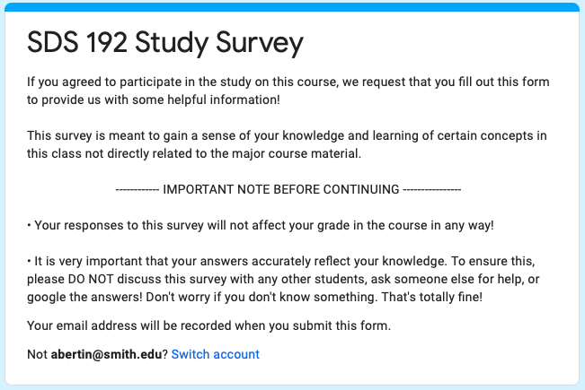
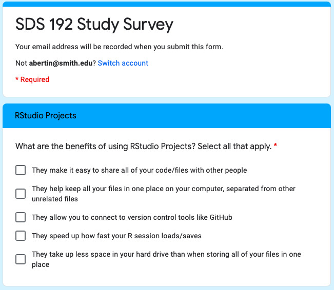
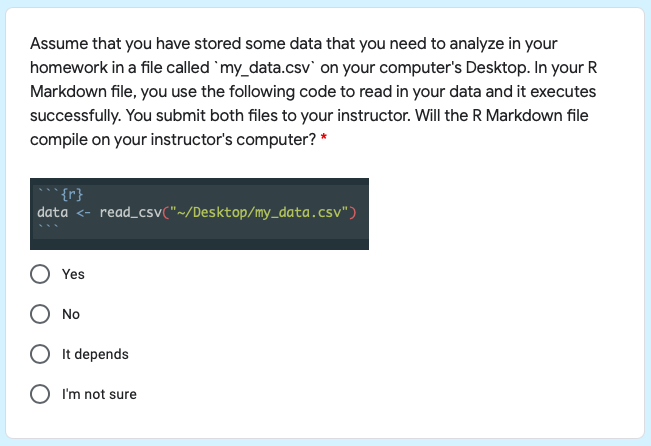
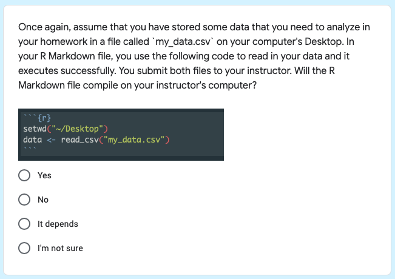
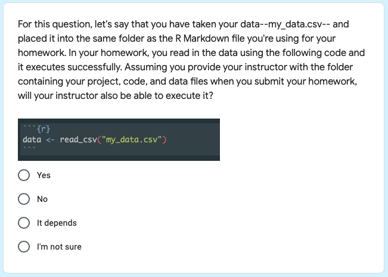
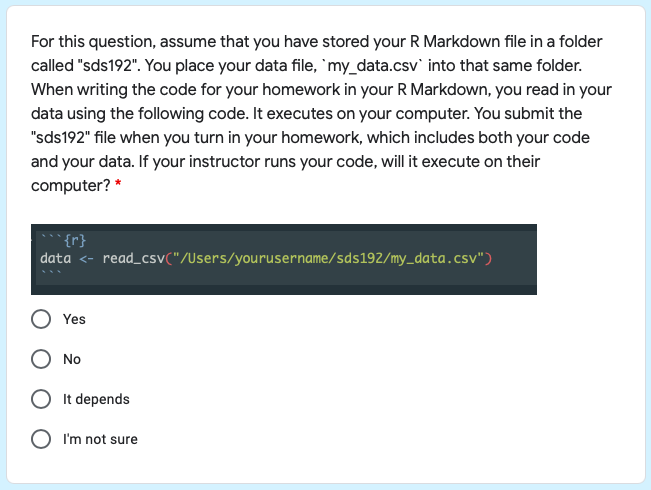
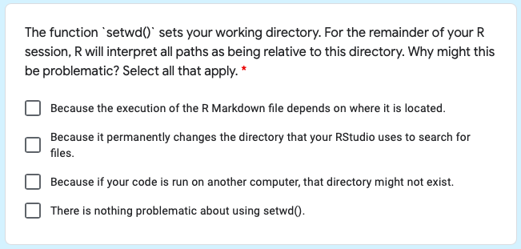
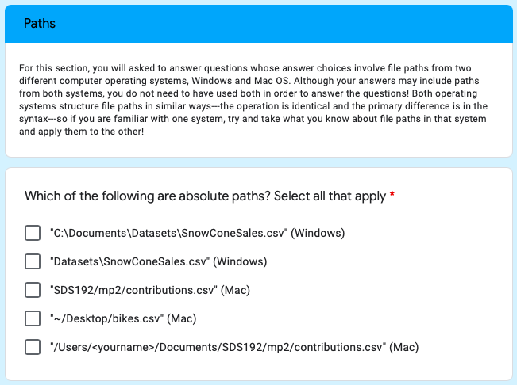
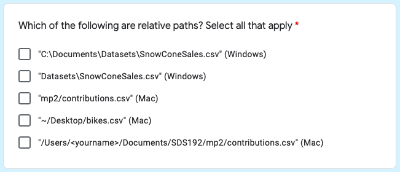
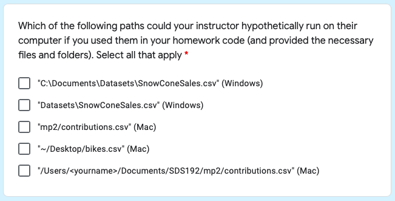

`r if(knitr:::is_latex_output()) '\\appendix'`

`r if(!knitr:::is_latex_output()) '# (APPENDIX) Appendix {-}'` 


# A Summary of Relevant Links

Several links relevant to `fertile` were shared throughout the text. To make them easier to find and review, they are all provided together below.

1. GitHub repository for `fertile`: https://github.com/baumer-lab/fertile

2. My GitHub fork of `fertile`, where you can track my changes and code contributions more easily: https://github.com/ambertin/fertile

3. GitHub repository for this thesis, which contains the sample project `project_miceps`, all of the non-R-generated figures that were included, as well as the de-identified data from the experiment: https://github.com/ambertin/thesis

4. DOI for the paper about `fertile` which was published in `Stat`: http://dx.doi.org/10.1002/sta4.332 


# Full Overview of the Experimental Reproducibility Test

Chapter 3 discusses an experiment that Professor Baumer and myself conducted at Smith College to test `fertile` in a classroom environment. 

In order to measure the package's effectiveness, we constructed a test that could capture information about students' knowledge of reproducibility. A sample of these questions was included in Chapter 3. The full list, alongside with a step-by-step example of the scoring process, is provided here:

## Full Reproducibility Test

#### Test Introduction

```{r, echo = FALSE, out.width='80%'}

```


#### Question 1 (Projects)

```{r, echo = FALSE, out.width='80%'}

```

**Correct Answers:** 1) They make it easy to share all of your code/files with other people, 2) They help keep all your files in one place on your computer, separated from other unrelated files, 3) They allow you to connect to version controls like GitHub.

#### Question 2 (Projects)

```{r, echo = FALSE, out.width='80%'}

```

**Correct Answer:** "It depends" 

#### Question 3 (Projects)

```{r, echo = FALSE, out.width='80%'}

```

**Correct Answer:** "It depends" 

#### Question 4 (Projects)

```{r, echo = FALSE, out.width='80%'}

```

**Correct Answer:** "Yes" 

#### Question 5 (Projects)

```{r, echo = FALSE, out.width='80%'}

```

**Correct Answer:** "No" 

#### Question 6 (Projects)

```{r, echo = FALSE, out.width='80%'}

```

**Correct Answers:** 3) Because if your code is run on another computer, that directory might not exist. __Note__: *1) Because the execution of the R Markdown file depends on where it is located* is sort of ambiguous. Because of this, in scoring, it was considered to be a no change (0) answer if it was selected. Students would not gain or lose points from choosing that answer.

#### Question 7 (Paths)

```{r, echo = FALSE, out.width='80%'}

```

**Correct Answers:** 1) `"C:\Documents\Datasets\SnowConeSales.csv"` \ (Windows), 4) `"~/Desktop/bikes.csv"` (Mac), 5) `"/Users/<yourname>` \ 
`/Documents/SDS192/mp2/contributions.csv"` (Mac).

#### Question 8 (Paths)

```{r, echo = FALSE, out.width='80%'}

```

**Correct Answers:** 2) `"Datasets\SnowConeSales.csv"` (Windows), \ 
3) `"mp2/contributions.csv"` (Mac).


#### Question 9 (Paths)

```{r, echo = FALSE, out.width='80%'}

```


**Correct Answers:** 2) `"Datasets\SnowConeSales.csv"` (Windows), 3) `"mp2/contributions.csv"` (Mac). __Note__: 1) and 4) might also be considered plausible, as they could theoretically work under some conditions, though after some discussion, Professor Baumer and I decided that they would be marked incorrect due to the wording of the question, which specifies that you provide the files and folders.

## Sample Scoring Example

Below, we will consider a student's sample answers to this reproducibility test and how they will be scored. As discussed in Chapter 3, the following scoring method was used:

- For each question, students would start at a score of zero. Based on their answers, points would then be added, subtracted, or stay constant. 

- On select-all-that apply questions, the following scoring rules were used. This meant that students who answered some things correctly, but other things incorrectly, could still receive negative or neutral scores, based on the overall analysis of how correct they were:
     - Each correct box that was checked --> +1 Point
     - Each incorrect box that was checked --> -1 Point
     - Each box not checked but should have been --> No change (0)
     
- On multiple choice questions, the scoring rules were slightly different. This was due to the inclusion of an option for "I'm not sure," which was included as a way to discourage random guessing and ensure that students were answering based on their actual knowledge.
     - If the correct answer was selected --> +1 Point
     - If the incorrect answer was selected --> -1 Point
     - If the student expressed uncertainty ("I'm not sure") --> No change (0)

Prior to scoring question 1, the total score of the student is set at 0, as is their projects questions score and paths questions score.

#### Question 1 (Projects)

A student has selected all of the following options:

- They make it easy to share all of your code/files with other people (CORRECT)
- They help keep all your files in one place on your computer, separated from other unrelated files (CORRECT)
- They allow you to connect to version control tools like GitHub (CORRECT)
- They speed up how fast your R session loads/saves (NOT CORRECT)
- They take up less space in your hard drive than when storing all of your files in one place (NOT CORRECT)

This student will receive [+1] for each of the three correct answers, and [-1] for each of the two incorrect ones, for a total of **[+1]**, for a new total score of 1. Since this question was about R projects, the student will also increase their `Projects Score` from 0 to 1. 

*Question Score*: 1   *Projects Score*: 1   *Total Score*: 1


#### Question 2 (Projects) 

The student has selected the following answer:

- Yes (NOT CORRECT) --- the correct answer is "It Depends"

The student will receive [-1] for this answer, since it is incorrect. This will be added to their previous projects score and total score, resulting in the following updated scores:

*Question Score*: -1   *Projects Score*: 0   *Total Score*: 0


#### Question 3 (Projects)

The student has selected the following answer:

- Yes (NOT CORRECT) --- the correct answer is "It Depends"

The student will receive [-1] for this answer, since it is incorrect. This will be added to their previous projects score and total score, resulting in the following updated scores: 

*Question Score*: -1   *Projects Score*: -1   *Total Score*: -1 

#### Question 4 (Projects)

The student has selected the following answer:

- Yes (CORRECT) 

The student will receive [+1] for this answer, since it is correct. This will be added to their previous projects score and total score, resulting in the following updated scores:

*Question Score*: 1   *Projects Score*: 0   *Total Score*: 0

#### Question 5 (Projects)

The student has selected the following answer:

- No (CORRECT) 

The student will receive [+1] for this answer, since it is correct. This will be added to their previous projects score and total score, resulting in the following updated scores:

*Question Score*: 1   *Projects Score*: 1   *Total Score*: 1 

#### Question 6 (Projects)

The student has clicked one of the boxes:

- Because if your code is run on another computer, that directory might not exist (CORRECT)

The student will receive [+1] for this answer, since the box they chose was correct. Their choice not to select any other boxes will not affect their score. This will be added to their previous projects score and total score, resulting in the following updated scores:

*Question Score*: 1   *Projects Score*: 2   *Total Score*: 2

At the end of the section on projects, the student has gained a projects score of 2 and is at a total score of 2 as well.

#### Question 7 (Paths)

The student has clicked two of the boxes: 

- `"C:\Documents\Datasets\SnowConeSales.csv"` (Windows) (CORRECT)
- `"~/Desktop/bikes.csv"` (Mac) (CORRECT)

The student will receive [+2] for this answer, since both of the boxes they chose was correct. Their choice not to select any other boxes will not affect their score. This will be added to their their paths score (which started at zero) and total score, resulting in the following updated scores:

*Question Score*: 2   *Paths Score*: 2   *Total Score*: 4

#### Question 8 (Paths)

The student has clicked three of the boxes:

- `"Datasets\SnowConeSales.csv"` (Windows) (CORRECT)
- `"mp2/contributions.csv"` (Mac) (CORRECT)
- `"/Users/<yourname>/Documents/SDS192/mp2/contributions.csv"` (Mac) (NOT CORRECT)

The student will receive [+1] for this answer, [+2] for the correct boxes and [-1] for the incorrect one. Their choice not to select any other boxes will not affect their score. This will be added to their their paths score and total score, resulting in the following updated scores: 

*Question Score*: 1   *Paths Score*: 3   *Total Score*: 5

#### Question 9 (Paths)

The student has clicked two of the boxes:

- `"mp2/contributions.csv"` (CORRECT)
- `"/Users/<yourname>/Documents/SDS192/mp2/contributions.csv"` (Mac) (NOT CORRECT)

The student will receive [0] for this answer, [+1] for the correct box and [-1] for the incorrect one. Their choice not to select any other boxes will not affect their score. This will be added to their their paths score and total score, resulting in the following updated scores: 

*Question Score*: 0   *Paths Score*: 3   *Total Score*: 5

At the end of the test, they will be left with a Projects Score of 2, a Paths Score of 3, and a Total Score of 5.

