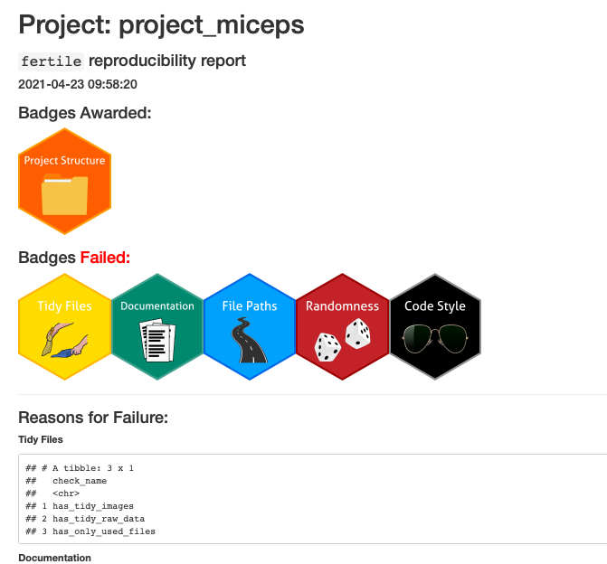
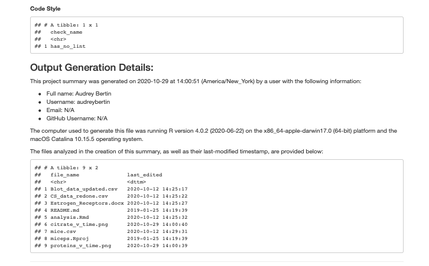
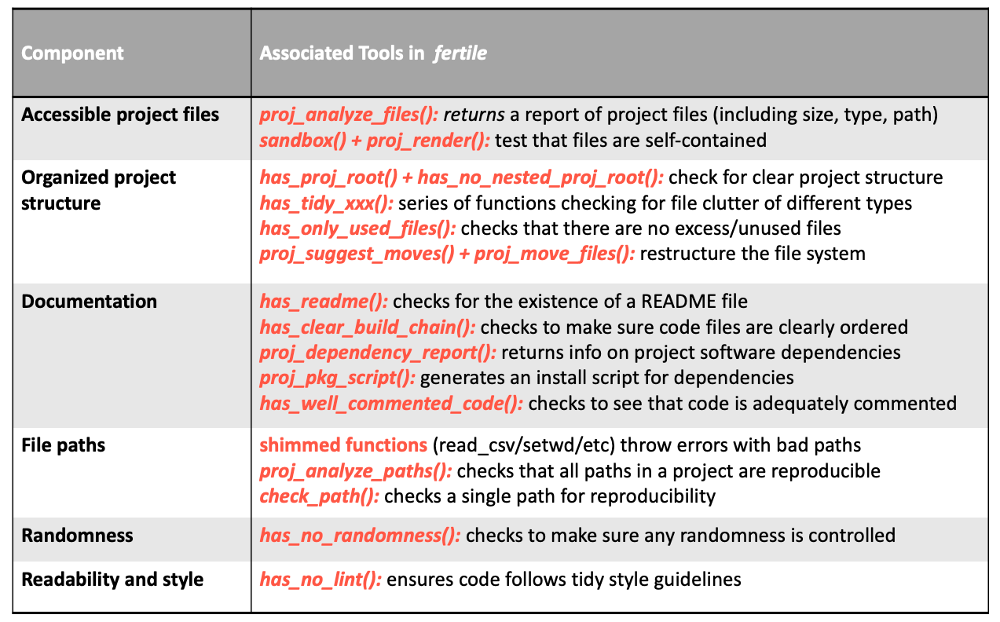

```{r setup, include=FALSE}
options(htmltools.dir.version = FALSE)
library(fertile)
```

```{r xaringan-themer, include=FALSE, warning=FALSE}
library(xaringanthemer)
style_mono_light(base_color = "#23395b")
```

```{css, echo= FALSE}
.remark-code {
  font-size: 24px;
}

.small .remark-code {
  font-size: 80% !important;
}
.tiny .remark-code {
  font-size: 50% !important;
}
```


## Introduction

`fertile`:
  - **What?** Software package written in `R`
  - **Goal:** Improve scientific reproducibility of `R` projects
  - **My Role:** Leading code development for the last ~2 years!
  
```{r, echo = FALSE, fig.align='center', out.height=270, out.width=250}
knitr::include_graphics("fertile-hex.png")
```


---
## Overview

1. What is reproducibility and why is it lacking?
2. Other attempts to address reproducibility and their shortcomings
3. Why `fertile` is different
4. Potential applications
5. Conclusion
6. Accessing project materials

---
## What is reproducibility?

> In data science, research is considered fully __reproducible__ when the requisite code and data files produce identical results when run by another analyst.


.center[VS]

> __Replicability__: The ability of a researcher to duplicate the results of a study when following the original procedure but collecting new data


---
## The benefits of reproducibility

1. Trusting findings

2. Receiving feedback

3. Extending ideas

---
## The reproducibility crisis

*Nature (2016)*: 52% respondents claim "crisis"

Vast majority cannot reproduce others' work. 

Half cannot even reproduce their own!

Some fields have reproducibility rate <10%.

```{r, echo = FALSE, out.width = '50%'}
knitr::include_graphics("nature-1.jpeg")
```

---
## The reproducibility crisis
```{r, echo = FALSE, out.width = '60%'}
knitr::include_graphics("nature-2.png")
```

---

## 6 components of reproducibility

1) Basic files made accessible

2) Organized file structure

3) Good documentation

4) File paths

5) Randomness

6) Style


---
## Attempts to address reproducibility: educational programs

- Replication studies at Graduate level (Cambridge, Harvard, UNC, Penn State, Berkeley)
- At undergraduate level, requirement for work to be completed in `.Rmd` (Smith, Duke)

---
## Attempts to address reproducibility: journals

```{r, echo = FALSE, out.width='80%'}
knitr::include_graphics("stats-journals.png")
```

- Even if you have a reproducibility statement that does not mean that all the articles are reproducible!! 

---
## Attempts to address reproducibility: software

- `rrtools`: create basic package structure, Docker dependency management
- `orderly`: automation of projects
- `workflowr`: version control
- `checkers`: custom checks to assess reproducibility
- `renv` (formerly `packrat`): dependency management
- `drake`: makefiles
- `reproducible`: caching to speed up analysis


- Continuous integration tools: `wercker`, `GitHub Actions`, `Travis CI`, `Circle CI`.

```{r, echo = FALSE}

```

---
## Shortcomings of current attempts

- Education:

    1. Workshops often optional
    2. Only really at graduate level
    3. Takes time away from other important class topics
    4. Takes a lot of effort for professor to set up
    
- Journals:

    1. Authors lack knowledge and/or time to make changes
    2. Reproducibility review is time/cost intensive for journals

- Software:

    1. Packages narrow in scope
    2. Complex functions, bad for new users
    3. Cumbersome, with steep learning curve
    4. CI tools: lack software-specific tools 
    

---

## Setting `fertile` apart: package goals

1) Simple and straightforward

2) Accessible to variety of users

3) Addresses many aspects of reproducibility

4) R-specific features

5) Customizable

6) Educational

7) Applicable in many domains

---

## Overview functions

- `proj_check()`: run a bunch of different tests on various parts of reproducibility (files, paths, documentation, etc.)

- `proj_analyze()`: package dependencies, files, file move suggestions, paths

- `proj_badges()`: earn/display badges for different components, summary of project generation info

```{r badge-graphics, out.width="15%",  fig.show='hold', echo = FALSE}
knitr::include_graphics(c("structure-badge.png", "tidy-badge.png", "documentation-badge.png", "paths-badge.png", "randomness-badge.png", "style-badge.png"))
```
---
## Overview functions

```{r, echo = FALSE, out.width = '90%'}

```

---
## Overview functions

```{r, echo = FALSE}

```


## More specific functions

.small[
```{r, echo = FALSE}

```
]

---
## Educational features

- Interactive path warning system

- Checks provide informative messages
  - Explain problem
  - Provide solution

.small[
```{r, error=TRUE, eval = FALSE}
read.csv("~/Desktop/my_data.csv")
```

```{r, echo = FALSE}
error_msg <- "Error: Detected absolute paths. Absolute paths are not reproducible and will likely only work on your computer. If you would like to continue anyway, please execute the following command: utils::read.csv('~/Desktop/my_data.csv')"

cat(stringr::str_wrap(error_msg, width = 70))
```
]

---
## Customizability

- `proj_check_some()`: run subset of checks
- `proj_check_badge()`: run each of the badges from `proj_badges()` individually

- Controlling which functions throw warnings about paths:

  - Some built in, but users can add/edit others:
  - `add_shim()`: add a function to the warning list
  - `edit_shims()`: edit warning list
  - `load_shims()`: activate warning system
  - `unload_shims()`: deactivate warning system

---
## Potential applications: teaching reproducibility

- Introduce reproducibility in undergrad classrooms

- Limited barriers to entry:
1. R and RStudio installed on their computer
2. Knowledge of how to install a package from GitHub and load it into their
environment
3. Knowledge of how to create an R project
4. Knowledge of how to run basic functions and input simple file paths


---
## Potential applications: miscellaneous

- Private companies: increasing transparency w/ clients, building trust

- Conferences: reproducibility standards as requirement for acceptance

- Informal analysis: more reproducible work for events like `tidy tuesday` --> share knowledge!

---
## Conclusion

- There is currently a reproducibility crisis

- Existing solutions are lacking for a variety of reasons

- `fertile` addresses these all in one!
  - Customizable
  - Easy to use
  - Educational
  - R specific features
  - Addresses multiple aspects of reproducibility
  - Applicable to many domains
  
- Potential uses:
  - Classroom
  - Journals
  - Offices
  - Conferences
  - Informal analysis


---
## To learn more

- GitHub repository for `fertile`: https://github.com/baumer-lab/fertile

- My repository for `fertile`, to track my changes:
https://github.com/ambertin/fertile

- Currently writing a thesis. The library will have a copy sometime in the near future!

- `fertile` article in `Stat` journal:
https://doi.org/10.1002/sta4.332

```{r, echo = FALSE, out.width= '80%'}

```


---


# .center[Questions?]

