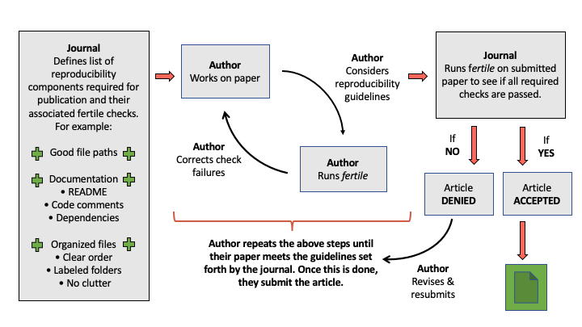

```{r setup, include=FALSE}
options(htmltools.dir.version = FALSE)
library(fertile)
```

```{r xaringan-themer, include=FALSE, warning=FALSE}
library(xaringanthemer)
style_mono_light(base_color = "#23395b")
```


## Introduction

`fertile`:
  - **What?** `R` package started by Prof. Ben Baumer
  - **Goal:** Improve reproducibility in R
  - **My Role:** Leading code development for the last ~2 years!
  - **This Year:** Advanced features, getting product ready for public use, and experimental testing.
  
```{r, echo = FALSE, fig.align='center', out.height=270, out.width=250}
knitr::include_graphics("fertile-hex.png")
```


---
## Overview

1. What is reproducibility and why is it lacking?
2. Other attempts to address reproducibility and their shortcomings
3. Why `fertile` is different
4. How `fertile` works
5. Potential applications and Smith College experiment
6. Conclusion
7. Accessing project materials

---
## What is reproducibility?

> In data science, research is considered fully __reproducible__ when the requisite code and data files produce identical results when run by another analyst.


.center[VS]

> __Replicability__: The ability of a researcher to duplicate the results of a study when following the original procedure but collecting new data


---
## The benefits of reproducibility

1. Trusting findings

2. Receiving feedback

3. Extending ideas

---
## The reproducibility crisis

*Nature (2016)*: 52% respondents claim "crisis"

Vast majority cannot reproduce others' work. 

Half cannot even reproduce their own!

Some fields have reproducibility rate <10%.

```{r, echo = FALSE, out.width = '50%'}
knitr::include_graphics("nature-1.jpeg")
```

---
```{r, echo = FALSE}
knitr::include_graphics("nature-2.png")
```

---
background-image: url("tidy-badge.png")
background-position: right bottom
background-size: 30%

## The six major components of reproducibility


Component 1: Basic project components made accessible to the public:

- Data (raw and/or processed)

- Metadata

- Code

- Related Software


---
background-image: url("structure-badge.png")
background-position: right bottom
background-size: 30%

## The six major components of reproducibility

Component 2: Well-organized file structure:

- Separate folders for different file types

- No extraneous files

- Minimal clutter


---
background-image: url("documentation-badge.png")
background-position: right bottom
background-size: 30%

## The six major components of reproducibility


Component 3: The project is documented well:

- Files are clearly named / ordered

- A README is present

- Code contains comments

- Software dependencies are noted


---
background-image: url("paths-badge.png")
background-position: right bottom
background-size: 30%

## The six major components of reproducibility


Component 4: Good file paths:

- No absolute paths

- No paths leading outside of a project’s directory

- Only relative paths within directory


---
background-image: url("randomness-badge.png")
background-position: right bottom
background-size: 30%

## The six major components of reproducibility


Component 5: Randomness is accounted for:

- If used, seed must be set

---
background-image: url("style-badge.png")
background-position: right bottom
background-size: 30%

## The six major components of reproducibility

Component 6: Code is readable and consistently styled:

- Coherent style
- Follow guide (e.g. `tidyverse`)


---
## Attempts to address reproducibility: journals

```{r, echo = FALSE, out.width='80%'}
knitr::include_graphics("stats-journals.png")
```
- Even if you have a reproducibility statement that does not mean that all the articles are reproducible!! 

---
## Attempts to address reproducibility: journals

### TOP Factor

- Helps measure state of academic reproducibility on the whole
- Score range: 0-30
- Approx 50% of journals = 5 or below
- Only 5% score > 15

---
## Attempts to address reproducibility: educational programs

- Replication studies at Graduate level (Cambridge, Harvard, UNC, Penn State, Berkeley)
- At undergraduate level, requirement for work to be completed in `.Rmd` (Smith, Duke)

---
## Attempts to address reproducibility: software

- `rrtools`: create basic package structure, Docker dependency management
- `orderly`: automation of projects
- `workflowr`: version control
- `checkers`: custom checks to assess reproducibility
- `renv` (formerly `packrat`): dependency management
- `drake`: makefiles
- `reproducible`: caching to speed up analysis


- Continuous integration tools: `wercker`, `GitHub Actions`, `Travis CI`, `Circle CI`.

```{r, echo = FALSE}
knitr::include_graphics('ci-tools.png')
```


---
## Shortcomings of current attempts

- Journals:

    1. Authors lack knowledge and/or time to make changes
    2. Reproducibility review is time/cost intensive for journals

- Education:

    1. Workshops often optional
    2. Only really at graduate level
    3. Takes time away from other important class topics
    4. Takes a lot of effort for professor to set up

- Software:

    1. Packages narrow in scope
    2. Complex functions, bad for new users
    3. Cumbersome, with steep learning curve
    4. CI tools: lack software-specific tools 

---
## Setting `fertile` apart: package goals

1) Be simple, with a small library of functions/tools that are straightforward to use.

2) Be accessible to a variety of users, with a relatively small learning curve.

3) Be able to address a wide variety of aspects of reproducibility, rather than just
one or two key issues.

4) Have features specific to a particular coding language that can address that
language’s unique challenges.

5) Be customizable, allowing users to choose for themselves which aspects of
reproducibility they want to focus on.

6) Be educational, teaching those that use it about why their projects are not
reproducible and how to correct that in the future.

7) Be applicable to a wide variety of domains.


---
## R Projects

```{r, echo = FALSE}
knitr::include_graphics('sample-project.png')
```


---


## Component 1: accessible project files

```{r}
 proj_analyze_files("project_miceps")
```

```{r}
has_readme("project_miceps")
```

---
## Component 1: accessible project files

- `sandbox()`: copying project to temp directory

- `proj_render()`

```{r}
proj_render("project_miceps")
slice_tail(render_log_report('project_miceps'))
```

---
## Component 2: organized project structure

- `has_proj_root()` / `has_no_nested_proj_root()`

- `has_tidy_` series

```{r}
has_only_used_files("project_miceps")
```

---
## Component 2: organized project structure

```{r}
files <- proj_analyze_files("project_miceps")
proj_suggest_moves(files)
```

- `proj_move_files()`

---
## Component 3: documentation

- `has_readme()`

- `has_clear_build_chain()`

- `has_well_commented_code()`

---
## Component 3: documentation

- `proj_dependency_report()`

```{r, eval = FALSE}
install_script <- proj_pkg_script("project_miceps")
```

> # Run this script to install the required packages for this
R project.
# Packages hosted on CRAN...
install.packages(c( 'broom', 'dplyr', 'fs', 'ggplot2',
'purrr', 'readr', 'rmarkdown', 'skimr', 'stargazer',
'tidyr' ))
# Packages (likely) hosted on GitHub...

---
## Component 4: File Paths

```{r, error=TRUE}
read.csv("~/Desktop/my_data.csv")
```

```{r, error=TRUE}
read_csv("../../../Desktop/my_data.csv")
```

```{r, error=TRUE}
setwd("~/Desktop")
```

---
## Component 4: File Paths

```{r}
proj_analyze_paths("project_miceps")
```

- `check_path()`

---
## Component 5: randomness

```{r}
has_no_randomness('project_miceps')
```

---
## Component 6: readability and style

- `has_no_lint()`

- `tidy` code style (Hadley Wickham)


---
## Summary of Components

```{r, echo = FALSE}
knitr::include_graphics('components-summary.png')
```


---
## Overview functions

- `proj_check()`: run all 16 individual checks

- `proj_analyze()`: package dependencies, files, file move suggestions, paths

- `proj_badges()`: earn/display badges for different components, summary of project generation info

```{r badge-graphics, out.width="15%",  fig.show='hold', echo = FALSE}
knitr::include_graphics(c("structure-badge.png", "tidy-badge.png", "documentation-badge.png", "paths-badge.png", "randomness-badge.png", "style-badge.png"))
```

---
## Overview functions

```{r, echo = FALSE}
knitr::include_graphics('badges-1.png')
```

---
## Overview functions

```{r, echo = FALSE}
knitr::include_graphics('badges-2.png')
```

---
## Educational features

- Interactive path warning system

- Checks provide informative messages
  - Explain problem
  - Provide solution


---
## Customizability

- `proj_check_some()`: run subset of checks; `tidyselect`

- Controlling which functions throw warnings about paths:

  - Some built in, but users can add/edit others:
  - `add_shim()`: add a function to the warning list
  - `edit_shims()`: edit warning list
  - `load_shims()`: activate warning system
  - `unload_shims()`: deactivate warning system


---
## How it works: shims

- Invisibly intercept users' actions and alter them slightly

1. Identify path-accepting function.
2. Create function in `fertile` w/ same name/arguments (and the dots...)
3. Write this new function so that it:
a) captures any arguments,
b) logs the name of the function called,
c) performs `fertile` file path checks on these arguments, and
d) calls the original function with the original arguments. 

---
## How it works: shims

```{r}
fertile::read.csv
```


---
## How it works: hidden files

- Hidden log files track user behavior (calls to shimmed functions, seeds, dependencies)
- Update when `fertile` functions are run
- User cannot see them, but can access them: `render_log_report()`, `log_report()`

---
## How it works: environment variables

- Multiple hidden log files must be kept separate
- Environment variables determine which file gets written to
- When interactive --> normal log
- When rendering --> render log

---
## How it works: the dots (...)

- Shims must be flexible!
- Definitions only explicitly include required args and path-related args
- All other args accepted through dots

---
## Potential applications: journal review

- Drastically speed up review process, save money
- Two methods: 1. Run fertile checks, 2. Require `proj_badges()` output


```{r, echo = FALSE}

```
---
## Potential applications: journal review

```{r, echo = FALSE}
knitr::include_graphics('journal-process-2.png')
```

---
## Potential applications: teaching reproducibility

- Introduce reproducibility in undergrad classrooms

- Limited barriers to entry:
1. R and RStudio installed on their computer
2. Knowledge of how to install a package from GitHub and load it into their
environment
3. Knowledge of how to create an R project
4. Knowledge of how to run basic functions and input simple file paths


---
## Potential applications: miscellaneous

- Private companies: increasing transparency w/ clients, building trust

- Conferences: reproducibility standards as requirement for acceptance

- Informal analysis: more reproducible work for events like `tidy tuesday` --> share knowledge!

---
## Experimental testing: design

---
## Experimental testing: results


---
## Experimental testing: limitations


---
## Experimental testing: implications


---
## Conclusion: The future of `fertile`?


---
## How to access project materials

- GitHub repository for `fertile`: https://github.com/baumer-lab/fertile

- My repository for `fertile`, to track my changes:
https://github.com/ambertin/fertile

- Repository for this thesis, containing additional text, figures, and experimental data:
https://github.com/ ambertin/thesis


