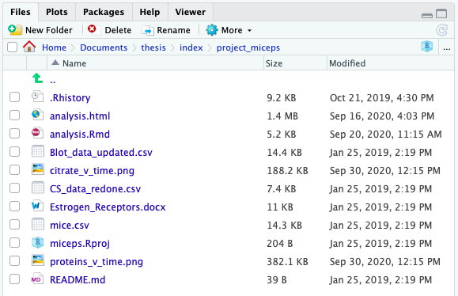

```{r setup, include=FALSE}
options(htmltools.dir.version = FALSE)
library(fertile)
```

```{r xaringan-themer, include=FALSE, warning=FALSE}
library(xaringanthemer)
style_mono_light(base_color = "#23395b")
```

```{css, echo= FALSE}
.remark-code {
  font-size: 24px;
}

.small .remark-code {
  font-size: 80% !important;
}
.tiny .remark-code {
  font-size: 50% !important;
}
```


---
## Overview

1. What is reproducibility and why is it lacking?
2. Other attempts to address reproducibility and their shortcomings
3. Why `fertile` is different
4. How `fertile` works
5. Potential applications and Smith College experiment
6. Conclusion
7. Accessing project materials

```{r, echo = FALSE, fig.align='center', out.height=270, out.width=250}
knitr::include_graphics("fertile-hex.png")
```

---
## What is reproducibility?

> In data science, research is considered fully __reproducible__ when the requisite code and data files produce identical results when run by another analyst.


.center[VS]

> __Replicability__: The ability of a researcher to duplicate the results of a study when following the original procedure but collecting new data


---
## The benefits of reproducibility

1. Trusting findings

2. Receiving feedback

3. Extending ideas

---
## The reproducibility crisis

*Nature (2016)*: 52% respondents claim "crisis"

Vast majority cannot reproduce others' work. 

Half cannot even reproduce their own!

Some fields have reproducibility rate <10%.

```{r, echo = FALSE, out.width = '50%'}
knitr::include_graphics("nature-1.jpeg")
```

---
## The reproducibility crisis
```{r, echo = FALSE, out.width = '60%'}
knitr::include_graphics("nature-2.png")
```

---
background-image: url("tidy-badge.png")
background-position: right bottom
background-size: 30%

## The six major components of reproducibility


### Component 1: Basic project components made accessible to the public:

- Data (raw and/or processed)

- Metadata

- Code

- Related Software


---
background-image: url("structure-badge.png")
background-position: right bottom
background-size: 30%

## The six major components of reproducibility

### Component 2: Well-organized file structure:

- Separate folders for different file types

- No extraneous files

- Minimal clutter


---
background-image: url("documentation-badge.png")
background-position: right bottom
background-size: 30%

## The six major components of reproducibility


### Component 3: The project is documented well:

- Files are clearly named / ordered

- A README is present

- Code contains comments

- Software dependencies are noted


---
background-image: url("paths-badge.png")
background-position: right bottom
background-size: 30%

## The six major components of reproducibility


### Component 4: Good file paths:

- No absolute paths

- No paths leading outside of a project’s directory

- Only relative paths within directory


---
background-image: url("randomness-badge.png")
background-position: right bottom
background-size: 30%

## The six major components of reproducibility


### Component 5: Randomness is accounted for:

- If used, seed must be set

---
background-image: url("style-badge.png")
background-position: right bottom
background-size: 30%

## The six major components of reproducibility

### Component 6: Code is readable and consistently styled:

- Coherent style
- Follow guide (e.g. `tidyverse`)


---
## Attempts to address reproducibility: journals

```{r, echo = FALSE, out.width='80%'}
knitr::include_graphics("stats-journals.png")
```
- Even if you have a reproducibility statement that does not mean that all the articles are reproducible!! 

---
## Attempts to address reproducibility: journals

### TOP Factor

- Helps measure state of academic reproducibility on the whole
- Score range: 0-30
- Approx 50% of journals = 5 or below
- Only 5% score > 15

---
## Attempts to address reproducibility: educational programs

- Replication studies at Graduate level (Cambridge, Harvard, UNC, Penn State, Berkeley)
- At undergraduate level, requirement for work to be completed in `.Rmd` (Smith, Duke)

---
## Attempts to address reproducibility: software

- `rrtools`: create basic package structure, Docker dependency management
- `orderly`: automation of projects
- `workflowr`: version control
- `checkers`: custom checks to assess reproducibility
- `renv` (formerly `packrat`): dependency management
- `drake`: makefiles
- `reproducible`: caching to speed up analysis


- Continuous integration tools: `wercker`, `GitHub Actions`, `Travis CI`, `Circle CI`.

```{r, echo = FALSE}
knitr::include_graphics('ci-tools.png')
```


---
## Shortcomings of current attempts

- Journals:

    1. Authors lack knowledge and/or time to make changes
    2. Reproducibility review is time/cost intensive for journals

- Education:

    1. Workshops often optional
    2. Only really at graduate level
    3. Takes time away from other important class topics
    4. Takes a lot of effort for professor to set up

- Software:

    1. Packages narrow in scope
    2. Complex functions, bad for new users
    3. Cumbersome, with steep learning curve
    4. CI tools: lack software-specific tools 

---
## Setting `fertile` apart: package goals

1) Be simple, with a small library of functions/tools that are straightforward to use.

2) Be accessible to a variety of users, with a relatively small learning curve.

3) Be able to address a wide variety of aspects of reproducibility, rather than just
one or two key issues.

4) Have features specific to a particular coding language that can address that
language’s unique challenges.

5) Be customizable, allowing users to choose for themselves which aspects of
reproducibility they want to focus on.

6) Be educational, teaching those that use it about why their projects are not
reproducible and how to correct that in the future.

7) Be applicable to a wide variety of domains.


---
## R Projects

`project_miceps`:

```{r, echo = FALSE, out.width = "80%"}

```


---

## Component 1: accessible project files

.small[

```{r}
 proj_analyze_files("project_miceps")
```

```{r}
has_readme("project_miceps")
```
]

---
## Component 1: accessible project files

- `sandbox()`: copying project to temp directory

- `proj_render()`

.small[

```{r}
proj_render("project_miceps")
slice_tail(render_log_report('project_miceps'))
```
]
---
## Component 2: organized project structure

- `has_proj_root()` / `has_no_nested_proj_root()`

- `has_tidy_` series

.small[
```{r}
has_only_used_files("project_miceps")
```
]

---
## Component 2: organized project structure

.small[

```{r}
files <- proj_analyze_files("project_miceps")
proj_suggest_moves(files)
```

]

- `proj_move_files()`

---
## Component 3: documentation

- `has_readme()`

- `has_clear_build_chain()`

- `has_well_commented_code()`

.small[
```{r, eval = FALSE}
has_well_commented_code("project_miceps")
```

```{r, echo = FALSE}
comments_tbl <- has_well_commented_code("project_miceps")

cat("*", comments_tbl$name, "\n")
cat("Problem:", comments_tbl$problem, "\n")
cat("Solution:", stringr::str_wrap(comments_tbl$solution, width = 60), "\n")
cat("See for help:", stringr::str_wrap(comments_tbl$help, width = 60))

errors <- comments_tbl$error

errors[[1]]
```
]

---
## Component 3: documentation

- `proj_dependency_report()`: runs project in new environment and captures `sessionInfo()`

.small[
```{r, eval = FALSE}
install_script <- proj_pkg_script("project_miceps")
```

```{r, echo = FALSE}
message_print <- "Run this script to install the required packages for this R project. \n Packages hosted on CRAN... \ninstall.packages(c( 'broom', 'dplyr', 'fs', 'ggplot2', 'purrr', 'readr', 'rmarkdown', 'skimr', 'stargazer', 'tidyr' )) \nPackages (likely) hosted on GitHub..."

cat(stringr::str_wrap(message_print, width = 70))


```

]

---
## Component 4: File Paths

.small[
```{r, error=TRUE, eval = FALSE}
read.csv("~/Desktop/my_data.csv")
```

```{r, echo = FALSE}
error_msg <- "Error: Detected absolute paths. Absolute paths are not reproducible and will likely only work on your computer. If you would like to continue anyway, please execute the following command: utils::read.csv('~/Desktop/my_data.csv')"

cat(stringr::str_wrap(error_msg, width = 70))
```

```{r, error=TRUE, eval = FALSE}
read_csv("../../../Desktop/my_data.csv")
```

```{r, echo = FALSE}
error_msg <- "Error: Detected paths that lead outside the project directory. Such paths are not reproducible and will likely only work on your computer. If you would like to continue anyway, please execute the following command: readr::read_csv('../../../Desktop/my_data.csv')"

cat(stringr::str_wrap(error_msg, width = 80))
```


```{r, error=TRUE}
setwd("project_miceps")
```
]

---
## Component 4: File Paths

.small[
```{r}
proj_analyze_paths("project_miceps")
```
]

- `check_path()`

---
## Component 5: randomness

- Differentiate between `controlled` (seed) & `uncontrolled` (no seed) randomness

.small[
```{r}
has_no_randomness('project_miceps')
```
]

---
## Component 6: readability and style

- `has_no_lint()`

- `tidy` code style (Hadley Wickham)


---
## Summary of Components

.small[
```{r, echo = FALSE}
knitr::include_graphics('components-summary.png')
```
]

---
## Overview functions

- `proj_check()`: run all 16 individual checks

- `proj_analyze()`: package dependencies, files, file move suggestions, paths

- `proj_badges()`: earn/display badges for different components, summary of project generation info

```{r badge-graphics, out.width="15%",  fig.show='hold', echo = FALSE}
knitr::include_graphics(c("structure-badge.png", "tidy-badge.png", "documentation-badge.png", "paths-badge.png", "randomness-badge.png", "style-badge.png"))
```

---
## Overview functions

```{r, echo = FALSE, out.width = '80%'}
knitr::include_graphics('badges-1.png')
```

---
## Overview functions

```{r, echo = FALSE}
knitr::include_graphics('badges-2.png')
```

---
## Overview functions: more customizable

- `proj_check_some()`: tidyselect
- `proj_check_badge()`:

- Functions to handle the interactive warning system:
- `add_shim()`: add a new function to the system
- `edit_shims()`: edit the functions that throw errors
- `load_shims()`: turn on warning system
- `unload_shims()`: turn off warning system

---
## How it works: shims

- Invisibly intercept users' actions and alter them slightly

1. Identify path-accepting function.
2. Create function in `fertile` w/ same name/arguments (and the dots...)
3. Write this new function so that it:

a) captures any arguments,

b) logs the name of the function called,

c) performs `fertile` file path checks on these arguments, and

d) calls the original function with the original arguments. 

---
## How it works: shims

.small[
```{r}
fertile::read.csv
```
]

---
## How it works: the dots (...)

- Shims must be flexible!
- Definitions only explicitly include required args and path-related args
- All other args accepted through dots


---
## How it works: hidden files

- Hidden log files track user behavior (calls to shimmed functions, seeds, dependencies)
- Update when `fertile` functions are run
- Users can access them via `render_log_report()`, `log_report()`

.small[
```{r}
render_log_report('project_miceps')
```
]

---
## How it works: environment variables

- Multiple hidden log files must be kept separate
- Environment variables determine which file gets written to
- When interactive --> normal log
- When rendering --> render log


---
## Disclaimer on malware

- `fertile` could be considered malware

- Will likely not ever be on `CRAN`: significant number of dependencies, creating hidden files on users' computers, intercepting their behavior w/o knowledge

- However: necessary for features to work, plus code is fully available on GitHub --> complete transparency

---
## Review of Goals

1) `Simple`: functions usually just take one or two arguments

2) `Accessible`: no advanced coding knowledge required

3) `Addresses multiple components`: all six components have functions

4) `R-specific features`: package dependency management, randomness

5) `Customizable`: editing warning system, choosing which checks to run

6) `Educational`: warning messages, checks give explanations and recommendations on failure

7) `Applicable in many domains`


---
## Potential applications: journal review

- Drastically speed up review process, save money
- Two methods: 1. Run fertile checks, 2. Require `proj_badges()` output


```{r, echo = FALSE}
knitr::include_graphics('journal-process-2.png')
```

---
## Potential applications: teaching reproducibility

- Introduce reproducibility in undergrad classrooms

- Limited barriers to entry:
1. R and RStudio installed on their computer
2. Knowledge of how to install a package from GitHub and load it into their
environment
3. Knowledge of how to create an R project
4. Knowledge of how to run basic functions and input simple file paths


---
## Potential applications: miscellaneous

- Private companies: increasing transparency w/ clients, building trust

- Conferences: reproducibility standards as requirement for acceptance

- Informal analysis: more reproducible work for events like `Tidy Tuesday` --> share knowledge!

---
## Experimental testing: design

- 2 Sessions: Fall 2020 (18 students), J-Term 2021 (38 students)
- Students randomly divided into two groups: `fertile` and no `fertile` 
- Students are unaware of group!
- Measuring reproducibility: post-test (fall) and pre/post- tests (j-term)
- Fall: Final Score, J-Term: Difference in scores

---
## Experimental testing: technical details

How software groups were blinded:

1. Provide us unique computer username / login name
2. Convert that with `md5()` hashing algorithm 
3. Assign hashed names to groups
4. `sds192` package `.onAttach()` pulls username, hashes it, and compares to pre-written assignment
5. If in `fertile` group, `fertile` secretly loaded. If not, just have access to basic `sds192` package features


---

## Experimental testing: results

- What we found:

1. No evidence of relationship between `fertile` and test score (or difference in scores)

**Fall:** `Group` vs `Final Score` (-) --- p = 0.117, + `Previous Classes`: p = 0.08

**J-Term:** `Group` vs `Score Differential` (+) --- p = 0.964, + `Previous Classes`: p = 0.968


2. Fall results seemed to actually have `fertile` group scoring worse overall (not statistically significant), but this was somewhat reversed in `J-term`. `fertile` students started worse and finished worse, but made overall (slightly) larger score improvements—again, not significant!

3. Students across both groups seemed to learn about reproducibility throughout the class


---
## Experimental testing: limitations

- Small sample size
- Non-independent subjects
- Classroom environment not same as true testing environment
- Experiment structure does not accurately represent real-world use of `fertile`
- Very hard to know if the `fertile` group's software was behaving correctly the whole semester


---
## Experimental testing: implications

- Not much in terms of `fertile`
- However, potential for A/B testing of other R software

```{r, echo = FALSE}

```


---
## Conclusion

- `fertile`, regardless of experimental results, has potential to improve reproducibility
- Fills gaps where other solutions---in software, education, or journal review--- fail
- Appears to be gaining some traction. Even helping one person improve their reproducibility will be worth it!


---
## How to access project materials

- GitHub repository for `fertile`: https://github.com/baumer-lab/fertile

- My repository for `fertile`, to track my changes:
https://github.com/ambertin/fertile

- Repository for this thesis, containing additional text, figures, and experimental data:
https://github.com/ ambertin/thesis

---


# .center[Questions?]


---

## Additional Info: Experiment 

- `.onAttach()`:

.tiny[
```{r, eval = FALSE}

# .onAttach() from the sds192 package
# Run automatically any time the sds192 package is loaded

.onAttach <- function(libname, pkgname) {

  # The experimental group gets `fertile` loaded secretly
  if (is_experimental()) {
    suppressMessages(library(fertile))
  }
}

is_experimental <- function(logname = whoami::username()) {
  
  # Students are placed into experimental and control
  # groups but remain anonymous
  fertile_group <- c(
    "f7b0a9d5117b88cecec122f8ba0e52fb",
    "4d0295a810fb8491f91f914771572485",
    "36211a1f19f82ae07aed990b671c9b20",
    "b5d2b72b4f36f3afdce32a8409dc6ea0",
    "d498227fd9e6a4c42494bbebc42f6aa8",
    # ... and so on
  )
  control_group <- c(
    "9aa36583f54766205850428e8f1a4c89", 
    "f03020938b31818063c79d2422755183", 
    "7ec57b1f2bca9ac1e702fb68427b781b", 
    "e5e30623e9d09d29ded851b7fb40cb51", 
    "592572bb9fce168f37117fd0d6e0e5ee",
    # ... and so on
 
  )
  

  digest::digest(logname, algo = "md5") %in% fertile_group
  
}
```
]

---
## Additional Info: Experiment (Fall 2020)

```{r, echo = FALSE,  message = FALSE}
library(readr)
library(tidyverse)


fall2020 <- readr::read_csv("../data/Fall_2020_Single_Post_test.csv")
jterm2021 <- readr::read_csv("../data/JTerm_2021_Pre_Post.csv")
jterm2021$Test <- factor(jterm2021$Test, levels = c("Pre", "Post"))

```

```{r, echo = FALSE, message = FALSE}
library(RColorBrewer)

fall2020_averages <- fall2020 %>% 
  group_by(Group) %>%
  summarize(Projects_Total = mean(Projects_Total),
            Paths_Total = mean(Paths_Total),
            Overall_Total = mean(Overall_Total)) %>%
  pivot_longer(cols = 2:4, names_to = "Question_Average")

ggplot(fall2020_averages, aes(x = Group, fill = Group, y = value)) + 
  facet_wrap(~Question_Average) + 
  geom_col() +
  ylab("Average Score") +
  scale_fill_brewer(palette = "Paired") +
  xlab(NULL) + 
  ggtitle("Difference in Reproducibility Score Averages, Fall 2020")
```
---
## Additional Info: Experiment (Fall 2020)


```{r, echo = FALSE, message = FALSE}
ggplot(fall2020, aes(x = Previous_Classes, y = Overall_Total, col = Group)) + 
  geom_point(size = 4) +
  scale_color_brewer(palette = "Paired") +
  ggtitle("Previous Classes vs Total Score, Fall 2020") +
  geom_smooth(method = "lm", se = FALSE)
```
---
## Additional Info: Experiment (Fall 2020)

.small[
```{r, echo = FALSE}
fall_model <- lm(Overall_Total ~ Group, data = fall2020)
summary(fall_model)
```
]
---
## Additional Info: Experiment (Fall 2020)

.small[

```{r, echo = FALSE}
fall_model <- lm(Overall_Total ~ Group + Previous_Classes, data = fall2020)
summary(fall_model)
```
]

---
## Additional Info: Experiment (Jan 2021)

```{r, echo = FALSE, message = FALSE}
group_scores <- jterm2021 %>% select(1:5, 15:17) %>%
  rename(Projects = "Projects_Total",
         Paths = "Paths_Total",
         Overall = "Overall_Total") %>%
  pivot_longer(cols = 6:8,
               names_to = "Question_Group",
               values_to = "Score")

ggplot(group_scores, aes(x = Test, y = Score, fill = Group)) +
  geom_boxplot() +
  facet_wrap(~Question_Group) +
  scale_fill_brewer(palette = "Paired") +
  ggtitle("Score Distributions for Pre/Post Tests, J-Term 2021")
```


---
## Additional Info: Experiment (Jan 2021)


```{r, echo = FALSE, message = FALSE, warning = FALSE}
pre_post_differences <- jterm2021 %>% group_by(Student_ID, Group, Previous_Classes) %>%
  summarize(pre_total = ifelse(Test == "Pre", Overall_Total, NA),
            post_total = ifelse(Test == "Post", Overall_Total, NA),
            pre_projects = ifelse(Test == "Pre", Projects_Total, NA),
            post_projects = ifelse(Test == "Post", Projects_Total, NA),
            pre_paths = ifelse(Test == "Pre", Paths_Total, NA),
            post_paths = ifelse(Test == "Pre", Paths_Total, NA)) %>%
  group_by(Student_ID, Group, Previous_Classes) %>%
  summarize(Total = na.omit(post_total) - na.omit(pre_total),
            Projects = na.omit(post_projects) - na.omit(pre_projects),
            Paths = na.omit(post_paths) - na.omit(pre_paths)) %>%
  pivot_longer(cols = 4:6, names_to = "Question_Group", values_to = "Score_Difference")

jterm_model_data <- pre_post_differences %>% 
  filter(Question_Group == "Total")

```


.small[
```{r, echo = FALSE}
jterm_model <- lm(Score_Difference ~ Group, data = jterm_model_data)

summary(jterm_model)
```
]

---
## Additional Info: Experiment (Jan 2021)

.small[
```{r, echo = FALSE}
jterm_model_mr <- lm(Score_Difference ~ Group + Previous_Classes, data = jterm_model_data)

summary(jterm_model_mr)

```
]

---
## Additional Info: Assumptions

### Fall 2020

```{r, echo = FALSE, fig.show="hold", out.width="50%"}
plot(fall_model, which = c(1,2)) 
```

---
## Additional Info: Assumptions

### Jan 2021

```{r, echo = FALSE, fig.show="hold", out.width="50%"}
plot(jterm_model, which = c(1,2))
```

---
## Additional Info: Test Questions

```{r, echo = FALSE, out.width = '80%'}
knitr::include_graphics("test-4.png")
```

---
## Additional Info: Test Questions

```{r, echo = FALSE, out.width = '80%'}

```

